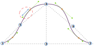

Esta opción controla la dispersión a la baja en el tercer cuadrante de la manga.

<Tip>

Consulta [entender el cubremangas](/docs/designs/brian/options#understanding-the-sleevecap) para ver en profundidad en
cómo se construye el cubremangas y la influencia de las distintas opciones en su forma.

</Tip>

