Спочатку ми креслимо пройму для рукава, а потім - рукав, який її облягає.

Коли все йде добре, рукав сидить ідеально, і ця опція не актуальна. Однак, якщо/коли рукав не ідеально прилягає до пройми, його потрібно адаптувати.

Since the shape and height of the sleevecap are more important than the width, we tend to prefer adjusting the width to fit the sleevecap.

Щоб рукав не став занадто вузьким, ми адаптуємо лише частину ширини рукава. Ця опція дозволяє контролювати, яка частина ширини рукава гарантована. Збільшення цього параметра дозволить нам менше гратися з шириною, щоб підігнати рукав під себе. Таким чином, отриманий рукав буде ближчим до теоретичної ширини, і ми натомість змінимо (більшою мірою) висоту шапки рукава, щоб підігнати його під рукав.

## Вплив цієї опції на шаблон

