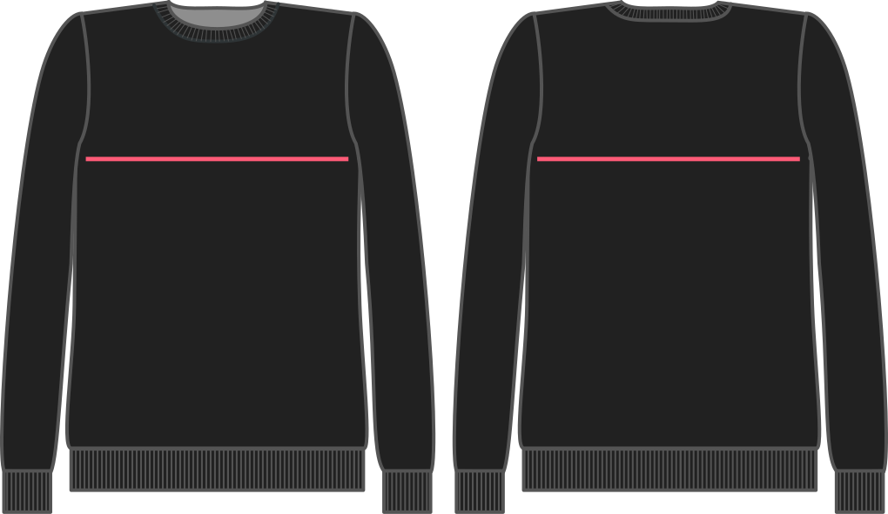

- - -
titre : "aisance thoracique"
- - -

Combien d'aisance voulez-vous pour le buste ? Quelle que soit la valeur que vous choisissez, la valeur sera simplement ajoutée à votre mesure de tour de poitrine lors de la génération du patron.

## Effet de cette option sur le motif

