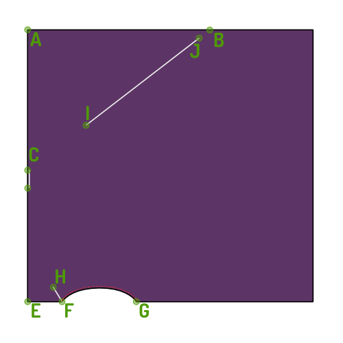

### Schritt 1: Beende die Rüstungsnaht

- Beenden Sie die Armlochnaht mit einem schmalen Saum.

### Schritt 2: Beende die Spitze

<Note>

Da Ihr Oberteil gefaltet ist, ist es eine gute Idee, beide Hälften zusammenzupinnen.
Auf diese Weise kann sich dein Oberteil nicht umdrehen, während wir es beenden.

</Note>

- Nähen Sie die drei Nähte, die auf Ihrem Entwurf markiert sind. F-H, C und I-J in der Abbildung, dargestellt durch Linien und Kerben auf dem Muster.

### Schritt 3: Viel Spaß!

Habe nun viel Spaß mit deinem neuen Oberteil und den dazugehörigen Zero-Waste-Eigenschaften!
