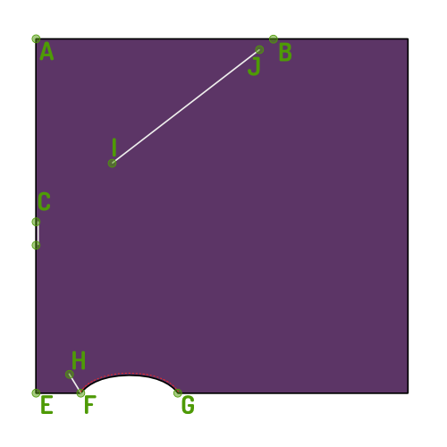

### Paso 1: Termina la costura del orificio

- Termina la costura del orificio con un tubo estrecho.

### Paso 2: Termina la parte superior

<Note>

A medida que tu parte superior está doblada, es una buena idea fijar ambas mitades.
De esta manera, tu parte superior no puede desplazarse mientras lo terminamos.

</Note>

- Define las tres líneas de costura que están marcadas en tu borrador. F-H, C e I-J en el diagrama, representados por líneas y muescas en el patrón.

### Paso 3: ¡Disfrútalo!

¡Ahora disfruta de tu nuevo top y de sus propiedades de residuo cero!
