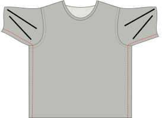

## Paso 1: Cierra las costuras del hombro

- Coloca el frente y la parte trasera sobre el otro con [buenos lados juntos](/docs/sewing/good-sides-together). Alinear las costuras del hombro.
- Servir las costuras del hombro o unirlas con un zigzag estrecho (~2 mm) en la costura estándar.

<Note>
Opcional: En un tejedor más apretado, puede optar por reforzar las costuras del hombro pegando elástico claro a lo largo de la costura en el interior. En una camiseta, las costuras del hombro soportan la mayor parte del peso de la prenda. El refuerzo no es necesario, pero puede evitar que las costuras del hombro se estiren con el paso del tiempo.
</Note>

## Paso 2: Establecer en mangas

- Coloca tu ahora unido frente y atrás con el lado bueno arriba.
- Identifique los lados delanteros y traseros de cada una de sus mangas. (Así es como separas la manga izquierda de la derecha.) (Así es como separas la manga izquierda de la derecha.) (Así es como separas la manga izquierda de la derecha.) On your paper pattern piece, the front side of the sleeve is to the right.
- Coloque una manga en la parte superior de la parte frontal y trasera, con el lado bueno abajo.
- Alínea la parte superior de la manga con la costura del hombro. Asegúrate de que la parte delantera y trasera de la manga esté alineada con las partes delanteras y traseras de tu camiseta.
- Pin manga en su lugar a lo largo de todo el orificio. Hay un poco de facilidad de mangas, lo que significa que la cabeza de manga es un poco más larga que el orificio. Eche en la parte superior de la cabeza de manga mientras se pincha.
- Coser / servir tu manga anclada en su lugar.
- Repita para la otra manga.

## Paso 3: Cose la terminación del cuello

Hay dos opciones para el acabado del cuello de Teagan: una banda de punto o un ribete de punto. La banda de punto es lo que sueles ver en las camisetas compradas en tiendas, mientras que el ribete de punto es el acabado que encontrarás en la camiseta Aaron A-Tank. Aquí se dan las instrucciones para ambos.

<Note>
Este es el paso más complejo para hacer la camisa de Teagan, pero sólo requiere un poco de práctica. No te preocupes, todo lo que tienes que hacer es hacer un par de estos y serás un profesional en poco tiempo.
</Note>

### Opción 1: acabado de banda de punto

#### Coloca (el inicio de) tu banda de punto

- Dobla la encuadernación por la mitad a lo largo (paralelamente al lado más largo), y presiona.
- Coloca la camiseta con la parte buena de la espalda hacia arriba, y pon encima la tira de banda, alineando los bordes crudos de la banda con el borde crudo de la abertura del cuello.
- Tu banda debe empezar en el centro de la parte posterior de la abertura del cuello.
- Ahora desplaza tu tira de unión de 1 cm más allá de tu punto de partida. Este pequeño extra garantizará que podamos unirnos a los dos fines más adelante.

#### Cose la banda en su sitio

- Coloca el prensatelas a 3 cm a lo largo de la banda de punto, de modo que quede una cola de 4 cm sin coser. Esto nos ayudará a unir los extremos más tarde. Luego, cose alrededor de la abertura del cuello, estirando la banda suavemente mientras coses.

<Note>
  
Este estiramiento es la parte más complicada. Muchos tutoriales en línea te dirán que empieces simplemente con una banda ligeramente más pequeña que la abertura del cuello, y que la estires hasta ajustarla. Aunque es una opción, no tiene en cuenta las diferencias de elasticidad y estiramiento del tejido, y puede dar lugar a un acabado de cuello flojo o fruncido. Estirarse para ajustarse a la abertura del mástil mediante el tacto es algo que requiere un poco de práctica, pero es una buena habilidad a desarrollar para conseguir mejores acabados a largo plazo.
  
</Note>

- Dejar de coser 3 cm antes del final, dejando una cola como lo hicimos al principio.

#### Cose los extremos de la banda

Ahora es el momento de coser los extremos de nuestra banda de punto.
- Coge el extremo de tu banda de punto y estíralo a lo largo de los 3 cm que lo separan del punto de inicio, como harías al coser. En la banda, marca dónde llegó la banda al punto de inicio, o al centro de la espalda. Haga lo mismo con el otro extremo.
- Dobla la camiseta de la forma que te resulte más fácil para colocar los dos extremos de la banda con los lados bien juntos, alineando las marcas. Consúltenlos juntos en las marcas.
 - Ahora deberías tener una banda de punto unida.

<Note>

6 cm no es mucho, pero debería ser suficiente para conseguir que ambos bordes cómodamente debajo de su máquina de coser juntos.

</Note>

- Ahora que los extremos de la banda están unidos, es el momento de terminar los últimos 6 cm, estirando y cosiendo la banda como hiciste con el resto.

¡Hurra! ¡Has terminado la parte más difícil! Hurray! You've finished the trickiest part! Optionally, you can secure the raw edges by stitching them down to the T-shirt fabric, just inside the knit band with a sig-zag or coverlock stitch. No es obligatorio, pero es un detalle que verás en muchas camisetas listas para llevar, y puede ayudar a que la banda del cuello quede plana.

### Opción 2: acabado de punto

<Tip>

Se puede encontrar una forma más extensa de enlazar en la [Instucciones de Aaron](/docs/patterns/aaron/instructions).

</Tip>

#### Colocar (el inicio de) tu vinculación

- Pon tu camisa abajo con la parte trasera buena arriba, y coloque su tira de unión en la parte superior con el lado bueno hacia abajo (como en los lados buenos juntos). Su unión debe comenzar en la parte central de la parte trasera del cuello.
- Alínea el largo borde de tu tira con el borde de tu tela para que la tira se encuentre en la parte superior de la tela (no en la abertura). Coloque la esquina en su punto de partida.
- Ahora desplaza tu tira de unión de 1 cm más allá de tu punto de partida. Este pequeño extra garantizará que podamos unirnos a los dos fines más adelante.

#### Marcar enlace en su lugar

- Coloque su pie más presor de 3 cm a lo largo del encuadernado para que una cola de 3 cm quede desenterrada. Esto nos ayudará a unirnos a los fines de lo vinculante más adelante. Luego, coser a 1,5 cm del borde alrededor del cuello, estirando la unión suavemente a medida que codes.  (Nota: esta no es la costura estándar.)
- Dejar de coser 3 cm antes del final, dejando una cola como lo hicimos al principio.

#### Marcar y coser extremos de enlace

- Con alrededor de 6 cm para ir antes de completar nuestro círculo, es hora de coser los extremos de la unión juntos.
- Tome uno de los bordes, y lo estire a lo largo de los 3 cm separándolo del punto de partida como lo haría mientras coser. En el encuadernador, marque donde el enlace alcanzó el punto de partida. Haga lo mismo con el otro extremo.
- Doblar la camiseta de cualquier manera le hace más fácil colocar ambos extremos de unión con buenos lados juntos, alineando las marcas. Consúltenlos juntos en las marcas.

<Note>

6 cm no es mucho, pero debería ser suficiente para conseguir que ambos bordes cómodamente debajo de su máquina de coser juntos.

</Note>

- Ahora que los extremos de la unión están unidos, es hora de terminar los últimos 6 cm de encuadernación. Manténgalo abajo, permaneciendo a 1,5 cm del borde como lo hiciste antes.

#### Doble unión de tejidos a la espalda y coser

- Doblar tu tela de unión alrededor de la tela de tu camisa hacia la espalda. Así es como lo costaremos.
- Mientras que la tela está doblada en la parte delantera (ocultando el borde de la tela en el proceso), no hay necesidad de eso en la parte trasera. Simplemente recortaremos el borde más tarde, dado que el nudo no se cuelga. Si tuviésemos que doblar la tela también en la espalda, sólo añadiríamos granel.
- Ahora coser el encuadernado. Desde el lado derecho de tu tejido, coser a lo largo del borde interior de tu unión (más alejado del borde), asegurándose de capturar el enlace en la espalda en el proceso.

<Note>
Si usted tiene una máquina de cierre, eso sería perfecto para esta costura.
</Note>

- Tendrás que, una vez más, estirar tu vinculación un poco mientras haces esto. Pero esta vez hay una advertencia adicional para mirar.

<Note>

##### Cuidado con el alimento desigual

Como tu alimento tu vinculación a través de tu máquina de coser, los perros de alimentación tirarán hacia adelante la capa inferior (parte trasera de su enlazamiento).

En un mundo perfecto, todas las capas seguirán sin problemas. Pero la mayoría de las veces la capa superior (frontal de su enlace) tiende a retrasarse un poco. Esto hace que su unión no se pliega bien alrededor del borde del tejido, sino que haga tortillas feas.

Así que ten cuidado con esto, y si ves que sucede, estira la capa de abajo un poco más para compensar.
En el interior de tu camiseta, recorta el enrollado justo fuera de tu costura para acabar.

</Note>

## Paso 4: Cierre las costuras y mangas laterales

- Doble tu camisa de Teagan doble en las costuras de hombro con buenos lados juntos.
- Alinear las costuras y mangas laterales y fijarlas juntos.
- Serge/coser la costura del lado y continuar cosiendo para cerrar los brazos hasta el césped de manga.
- Repetir en el otro lado.

## Paso 5: Termina el corte y mangas

- Doblar la sombra hacia arriba, hacia el interior, y coser. Si tienes una remalladora con coverlock, úsala. Si no es así, utilice una aguja gemela o una stitch zig-zag para mantener la costura estirable.
- Repita por el cabo de cada manga.

<Note>

##### Doblar solo una vez, para evitar el grueso

El brillo no se cuelga, así que puede doblar esto una vez y coser la tela, luego recortar la tela.

</Note>
