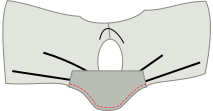
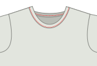

## Etape 1: Assemblez les coutures d'épaule

- Placez l'avant et l'arrière les uns sur les autres avec [bons côtés ensemble](/docs/sewing/good-sides-together). Alignez les coutures des épaules.
- Préparez les coutures des épaules ou coupez-les avec un point de zigzag étroit (~2 mm) à la couture standard.

<Note>
Optionnel: Dans un tricot drapier, vous pouvez choisir de renforcer les coutures des épaules en couturant l’élastique clair le long de la couture à l’intérieur. Sur un T-shirt, les coutures d'épaule supportent la plus grande partie du poids du vêtement. Le renforcement n'est pas nécessaire, mais il peut empêcher les coutures d'épaule de s'étirer au fil du temps.
</Note>

## Étape 2 : Mettre dans les manches

- Placez le devant et le dos maintenant fixés avec le bon côté vers le haut.
- Identifiez les côtés avant et arrière de chacune de vos manches. (C'est ainsi que vous séparez la manche gauche de la droite.) Sur ta pièce de patron en papier, le devant de la manche se trouve à droite.
- Placez une manche sur le devant et le dos, avec le bon côté vers le bas.
- Alignez le haut de la tête de manche avec la couture de l'épaule. Assurez-vous que l'avant et l'arrière de la manche sont alignés avec les pièces avant et arrière de votre chemise.
- Épingler la manche en place le long de toute l'armurière. Il y a un peu de tête de manche facile, ce qui signifie que la tête de manche est un peu plus longue que la manche. Facilité dans la partie supérieure de la tête de manche en épinglant.
- Coudre ou serrer votre manche épinglée en place.
- Répétez pour l'autre manche.

## Étape 3 : Coudre la finition du cou

Il y a deux options pour la finition du cou sur Teagan : une bande de tricot ou une reliure en tricot. La bande de tricot est ce que tu vois généralement sur les t-shirts achetés dans le commerce, tandis que la bande de tricot est la finition que tu trouveras sur le Aaron A-Tank. Les instructions pour les deux sont données ici.

<Note>
Il s'agit de l'étape la plus complexe dans la fabrication du T-shirt Teagan, mais cela nécessite juste un peu de pratique. Ne vous inquiétez pas, tout ce que vous avez à faire est d’en faire deux et vous serez un pro en un rien de temps.
</Note>

### Option 1 : finition de la bande tricotée

#### Place (le début de) ta bande de tricot.

- Plie ta reliure en deux dans le sens de la longueur (parallèlement au côté le plus long), et presse.
- Pose ton T-shirt avec le bon côté du dos vers le haut, et place ta bande sur le dessus, en alignant les bords bruts de la bande avec le bord brut de l'ouverture de l'encolure.
- Ta bande doit commencer au centre arrière de l'ouverture du cou.
- Décalez maintenant votre bande de biais de 1 cm avant votre point de départ. Ce petit surplus garantira que nous pourrons joindre les deux extrémités plus tard.

#### Couds la bande en place

- Place ton pied-de-biche à 3 cm de la bande de tricot, de sorte qu'une queue de 4 cm sera laissée sans couture. Cela nous aidera à joindre les extrémités plus tard. Puis, couds autour de l'ouverture du cou, en étirant doucement la bande pendant que tu couds.

<Note>
  
Cet étirement est la partie la plus délicate. De nombreux tutoriels en ligne te diront de simplement commencer par une bande légèrement plus petite que l'ouverture du cou, et de l'étirer pour l'ajuster. Bien qu'il s'agisse d'une option, cela ne tient pas compte des différences d'étirement et d'élasticité du tissu, et peut donner une finition de cou flasque ou froncée. S'étirer pour s'adapter à l'ouverture du manche au feeling est quelque chose qui demande un peu de pratique, mais c'est une bonne compétence à acquérir pour obtenir de meilleures finitions à long terme.
  
</Note>

- Arrêtez de coudre 3 cm avant la fin, laissant une queue comme nous l'avons fait au début.

#### Couds les extrémités de la bande ensemble

Il est maintenant temps de coudre les extrémités de notre bande de tricot ensemble.
- Prends l'extrémité de ta bande de tricot, et étire-la le long des 3 cm qui la séparent du point de départ, comme tu le ferais en cousant. Sur la bande, marque l'endroit où la bande a atteint le point de départ, ou le centre arrière. Faites la même chose pour l'autre extrémité.
- Plie ton T-shirt de la façon qui te facilitera la tâche pour placer les deux extrémités de la bande avec les bons côtés ensemble, en alignant les marques. Les coudre ensemble aux marques.
 - Tu devrais maintenant avoir une bande tricotée jointe.

<Note>

6 cm, ce n'est pas beaucoup, mais devrait suffire pour que les deux bords soient confortablement sous votre machine à coudre pour les coudre ensemble.

</Note>

- Maintenant que les extrémités de ta bande sont réunies, il est temps de terminer les 6 derniers centimètres, en étirant et en cousant la bande comme tu l'as fait pour le reste.

Hourra ! Vous avez terminé la partie la plus délicate ! Tu peux aussi fixer les bords bruts en les cousant au tissu du T-shirt, juste à l'intérieur de la bande de tricot, à l'aide d'un point sig-zag ou d'un point de recouvrement. Ce n'est pas obligatoire, mais c'est un détail que tu verras sur de nombreux T-shirts prêts à porter, et cela peut aider ton tour de cou à rester plat.

### Option 2 : finition tricotée

<Tip>

Un guide plus complet sur la liaison tricot peut être trouvé dans les [Instuctions Aaron](/docs/patterns/aaron/instructions).

</Tip>

#### Placer (démarrer) votre biais

- Mettez votre T-shirt vers le bas avec le bon côté du dos vers le haut, et placez votre bande de reliure sur le dessus avec le bon côté vers le bas (comme dans les bons côtés ensemble). Votre liaison devrait commencer au centre de l'encolure de l'encolure.
- Alignez le bord long de votre bande sur le bord de votre tissu de façon à ce que la bande repose sur le tissu (et non dans l'ouverture). Placez le coin sur votre point de départ.
- Décalez maintenant votre bande de biais de 1 cm avant votre point de départ. Ce petit surplus garantira que nous pourrons joindre les deux extrémités plus tard.

#### Coudre le biais bien positionné

- Placez le pied de votre presseur 3 cm le long de la corde de fixation, de sorte qu'une queue de 3 cm sera laissée sans coutures. Cela nous aidera à nous joindre plus tard à la fin de la liaison. Ensuite cousez 1,5 cm du bord autour de l'encolure en tirant doucement la reliure au moment de la couture.  (Note: ce n'est pas l'allocation standard de couture.)
- Arrêtez de coudre 3 cm avant la fin, laissant une queue comme nous l'avons fait au début.

#### Marquer et coudre les extrémités de liaison

- Avec environ 6cm de gauche avant de terminer notre cercle, il est temps de coudre les extrémités de la liaison ensemble.
- Prenez l'un des bords et étirez-le le le long des 3 cm en le séparant du point de départ comme vous le feriez lors de la couture. En ce qui concerne la liaison, marque où la liaison a atteint le point de départ. Faites la même chose pour l'autre extrémité.
- Plier votre T-shirt de quelque manière que ce soit vous permet de placer plus facilement les deux extrémités de liaison avec de bons côtés, alignant les marques. Les coudre ensemble aux marques.

<Note>

6 cm, ce n'est pas beaucoup, mais devrait suffire pour que les deux bords soient confortablement sous votre machine à coudre pour les coudre ensemble.

</Note>

- Maintenant que vos extrémités de reliure sont réunies, il est temps de terminer les 6 dernières cm de liaison. Cousez-les en restant à 1,5cm du bord comme vous l'avez fait auparavant.

#### Plier le tricot à l'arrière et coudre vers le bas

- Pliez votre tissu de reliure autour du tissu de votre T-shirt au dos. C'est ainsi que nous allons le coudre.
- Alors que le tissu est plié deux fois à l'avant (cachant le bord du tissu dans le processus), il n'y a pas besoin de cela à l'arrière. Nous allons simplement couper le bord plus tard, étant donné que le tricot ne ravira pas. Si nous devions replier le tissu à l'arrière également, cela ne ferait qu'ajouter de l'épaisseur.
- Maintenant vous courez la liaison. Sur l'endroit de votre tissu, cousez le long du bord de votre biais (le plus loin du bord du pli), en s'assurant de bien prendre le biais de l'arrière dans la couture.

<Note>
Si vous avez une recouvreuse, ce sera parfait pour cette couture.
</Note>

- Une fois de plus, vous devrez vous étirer un peu pendant que vous le ferez. Mais cette fois-ci, il y a une mise en garde supplémentaire à rechercher.

<Note>

##### Méfiez-vous des différences d'entraînement

En passant votre biais sous votre machine à coudre, les griffes d'entraînement tirent davantage la couche inférieure (arrière de votre biais).

Dans un monde parfait, toutes les épaisseurs suivent sans problème. Mais le plus souvent, la couche supérieure (face avant de votre biais) a tendance à se traîner un peu. Cela fait que votre biais ne se plie pas bien autour du bord du tissu, mais fait des plis disgracieux.

Surveillez donc si cela se produit, et si vous le voyez, étirez la couche inférieure un peu plus pour compenser.
À l'intérieur de votre tee-shirt, coupez le maillage juste à l'extérieur de votre couture pour finir.

</Note>

## Étape 4 : Fermer les coutures latérales et les manches

- Pliez votre T-shirt Teagan double à l'épaule avec de bons côtés ensemble.
- Alignez les coutures latérales et les manches et fixez-les ensemble.
- Servez/coudre la couture latérale et continuer à coudre pour fermer les bras jusqu'au manche de l'ourlet.
- Répéter de l'autre côté.

## Étape 5 : Terminer les ourlets et les manches

- Repliez l'ourlet vers l'intérieur, et courez-le vers le haut. Si vous avez une recouvreuse, utilisez-la. Dans le cas contraire, utilisez une aiguille jumelle ou un point de zig-zag pour garder la couture tendue.
- Répéter l'ourlet sur chaque manche.

<Note>

##### Ne pliez qu'une seule fois, pour éviter le vrac

Le maillot ne ravit pas, Vous pouvez simplement le plier une fois et le coudre, puis bien couper le tissu.

</Note>
