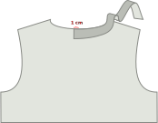
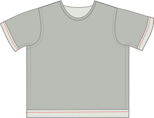

- - -
title: "Teagan T-shirt: Sewing Instructions"
- - -

## Stap 1: Sluit de schoudernaden

- Leg het voor- en achterpand op elkaar met [goede kanten op elkaar](/docs/sewing/good-sides-together). Leg de schoudernaden gelijk.
- Lock de schoudernaden of stik ze met een smalle (~2 mm) zigzagsteek aan de standaard naadwaarde.

<Note>
Optioneel: In een draaiknop kun je ervoor kiezen om de schoudernaden te versterken door duidelijk elastiek langs de naad aan de binnenkant te stikken. Op een T-shirt ondersteunen de schoudernaden het grootste gewicht van het kledingstuk. Versterking is niet vereist, maar het kan de schoudernaden niet na verloop van tijd uitrekken.
</Note>

## Stap 2: Zet de mouwen in

- Leg je aan elkaar bevestigde voor- en achterpand neer met de goede kant naar boven.
- Identificeer de voor- en achterkanten van elke mouw. (Dit is hoe je de linker mouw van rechts scheidt.) On your paper pattern piece, the front side of the sleeve is to the right.
- Leg een mouw bovenop de voor- en achterkant, met de goede kant naar beneden.
- Leg de bovenkant van de mouwkop gelijk met de schoudernaad. Zorg dat de voor- en achterkant van de mouw gelijk staan met de voor- en achterpanden van je shirt.
- Speld de mouw op z'n plaats langs het hele armsgat. Er is een beetje extra stof in de mouwkop, wat betekent dat de mouwkop iets langer is dan het armsgat. Verbeter het bovenste deel van de mouwkop tijdens het spelden.
- Stik/lock de gespelde mouw op z'n plaats.
- Herhaal voor de andere mouw.

## Step 3: Sew the neck finish

There are two options for the neck finish on Teagan: a knit band or knit binding. Knit band is what you typically see on store-bought T-shirts, whereas knit binding is the finish you'll find on the Aaron A-Tank. Directions for both are given here.

<Note>
Dit is de meest complexe stap in het maken van een T-shirt in Teagan, maar het vereist slechts een beetje praktijk. Maak je geen zorgen, het enige wat je hoeft te doen is een paar van deze maken en je zal binnen een tijdsbestek een pro zijn.
</Note>

### Option 1: knit band finish

#### Place (the start of) your knit band

- Fold your binding in half lengthwise (parallel to the longest side), and press.
- Put your T-shirt down with the back good side up, and place your band strip on top of it, lining up the raw edges of the band with the raw edge of the neck opening.
- Your band should start at the center back of the neck opening.
- Leg nu je bies 1 cm voorbij je startpunt. Dit beetje extra garandeert dat we later de twee uiteindes aan elkaar kunnen bevestigen.

#### Sew band in place

- Place your presser foot 3 cm along the knit band, so a 4 cm tail will be left unstitched. This will help us join the ends together later. Then, sew around the neck opening, stretching the band gently as you sew.

<Note>
  
This stretching is the trickiest part. Many online tutorials will tell you to simply start with a band slightly smaller than the neck opening, and stretch to fit. While an option, this does not account for differences in fabric stretch and elasticity, and can result in a floppy or puckered neck finish. Stretching to fit the neck opening by feel is something that takes a bit of practice, but is a good skill to build for better finishes long-term.
  
</Note>

- Stop met 3 cm voor het uiteinde en een staart achterlaten zoals we aan het begin deden.

#### Sew band ends together

Now it's time to sew the ends of our knit band together.
- Take the end of your knit band, and stretch it along the 3 cm separating it from the start point as you would while sewing. On the band, mark where the band reached the start point, or center back. Doe hetzelfde voor het andere uiteinde.
- Fold your T-shirt in whatever way makes it more easy for you to place both band ends with good sides together, aligning the marks. Stik ze samen op de marken.
 - You should now have a joined knit band.

<Note>

6 cm is niet veel, maar zou genoeg moeten zijn om de twee randen comfortabel onder je naaimachine te krijgen om ze aan elkaar te naaien.

</Note>

- Now that your band ends are joined together, it’s time to finish the last 6 cm, by stretching and sewing down the band as you did for the rest.

Hurray! You've finished the trickiest part! Optionally, you can secure the raw edges by stitching them down to the T-shirt fabric, just inside the knit band with a sig-zag or coverlock stitch. This is not required, but it is a detail that you'll see on many ready-to-wear T-shirts, and it can help your neck band lie flat.

### Option 2: knit binding finish

<Tip>

Een uitgebreidere manier om te springen is te vinden in de [Aaron Instuctions](/docs/patterns/aaron/instructies).

</Tip>

#### Positioneer (het begin van) je bies

- Leg je T-shirt neer met de goede kant omhoog. en leg je bies bovenop met de goede kant naar beneden (zoals in, goede kanten op elkaar). De bies moet aan de middenachterkant van de halsopening beginnen.
- Leg de lange rand van je bies gelijk met de rand van je stof zodat de bies op de stof ligt (en niet in de opening). Leg de hoek van je bies op je startpunt.
- Leg nu je bies 1 cm voorbij je startpunt. Dit beetje extra garandeert dat we later de twee uiteindes aan elkaar kunnen bevestigen.

#### Stik de bies vast

- Leg je presservoet 3 cm langs de jersey bies, zodat een staart van 3 cm onverstikt blijft. Dit helpt ons later aan de uiteinden van de binding te komen. Stik dan 1,5 cm van de rand rond de halsopening, rek de bies zachtjes uit terwijl je stikt.  (Let op: dit is niet de standaard naadwaarde)
- Stop met 3 cm voor het uiteinde en een staart achterlaten zoals we aan het begin deden.

#### Markeer en stik de uiteinden van de bies

- Met nog een zestal cm te gaan voordat we onze cirkel voltooien, is het tijd om de uiteindes van de bies samen te stikken.
- Neem een van de randen en rek het uit over de 3 cm van het beginpunt en je zou het ook tijdens het naaien. Op de binding, merk waar de bies het startpunt bereikte. Doe hetzelfde voor het andere uiteinde.
- Plooi je T-shirt op welke manier dan ook, zodat je beide uiteindes van de bies gemakkelijk met de goede kanten op elkaar kan leggen en de markeringen kunt uitlijnen. Stik ze samen op de marken.

<Note>

6 cm is niet veel, maar zou genoeg moeten zijn om de twee randen comfortabel onder je naaimachine te krijgen om ze aan elkaar te naaien.

</Note>

- Nu de uiteindes van je bies aan elkaar bevestigd zijn, is het tijd om de laatste 6 cm van je bies te bevestigen. Naai dit stukje, 1,5 cm van de rand, zoals eerder.

#### Plooi jersey bies naar achter en stik vast

- Plooi je bies rond de stof van je T-shirt naar de achterkant. Zo gaan we het vaststikken.
- Terwijl de stof aan de voorkant dubbel geplooid is (verstopt de rand van de stof in het proces), is dat aan de achterkant niet nodig. Later knippen we het randje gewoon terug, aangezien mes niet rafelt. Als we de bies aan de achterkant ook zouden plooien zou dit alleen maar bulk toevoegen.
- Nu ga je de bies vaststikken. Stik langs de goede kant van de stof langs je bies, langs de aanzetnaad (en zo ver mogelijk van de rand), zorg zeker dat je het stuk bies dat je naar achter geplooid hebt mee vaststikt.

<Note>
Als je een coverlock hebt is dit ook een perfect moment om die te gebruiken.
</Note>

- Je moet opnieuw de bies een beetje rekken terwijl je dit doet. Maar deze keer is er een extra voorbehoud om naar buiten te kijken.

<Note>

##### Pas op voor de oneven feed

Als je je bies via je naaimachine, de feed honden trekken de onderste laag (achterkant van je binding) vooruit.

In een ideale wereld zouden alle lagen gelijkmatig volgen. Maar meestal blijft de bovenste laag (de voorkant van je bies) wat achter. Dit zorgt dat je bies niet helemaal recht rond de randjes geplooid ligt, en lelijke rimpels maakt.

Dus let hierop, en als je het ziet gebeuren, rek dan de onderste laag een beetje uit om te compenseren. Een boventransportvoet op je naaimachine helpt ook met dit probleem.
Knip de bies bij aan de binnenkant van je T-shirt, net buiten de naad om ze af te werken.

</Note>

## Stap 4: Sluit de zijnaden en mouwen

- Plooi je Teagan T-shirt dubbel aan de schoudernaden met de goede kanten op elkaar.
- Leg de zijnaden en mouwen gelijk en speld ze samen.
- Stik de zijnaad vast/stik en stik door om de armen helemaal naar de mouwzoom.
- Herhaal aan de andere kant.

## Stap 5: Werk de zoom en mouwen af

- Plooi de zoom naar boven, naar binnen, en stik hem vast. Als je een coverlock hebt is dit het moment om hem te gebruiken. Indien niet, gebruik een tweelingnaald of een zigzagsteek zodat de zoom elastisch blijft.
- Herhaal de zoom op elke mouw.

<Note>

##### Slechts eenmaal vouw vouw om bulk

te voorkomen wordt niet ravel, dus je kan dit gewoon een keer omplooien en vaststikken, en dan de stof netjes bijknippen.

</Note>
