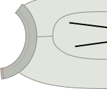

- - -
title: "Teagan T-shirt: Sewing Instructions"
- - -

## Stap 1: Sluit de schoudernaden

- Leg het voor- en achterpand op elkaar met [goede kanten op elkaar](/docs/sewing/good-sides-together). Leg de schoudernaden gelijk.
- Lock de schoudernaden of stik ze met een smalle (~2 mm) zigzagsteek aan de standaard naadwaarde.

<Note>
Optioneel: In een draaiknop kun je ervoor kiezen om de schoudernaden te versterken door duidelijk elastiek langs de naad aan de binnenkant te stikken. Op een T-shirt ondersteunen de schoudernaden het grootste gewicht van het kledingstuk. Versterking is niet vereist, maar het kan de schoudernaden niet na verloop van tijd uitrekken.
</Note>

## Stap 2: Zet de mouwen in

- Leg je aan elkaar bevestigde voor- en achterpand neer met de goede kant naar boven.
- Identificeer de voor- en achterkanten van elke mouw. (Dit is hoe je de linker mouw van rechts scheidt.) On your paper pattern piece, the front side of the sleeve is to the right.
- Leg een mouw bovenop de voor- en achterkant, met de goede kant naar beneden.
- Leg de bovenkant van de mouwkop gelijk met de schoudernaad. Zorg dat de voor- en achterkant van de mouw gelijk staan met de voor- en achterpanden van je shirt.
- Speld de mouw op z'n plaats langs het hele armsgat. Er is een beetje extra stof in de mouwkop, wat betekent dat de mouwkop iets langer is dan het armsgat. Verbeter het bovenste deel van de mouwkop tijdens het spelden.
- Stik/lock de gespelde mouw op z'n plaats.
- Herhaal voor de andere mouw.

## Step 3: Sew the neck finish

There are two options for the neck finish on Teagan: a knit band or knit binding. Knit band is what you typically see on store-bought T-shirts, whereas knit binding is the finish you'll find on the Aaron A-Tank. Directions for both are given here.

<Note>
Dit is de meest complexe stap in het maken van een T-shirt in Teagan, maar het vereist slechts een beetje praktijk. Maak je geen zorgen, het enige wat je hoeft te doen is een paar van deze maken en je zal binnen een tijdsbestek een pro zijn.
</Note>

### Option 1: knit band finish

#### Place (the start of) your knit band

- Fold your binding in half lengthwise (parallel to the longest side), and press.
- Put your T-shirt down with the back good side up, and place your band strip on top of it, lining up the raw edges of the band with the raw edge of the neck opening.
- Your band should start at the center back of the neck opening.
- Now shift your binding strip 1cm beyond your starting point. This little extra will guarantee we can join the two ends later.

#### Sew band in place

- Place your presser foot 3 cm along the knit band, so a 4 cm tail will be left unstitched. This will help us join the ends together later. Then, sew around the neck opening, stretching the band gently as you sew.

<Note>
  
This stretching is the trickiest part. Many online tutorials will tell you to simply start with a band slightly smaller than the neck opening, and stretch to fit. While an option, this does not account for differences in fabric stretch and elasticity, and can result in a floppy or puckered neck finish. Stretching to fit the neck opening by feel is something that takes a bit of practice, but is a good skill to build for better finishes long-term.
  
</Note>

- Stop sewing 3 cm before the end, leaving a tail like we did at the beginning.

#### Sew band ends together

Now it's time to sew the ends of our knit band together.
- Take the end of your knit band, and stretch it along the 3 cm separating it from the start point as you would while sewing. On the band, mark where the band reached the start point, or center back. Do the same for the other end.
- Fold your T-shirt in whatever way makes it more easy for you to place both band ends with good sides together, aligning the marks. Sew them together at the marks.
 - You should now have a joined knit band.

<Note>

6 cm is not much, but should be enough to get both edges comfortably under your sewing machine to sew them together.

</Note>

- Now that your band ends are joined together, it’s time to finish the last 6 cm, by stretching and sewing down the band as you did for the rest.

Hurray! You've finished the trickiest part! Optionally, you can secure the raw edges by stitching them down to the T-shirt fabric, just inside the knit band with a sig-zag or coverlock stitch. This is not required, but it is a detail that you'll see on many ready-to-wear T-shirts, and it can help your neck band lie flat.

### Option 2: knit binding finish

<Tip>

Een uitgebreidere manier om te springen is te vinden in de [Aaron Instuctions](/docs/patterns/aaron/instructies).

</Tip>

#### Place (the start of) your binding

- Put your T-shirt down with the back good side up, and place your binding strip on top of it with the good side down (as in, good sides together). Your binding should start at the center back of the neck opening.
- Align the long edge of your strip with the edge of your fabric so the strip lies on top of the fabric (not in the opening). Place the corner on your starting point.
- Now shift your binding strip 1cm beyond your starting point. This little extra will guarantee we can join the two ends later.

#### Sew binding in place

- Place your presser foot 3 cm along the knit binding, so a 3 cm tail will be left unstitched. This will help us join the ends of the binding later. Then, sew 1.5 cm from the edge around the neck opening, stretching the binding gently as you sew.  (Note: this is not the standard seam allowance.)
- Stop sewing 3 cm before the end, leaving a tail like we did at the beginning.

#### Mark and sew binding ends

- With about 6cm left to go before we complete our circle, it’s time to sew the ends of the binding together.
- Take one of the edges, and stretch it along the 3cm separating it from the start point as you would while sewing. On the binding, mark where the binding reached the start point. Do the same for the other end.
- Fold your T-shirt in whatever way makes it more easy for you to place both binding ends with good sides together, aligning the marks. Sew them together at the marks.

<Note>

6 cm is not much, but should be enough to get both edges comfortably under your sewing machine to sew them together.

</Note>

- Now that your binding ends are joined together, it’s time to finish the last 6cm of binding. Sew it down, staying 1.5cm from the edge as you did before.

#### Fold knit binding to the back and sew down

- Fold your binding fabric around the fabric of your T-shirt to the back. This is how we’ll sew it down.
- While the fabric is folded double at the front (hiding the fabric edge in the process), there’s no need for that at the back. We will merely trim back the edge later, given that knit doesn’t ravel. If we were to fold back the fabric at the back too, it would only add bulk.
- Now you’ll sew the binding down. From the right side of your fabric, sew along the inner edge of your binding (furthest from the edge), making sure to catch the binding at the back in the process.

<Note>
If you have a coverlock machine, that would be perfect for this seam.
</Note>

- You’ll have to, once again, stretch your binding a bit while doing this. But this time, there’s an extra caveat to look out for.

<Note>

##### Beware of the uneven feed

As your feed your binding through your sewing machine, the feed dogs will pull the bottom layer (back of your binding) forward.

In a perfect world, all layers will follow smoothly. But more often than not, the top layer (front of your binding) tends to lag behind a bit. This causes your binding to not neatly fold around the edge of the fabric, but make ugly wrinkles.

So watch out for this, and if you see it happening, stretch the under layer a bit extra to compensate.
On the inside of your T-shirt, trim back the knit binding just outside of your seam to finish up.

</Note>

## Stap 4: Sluit de zijnaden en mouwen

- Fold your Teagan T-shirt double at the shoulder seams with good sides together.
- Align the side seams and sleeves and pin them together.
- Serge/sew the side seam and continue sewing to close the arms all the way to the sleeve hem.
- Repeat on the other side.

## Stap 5: Werk de zoom en mouwen af

- Fold the hem upwards, to the inside, and sew it down. If you have a coverlock, use it. If not, use a twin needle or zig-zag stitch to keep the seam stretchable.
- Repeat for the hem on each sleeve.

<Note>

##### Fold only once, to avoid bulk

Knitwear doesn’t ravel, so you can simply fold this over once and sew it down, then neatly trim back the fabric.

</Note>
