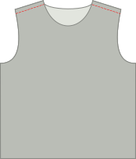
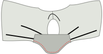
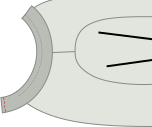
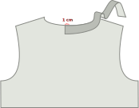
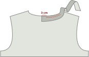
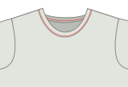
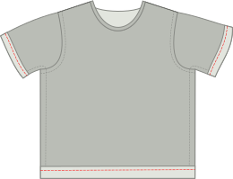

## Крок 1: Зшийте плечові шви

- Покладіть передню і задню частини один на одного [лицьовими сторонами разом](/docs/sewing/good-sides-together). Вирівняйте плечові шви.
- Плечові шви розпрасувати або прострочити вузькою (~2 мм) зигзагоподібною строчкою зі стандартним припуском на шви.

<Note>
За бажанням: у драпірованому трикотажі ви можете посилити плечові шви, вшивши прозору резинку вздовж шва з внутрішньої сторони. На футболці плечові шви приймають на себе більшу частину ваги одягу. Підкріплення не є обов'язковим, але воно може вберегти плечові шви від розтягування з часом.
</Note>

## Крок 2: Вставте рукава

- Покладіть тепер прикріплені передню і задню частини лицьовою стороною догори.
- Визначте передню і задню сторони кожного з рукавів. (Так ви відокремлюєте лівий рукав від правого). На вашій паперовій викрійці лицьовий бік рукава знаходиться праворуч.
- Покладіть рукав зверху на перед і спинку лицьовим боком донизу.
- Вирівняйте верхню частину рукава з плечовим швом. Переконайтеся, що передня і задня частини рукава суміщені з передньою і задньою частинами сорочки.
- Приколіть рукав по всій проймі. Тут трохи полегшений рукав, що означає, що горловина рукава трохи довша за пройму. Під час приколювання полегшіть верхню частину головки рукава.
- Пришийте/застрочіть приколотий рукав на місце.
- Повторіть для другого рукава.

## Крок 3: Пришийте горловину

У Teagan є два варіанти оздоблення горловини: трикотажна стрічка або трикотажна палітурка. Трикотажна стрічка - це те, що ви зазвичай бачите на куплених у магазині футболках, тоді як трикотажна палітурка - це обробка, яку ви знайдете на Aaron A-Tank. Схему проїзду до обох місць можна знайти тут.

<Note>
Це найскладніший крок у виготовленні футболки Teagan, але він вимагає лише трохи практики. Не хвилюйтеся, все, що вам потрібно зробити - це зробити пару таких, і ви станете професіоналом в найкоротші терміни.
</Note>

### Варіант 1: оздоблення трикотажною стрічкою

#### Помістіть (початок) трикотажну стрічку

- Складіть палітурку навпіл уздовж (паралельно найдовшій стороні) і притисніть.
- Покладіть футболку виворітним боком догори, а зверху накладіть на неї стрічку, сумістивши необроблені краї стрічки з необробленим краєм отвору для горловини.
- Ваша стрічка повинна починатися по центру задньої частини горловини.
- Тепер змістіть смужку для палітурки на 1 см від початкової точки. Ця невелика надбавка гарантує, що ми зможемо з'єднати кінці з кінцями пізніше.

#### Пришийте стрічку на місце

- Просуньте притискну лапку на 3 см уздовж трикотажної стрічки, щоб залишився непрошитий хвостик довжиною 4 см. Це допоможе нам згодом з'єднати кінці з кінцями. Потім пришийте навколо отвору для горловини, обережно розтягуючи стрічку під час шиття.

<Note>
  
Це розтягування - найскладніша частина. У багатьох онлайн-уроках ви можете просто почати зі стрічки трохи меншого розміру, ніж отвір для шиї, і розтягнути її до потрібного розміру. Хоча це і варіант, але він не враховує різницю в розтяжності та еластичності тканини, що може призвести до того, що горловина вийде зморшкуватою або зібганою. Розтягування на дотик, щоб підігнати виріз горловини, вимагає певної практики, але це хороший навик, який можна розвинути для кращої обробки в довгостроковій перспективі.
  
</Note>

- За 3 см до кінця припиніть шиття, залишивши хвостик, як ми робили на початку.

#### Зшийте кінці стрічки разом

Тепер настав час зшити кінці нашої трикотажної стрічки разом.
- Візьміть кінець трикотажної стрічки і розтягніть її вздовж 3 см, що відокремлюють її від початкової точки, як під час шиття. На стрічці відмітьте місце, де стрічка досягла початкової точки, або центр назад. Зробіть те саме з іншого боку.
- Складіть футболку так, щоб вам було легше розмістити обидва кінці стрічки лицьовими сторонами один до одного, вирівнявши мітки. Зшийте їх разом по мітках.
 - Тепер у вас повинна вийти з'єднана трикотажна смуга.

<Note>

6 см - це небагато, але цього має бути достатньо, щоб обидва краї зручно розташувати під швейною машинкою і зшити їх разом.

</Note>

- Тепер, коли кінці стрічки з'єднані разом, настав час закінчити останні 6 см, розтягуючи і пришиваючи стрічку так само, як ви робили це з рештою.

Ура! Ви закінчили найскладнішу частину! За бажанням ви можете закріпити необроблені краї, пришивши їх до тканини футболки, безпосередньо всередині трикотажної стрічки, швом "зигзаг" або потайним швом. Це не обов'язково, але це деталь, яку ви побачите на багатьох готових футболках, і вона може допомогти шийній стрічці лежати рівно.

### Варіант 2: оздоблення трикотажної палітурки

<Tip>

Більш детальну інструкцію по в'язанню можна знайти в [Інструкції Аарона] (/docs/patterns/aaron/instructions).

</Tip>

#### Розмістіть (початок) бейки

- Покладіть футболку лицьовою стороною догори, а зверху покладіть смужку для скріплення лицьовою стороною донизу (тобто лицьовими сторонами разом). Зв'язування слід починати від центру горловини ззаду.
- Вирівняйте край бейки з краєм тканини так, щоб бейка лежала на тканині (не в проймі/горловині). Зрівняйте кут бейки з початковою точкою.
- Тепер змістіть смужку для палітурки на 1 см від початкової точки. Ця невелика надбавка гарантує, що ми зможемо з'єднати кінці з кінцями пізніше.

#### Пришийте бейку

- Розмістіть притискну лапку на 3 см уздовж в'язальної палітурки, таким чином, 3 см хвостик залишиться не прошитим. Це допоможе нам пізніше з'єднати кінці палітурки. Потім прошийте 1,5 см від краю навколо отвору для горловини, обережно розтягуючи палітурку під час шиття.  (Примітка: це не стандартний припуск на шов).
- За 3 см до кінця припиніть шиття, залишивши хвостик, як ми робили на початку.

#### Розмітьте та зшийте кінці палітурки

- Коли до завершення нашого кола залишилося близько 6 см, час зшити кінці палітурки разом.
- Візьміть один з країв і розтягніть його на 3 см, що відокремлюють його від початкової точки, як під час шиття. На палітурці відмітьте, де палітурка досягла початкової точки. Зробіть те саме з іншого боку.
- Складіть футболку так, щоб вам було легше покласти обидва кінці для зшивання лицьовими сторонами один до одного, сумістивши мітки. Зшийте їх разом по мітках.

<Note>

6 см - це небагато, але цього має бути достатньо, щоб обидва краї зручно розташувати під швейною машинкою і зшити їх разом.

</Note>

- Тепер, коли кінці палітурки з'єднані між собою, настав час закінчити останні 6 см палітурки. Пришийте його вниз, відступивши 1,5 см від краю, як ви робили раніше.

#### Відверніть трикотажну палітурку на виворітну сторону і пришийте

- Складіть палітурну тканину навколо тканини футболки на спинку. Ось так ми його пришиватимемо.
- У той час як спереду тканина складається вдвічі (ховаючи край тканини в процесі), ззаду в цьому немає необхідності. Пізніше ми просто обріжемо край, враховуючи, що трикотаж не збивається. Якби ми склали тканину ззаду, це лише додало б об'єму.
- Тепер ви пришиваєте палітурку. З правого боку тканини прошийте вздовж внутрішнього краю палітурки (найвіддаленішого від краю), не забуваючи при цьому захопити палітурку ззаду.

<Note>
Якщо у вас є оверлочна машина, вона ідеально підійде для цього шва.
</Note>

- Знову ж таки, при цьому вам доведеться трохи розтягнути палітурку. Але цього разу є додаткове застереження, на яке слід звернути увагу.

<Note>

##### Остерігайтеся нерівномірної подачі

Коли ви протягуєте палітурку через швейну машину, ниткопротягувачі тягнуть нижній шар (задній бік палітурки) вперед.

В ідеальному світі всі шари будуть слідувати одна за одною. Але найчастіше верхній шар (передня частина палітурки) має тенденцію трохи відставати. Це призводить до того, що палітурка не акуратно складається по краю тканини, а утворює некрасиві складки.

Тому слідкуйте за цим, і якщо ви бачите, що це відбувається, розтягніть нижній шар трохи більше, щоб компенсувати це.
На внутрішній стороні футболки обріжте трикотажну в'язку трохи далі від шва, щоб завершити роботу.

</Note>

## Крок 4: Зашийте бокові шви та рукави

- Складіть футболку Teagan вдвічі по плечових швах лицьовими сторонами разом.
- Вирівняйте бокові шви і рукави та приколіть їх разом.
- Виконайте боковий шов і продовжуйте шити, щоб закрити рукава до самого низу рукава.
- Повторіть з іншого боку.

## Крок 5: Закінчіть обробку подолу та рукавів

- Підверніть підгин догори, всередину, і пришийте його. Якщо у вас є коверлок, то використовуйте її. Якщо ні, використовуйте подвійну голку або зигзагоподібну строчку, щоб шов залишався еластичним.
- Повторіть для подолу кожного рукава.

<Note>

##### Складіть лише один раз, щоб уникнути об'єму

Трикотаж не збивається, тому ви можете просто скласти його один раз і зшити, а потім акуратно обрізати тканину назад.

</Note>
