Cette option contrôle la position horizontale du dessus du tête de manche.

<Tip>

Voir [comprendre la tête de manche](/docs/patterns/brian/options#understanding-the-sleevecap) pour un
en profondeur sur la façon dont le chapeau de manche est construit et l'influence des différentes options sur sa forme.

</Tip>

## Effet de cette option sur le motif

