<Note>

Text a bit dry for you? I try to make videos available as part of the pattern documentation.

In this particular case, there's a lot of video material available, but it was originally recorded for a previous version of this pattern. Still, good stuff.

</Note>

<YouTube id='PL1gv5yv3DoZOcmOJf6f0YWi522VXXv-mM' playlist />

<Note>

Many of the steps below are to be repeated for both trouser legs.

That is not always mentioned because life is short and continuously writing _Do not forget to do this for both trouser legs_ gets tired really soon.

</Note>

### Step 1: Baste the pleat lines

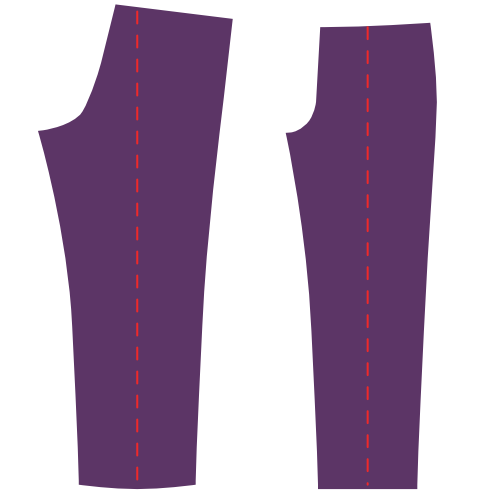

First thing to do is to  baste over the pleat line of your trouser legs. Do it on both front and back pieces for both legs.

### Step 2: Close the back darts and press

### Close the back darts

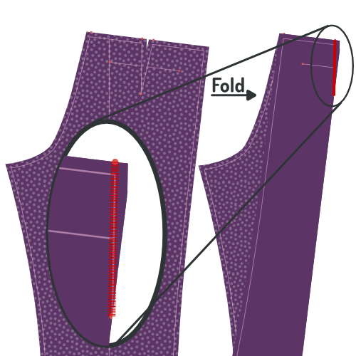

Fold piece 1 (back) double so that the notches of the dart on the waistband are aligned, and a sharp crease runs to the notch at the dart end. Feel free to briefly iron the crease, this will make it easier to sew the dart accurately.

Close the dart by sewing from the waistband down to the end of the dart.

Use a small stitch length, and let your stitch run completely to the end (and of) the dart, then backtrack making sure to veer into the seam allowance.

#### Press back darts to the side

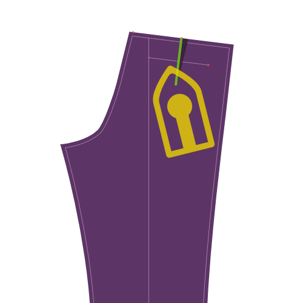

Press your back darts flat, folding the seam allowance to the side of your trousers.

### Step 3: Construct the back pockets

Construct the double welt pockets at the back of your trousers, including the pocket bag.

<Tip>

###### Double welt pockets

Constructing a double welt pocket is a technique that is used is different garments.
That is why I have branched it off into its own documentation page.

There's both written documentation and a video series that shows you how to do it, so even if you've never made welt pockets before, you'll be fine.

[To the welt pockets documentation](/docs/sewing/double-welt-pockets)

</Tip>

### Step 4: Optional: Trim your lining with pinking shears

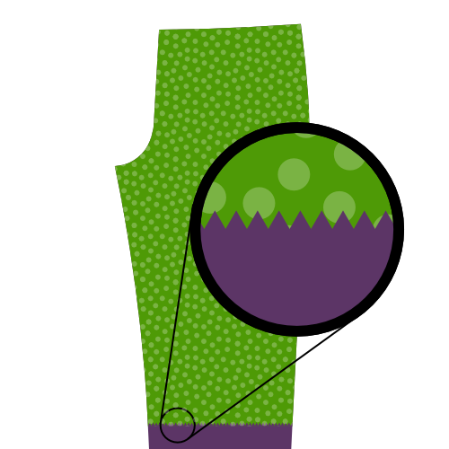

If you are going to line your trousers (it's optional), you'll need to finish the edge of your lining. To do so, trim the edge of the lining with pinking shears.

Note that you only need to do this for those edges of your lining that are not caught in a seam. In other words, only the bottom edge of your lining.

<Tip>

If you don't have pinking shears, you can apply another finish like a zig-zag stitch, or use a serger. However, pinking shears are best for this scenario because they don't add any bulk, which is important because we want to avoid the edge of the lining making a bump in your trousers.

</Tip>

### Step 5: Trim pieces for front pocket slant

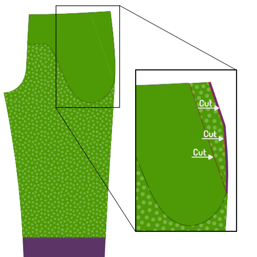

Align your front, lining and pocket bag on top of each other. Front and pocket back with their good side down, lining with the good side up.

Pin them together to make sure they don't move. Do so away from the pocket slant to not hinder yourself later.

Trim back the pocket bag (it should lie on top) exactly on the pocket slant line (marked on the pattern).

Now trim back the front piece (it should lie on the bottom) 3cm outwards from the slant line, parallel to it.

Finally, trim back your lining so that it stops 0.5 cm short of reaching the edge of your front.

<Tip>

The lining is trimmed a bit shorter so that when it is folded back, it does not show. But it's really not all that important to get it exactly 0.5 cm shorter.

</Tip>

### Step 6: Fold back and sew front pocket slant

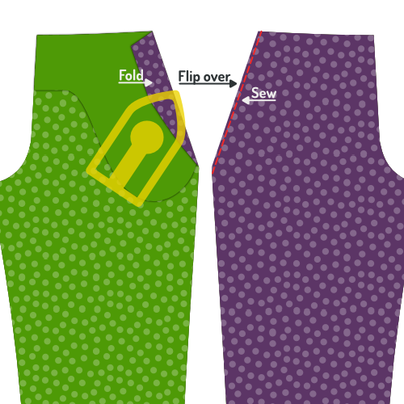

Fold back your lining and front piece along the pocket slant line (and thus along the trimmed edge of the pocket bag. Pin this down and press.

You are going to sew along the pocket slant, but make sure to flip everything over first so you can sew from the good side.

Topstitch a 0.5 cm from the fold, making sure to keep it parallel and not stretch your fabric.

<Tip>

This topstitching will always be on show, so make sure to match the thread color and make it pretty.

</Tip>

<Tip>

To prevent your pockets from bagging out, you can place a piece of non-stretching ribbon in between the fold. When stitching, you will also catch this ribbon, preventing the pocket to bag out.

</Tip>

### Step 7: Finish edge inside front pocket

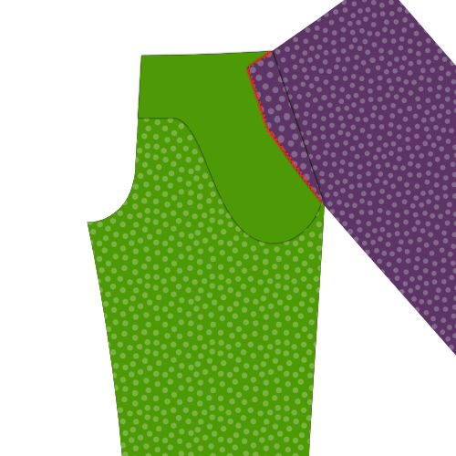

Fold away the main part of the front piece, so you can place the lining, pocket bag and folded edge of the front piece flat.

Zig-zag the edge of the folded-back front piece to finish it and secure it to the pocket back and lining.

### Step 8: Press side pocket

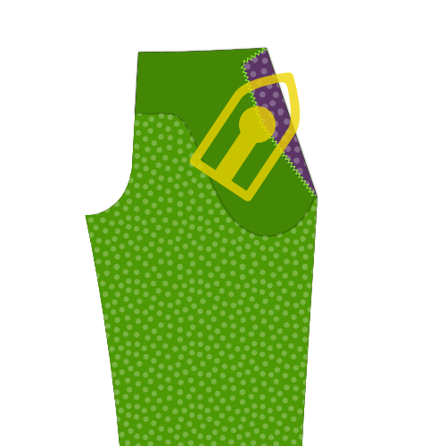

When you're done, place front piece, lining and pocket bag flat, and give it a good press.

<Tip>

This might be a good time to remind you that every step up to this point had to be done for both legs.

It's just a friendly reminder, the next steps need to be done for both legs too.

</Tip>

### Step 9: Attach side piece to pocket bag

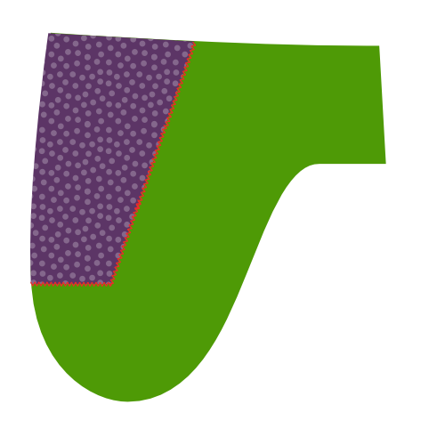

Place the other half of the pocket bag with the good side down, and align the side piece on it with the good side up.

Sew a zig-zag stitch along the edge of the side piece to finish it and attach it to the pocket bag.

### Step 10: Close the pocket bag

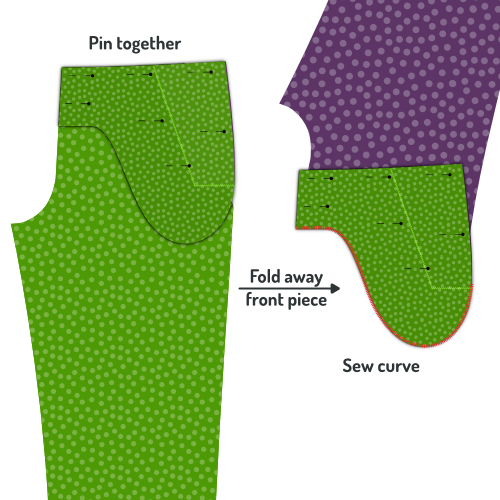

Place the front piece, lining and pocket bag with the pocket bag up.

Align the second pocket bag with the attached side piece facing down.

Pin all pieces together making sure to stay about the bottom curve of the pocket bag.

When everything is pinned together, fold away the front piece and lining, and close the bottom curve of the pocket bag.

<Tip>

Sew to bottom curve of the pocket bag up until the point where it reached the side piece

You can finish the pocket bag in a number of ways, including:

- Serge the sides together
- Finish the edge with bias tape
- Sew the sides together and finish the edge with a zig-zag stitch

</Tip>

### Step 11: Press the front pocket

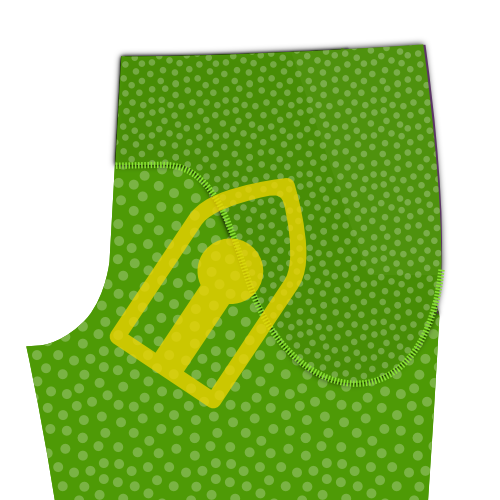

Put everything flat with the front piece at the bottom, and give it a good press.

### Step 12: Pin front pocket in place

Pin the pocket down to the front piece along the slant and the edges of the pocket bag.
This will prevent it from shifting around while we continue to work on our trousers.

### Step 13: Finish the side edges

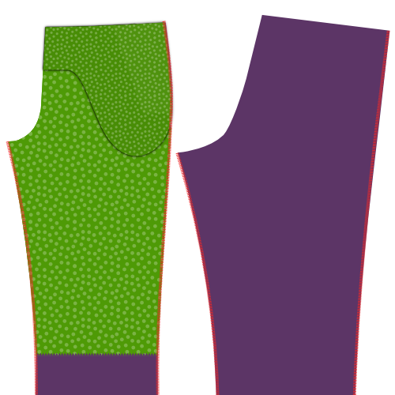

Before we are going to sew the side seams, finish the side edges by serging or running a zig-zag stitch along the sides of your front and back pieces, making sure to stay within the foreseen seam allowance.

<Tip>

Make sure to include the lining and pocket bag edges, as this will prevent things from shifting around when we sew the side seams.

</Tip>

### Step 14: Sew the side seams

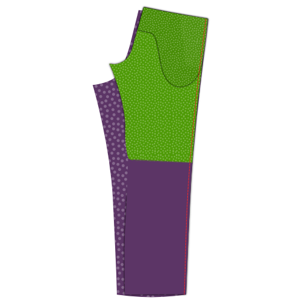

Place the front and back of each leg on top of each other, with the good sides together.

Align the side seam, more precisely the side seam on the outside, where there is no crotch curve.

<Tip>

You can pin the pieces together to make sure things stay in place while sewing this lengthy seam.

</Tip>

Sew the seam, starting from the waistband along the entire side of your trousers.

### Step 15: Press open seam allowance

Press open the seam allowance along the side seams. Do so from the back, and repeat from the good side of the fabric.

Take your time, making sure to use enough heat, but not too much. Use steam or spray on water for best effect.

<Tip>

A nice flat side seam looks great, so take your time to get it right.

</Tip>

### Step 16: Sew fly shield to fly piece

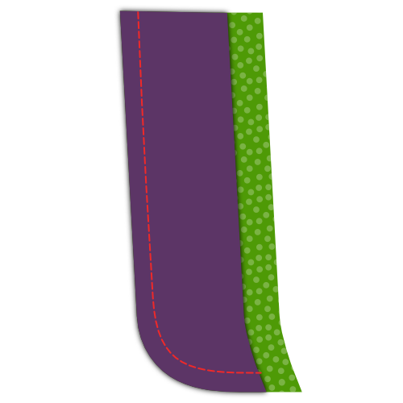

Place your fly piece on the fly shield with the good sides together, and align the edge with the biggest curve.

Sew along the curved edge, taking account the standard 1cm seam allowance, to join the two pieces together.

<Tip>

If your lining has any stretch in it at all, try to stretch it out a bit while you sew the curve. This will make it easier to get the lining to lie flat without wrinkles later on.

</Tip>

### Step 17: Press the fly shield

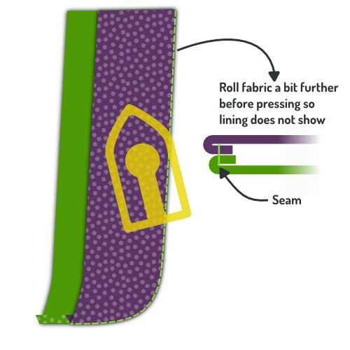

<Tip>

Before pressing down your fly piece, make sure to roll the seam a little bit so that your trouser lining fabric sits a bit further, and the lining starts only about 2mm from the edge. This will prevent the lining from peeking out at the edge.

</Tip>

After you have sewed fly piece and fly shield together, turn them inside out and press the seam you just made.

### Step 18: Pin zip to right front piece

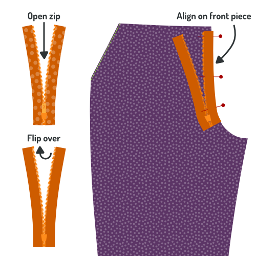

<Tip>

Steps 18 to 21 all lead up to a single row of stitching that will sew your zip to the front, while attaching the fly piece and fly shield in one go.

This is the hardest seam to do in the entire construction process, so I'm taking my time to explain and illustrate this before you start sewing.

</Tip>

Place your front piece for the right leg with the good side up. So that lining and front pocket bag sit underneath and lie flat.

Take your zip and open it (unzip it). Now turn it over so that it sits with the good side down. In other words, with the zipper puller down.

Align your zip with the crotch seam as shown in the illustration. Take the following into account:

- The end of your zip should sit at the top of your trousers where your waistband will start. However, make sure to remember that there is seam allowance there, so don't align it with the top of the front piece, but subtract 1cm seam allowance.
- Align the zip with the crotch seam. Do not mind the edge of the zip, as they come in different widths. Instead, make sure that you can sew next to the teeth of the zip within the seam allowance of the front piece.

Pin the zip in place with a few pins perpendicular to your zip (as shown). In other words, don't pin along the zip, but across the zip.

<Tip>

If you're unsure about the placement of your zip, put it as close to the edge as possible. Doing so will only mean your zip is tucked away a bit further under the fly, so that it certainly is not on show.

</Tip>

### Step 19: Pin fly shield to zip

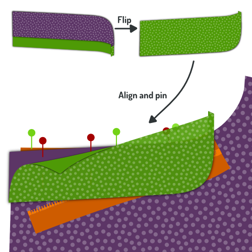

Take the fly shield/fly piece that you assembled in step 16 & 17, and place it with the fabric facing downward, and the lining upward.

Flip aside the top lining layer, and align the slightly curved edge of the fabric (where it is not sewn to the lining) with the edge of the fabric of your front piece.

<Tip>

For clarity, what side of the fly shield that should be facing up is shown in the top part of the illustration, at a smaller scale.

</Tip>

Pin this layer in place with a few pins perpendicular to your zip (as shown in red). Make sure you catch all layers underneath, including the zip. This way, you can remove your pins from the step before (shown in green) when done.

<Tip>

If you're comfortable holding all this in place, you can let the lining fall back and pin everything together as shown in the next step. That's somewhat faster, but more prone to errors as things can shift around easier.

</Tip>

### Step 20: Pin fly shield in place along zip

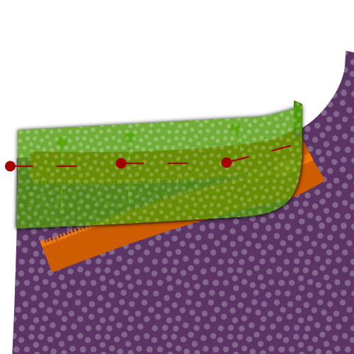

Let the lining fall back in place, and now pin all layers together along the zip.

When you are done, remove your earlier perpendicular pins.

### Step 21: Fold over fly shield and pin down

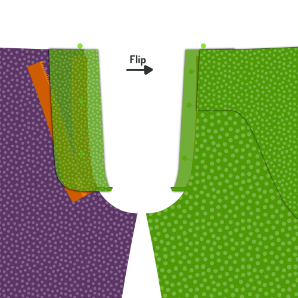
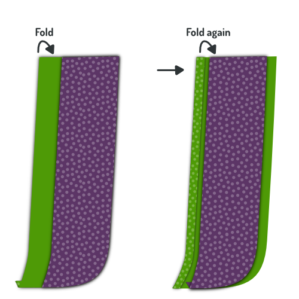

Flip everything over so that your fly shield lies at the bottom.

Fold the lining of the fly shield around the fly, front piece and fly piece, making sure to double-fold it so the raw edge is hidden inside.

Pin this down, and remove your previous pins.

### Step 22: Sew fly in place along zip

Now you can sew along the double folded fly piece. This will fix the front, zip, fly shield and fly piece all in place.

<Tip>

You will be sewing along your zip, so make sure to install your zipper foot for this.

</Tip>

### Step 23: Fold back fly and press

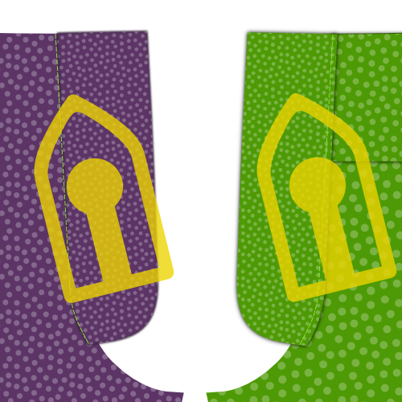

When you're done, fold back the fly so that it extends from the front piece, and give it a thorough press from the back. And a gentle press from the front.

### Step 24: Apply bias tape to second fly piece and press

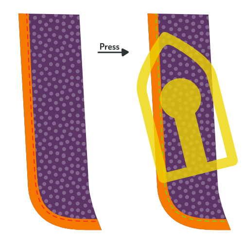

Apply bias tape to the edge with the large curve of your second fly piece.

Press the finished edge flat when you're done.

<Tip>

Bias tape is a way to finish a seam. If you are not sure what it is or how to apply it, let me know.

</Tip>

### Step 25: Pin and sew fly piece to crotch seam

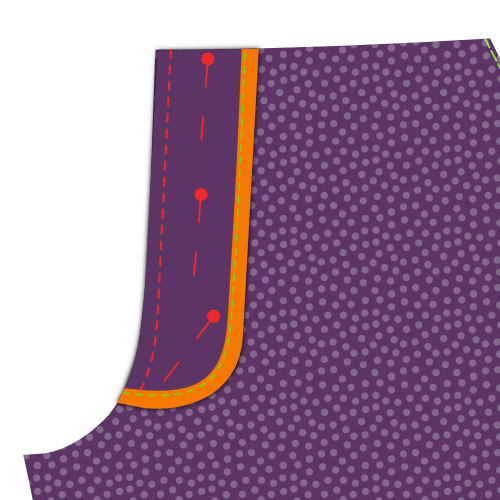

Place the left leg with the good side up. Place the second fly piece on top with the good side down, aligning the unfinished seam with the crotch seam.

Pin the fly piece in place, then sew it in place along the crotch seam.

<Tip>

When you sew this in place, make sure to catch the front lining.

</Tip>

Press the finished edge flat when you're done.

### Step 26: Roll the fly piece to the back, and press the seam

Fold the fly piece to the back. Before you press, make sure to roll the seam a bit backwards so that the front of the trousers sits a little further than the fly piece.

This way, the seam or fly piece will not show from the front.

Give it a good press from the back.

### Step 27: Pin and sew zip to fly piece

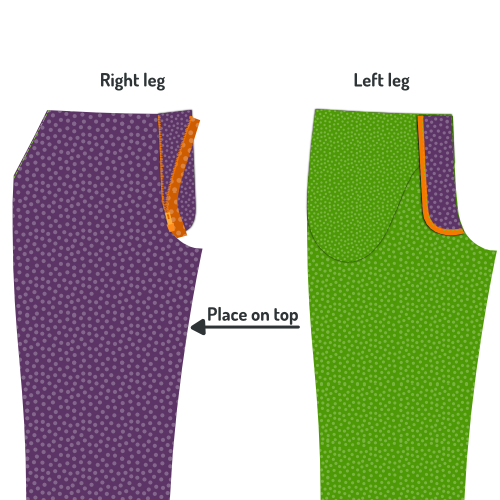
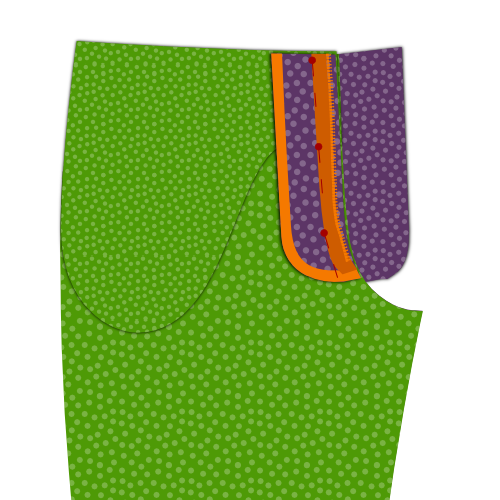

Place the right leg down with the good side up. Place the leg on top of it with the good side down.

With the crotch seams aligned, pin the zip along the edge of the fly piece with the good side of the zip down.

Make sure to pin the fly only to the fly piece. Not to any other layers underneath.

<Tip>

I find it's easier to pin the zip through all layers, and then when it's secure in place add extra pins that pin it to the fly piece only. When that's done, you can remove the pins that go through all layers.

</Tip>

Last but not least, sew along the zip with your zipper foot to attach it to the fly piece.

<Tip>

When aligning the zip, make sure to take the following into account:

- The zip should be placed with the good side down
- The zip should sit a bit back from the edge of your fly piece
- Make sure to align the top of the zip with the other zip half on the right leg

</Tip>

### Step 28: Zig-zag the zip edge to the fly piece

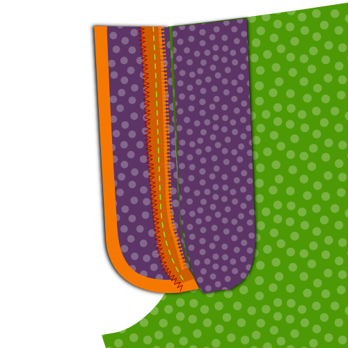

With the fly in place, run a zig-zag stitch along the edge of the zip to secure it to the fly piece.

### Step 29: Bar-tack both fly pieces together

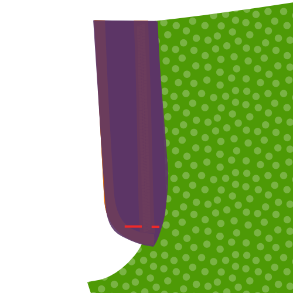

Place both fly pieces together, and move the front pieces out of the way.

Use a bar-tack to join them together at the bottom of the zip. Sew on both edges of the zip, and get as close to the zip as you can.

<Tip>

If your zip is too long, you can trim it below the bar-tacks.

</Tip>

### Step 30: Join crotch seam

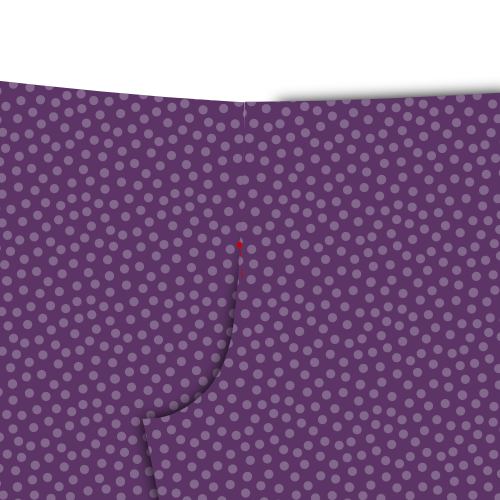
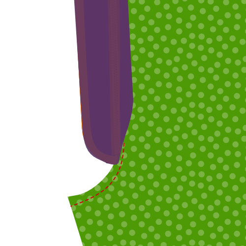

Place both fronts with the good sides up. They are now joined by the fly.

Make sure the fly is neatly tucked under, and pin together both fronts at the bottom of the fly, where you bar-tacked earlier. Make sure the pin is aligned to the fold of your front.

Fold the fronts with the good sides together, and pin them together along the crotch.

You'll need to get the fly shields out of the way, so if you've pinned through all layers before, remove that pin now, making sure to replace it with a horizontal pin. This will tell you how far to sew.

Sew the crotch seam, starting at the cross-seam point, and going up to your horizontal pin.

<Tip>

I find this step hard to explain, and hard to illustrate. I hope it will make sense when you're looking at your fly. If not, check the video instructions.

</Tip>

### Step 31: Pin fly closed and baste fly curve

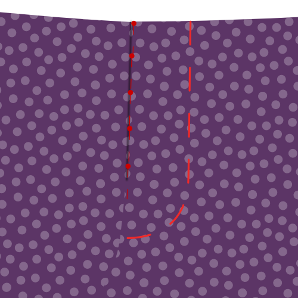

Close the fly, and pin the fronts together making sure the fly is neatly tucked away.

We will be topstitching the fly curve next, and it's a good idea to baste it first.

You should start a bit above your earlier bar tack, and make sure you catch only the fly shield of the left leg.

Curve upwards toward the edge of the fly shield, and then proceed in parallel with the zip.

### Step 32: Topstitch the fly curve

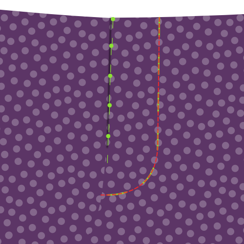

Now topstitch your fly curve, using your basting as a guide.

When doing so, you will be locking your front, fly piece, pocket bag and lining all together.

### Step 33: Pin together the inner leg seam

Close the legs with the good sides together, and pin together the inner leg seam. Start at the cross seam point and work your way to the bottom of the legs.

Make sure to do this for both legs.

### Step 34: Sew the inner leg seams

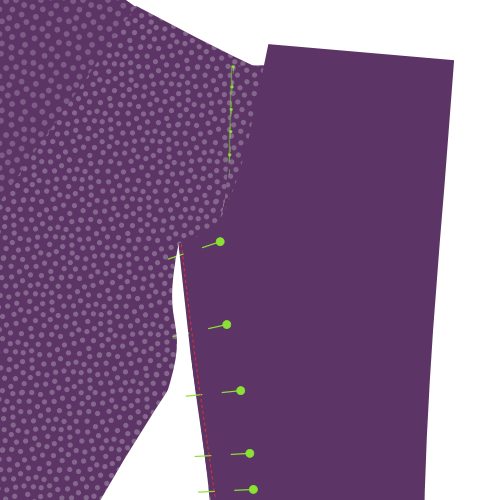

On both legs, sew the inner leg seams that you just pinned. Make sure to respect the seam allowance.

### Step 35: Press open seam allowance of the inner leg seam

Place your leg inside-out on your ironing board, and press open the seam allowance of the inner leg seam.

### Step 36: Close the cross-seam

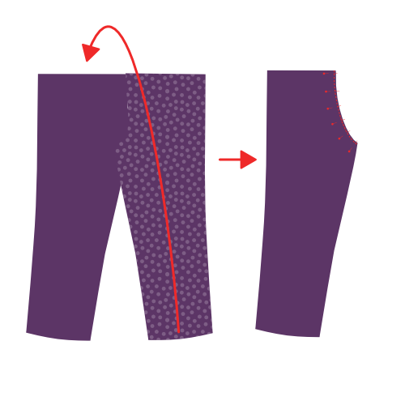

We are now going to close the cross-seam, from the bottom of your fly between your legs, up your bum to the center back of where you'll add the waistband later.

To do so, turn on of the legs inside out, so that that good side of the fabric is turned inside, and the bad side and lining sits on the outside.

The other leg should not be turned inside-out, but should just have its good side on the outside.

Now, put the leg that has the good side out (the normal leg) into the leg that has the bad side out (the inside-out leg).

This way, the good sides of both legs will sit against each other, and this is how you should sew the cross seam.

<Tip>

Be careful that your leg is not twisted inside the other leg. When in doubt, turn the inside-out leg outside-out again after you've pinned the cross-seam to make sure it's all ok.

</Tip>

Pin the cross-seam in place, and then sew it close, starting at the side of the fly, and making sure to respect the seam allowance.

When done, press the seam allowance open.

### Step 37: Press the leg crease in place

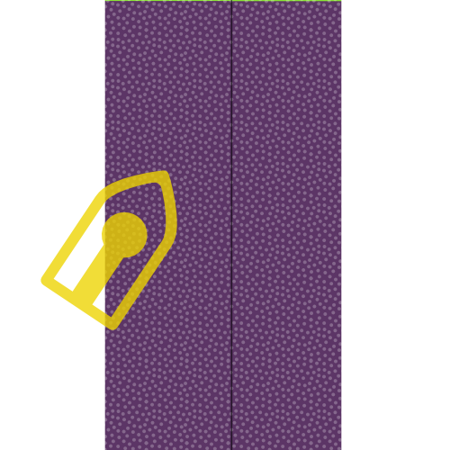

Turn your trousers good side out, and carefully place one leg on your ironing board so that it lies flat and folds exactly on the crease line your basted earlier.

When it's looking good, press the crease lines in your leg, front a back. Repeat for the other leg.

Give it a firm press because you want the pleats to still be there after you wash your trousers (so you can see where to press them again).

<Tip>

In the industry, chemicals are applied along the crease line before it is pressed together. Some tailors use some sort of wooden hammer and anvil to bang the fibers in a permanent crease.

</Tip>

Depending on your fabric, your crease might last longer, but ultimately, you can't expect to have a crease that can withstand a few washes without being reapplied.

<Tip>

Maybe this goes without saying, but there's also another option: Do not press the crease. This give your trousers a more informal look.

</Tip>

### Step 38: Fuse interfacing to waistband

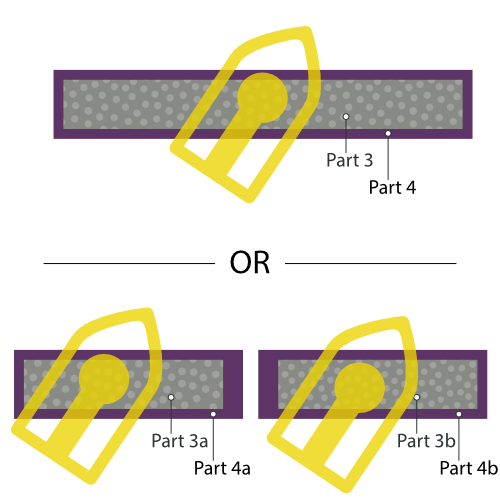

Fuse the waistband interfacing (Piece 3) to the waistband (Piece 4).

Align the interfacing in the middle of the waistband, and make sure to keep it nicely aligned as you fuse it in place with your iron.

### Step 39: Close waistband and waistband lining

Join the waistband (Pieces 4a and 4b) by sewing both pieces good sides together.

Join the waistband lining (Pieces 5a and 5b) by sewing both pieces good sides together.

### Step 40: Sew waistband to waistband lining

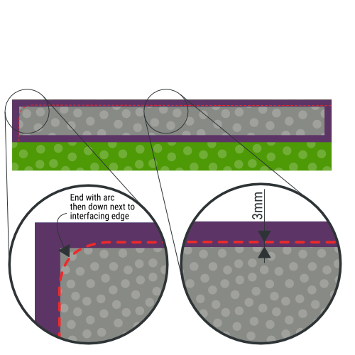

Place your waistband on the waistband lining, good sides together, so that the waistband interfacing is facing upwards.

Align the edge, and pin them together.

<Tip>

We are going to sew along the edge of the interfacing, but we will sew about 3mm or 1/8 inch from the actual interfacing edge. This will prevent the lining from being visible from the front later.

</Tip>

On one side of the waistband, end with a curve and then go down vertically along the edge of the waistband interfacing. Check the illustration to make sure you do it on the correct side.

### Step 41: Roll fabric around interfacing edge and press waistband

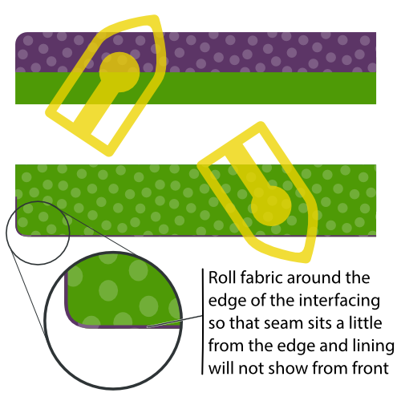

Before pressing the waistband, make sure to roll over the fabric around the edge of the interfacing.

Remember that in the previous step your sewed 3mm from the interfacing edge? You need to make the fold around the edge of the interfacing so that the actual seam sits 3mm more inwards.

This will make sure that our lining fabric is never on display from the front of your trousers.

### Step 42: Pin waistband to trousers

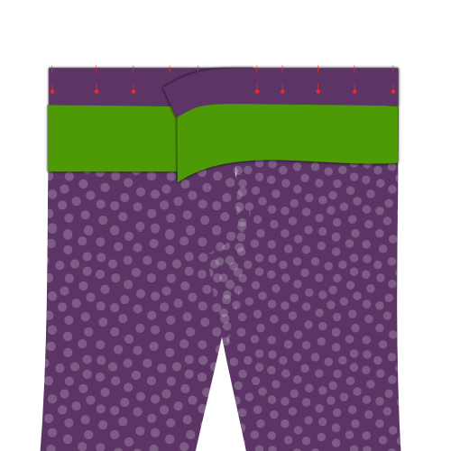

Pin the edge of your waistband (the side you did not sew the lining to) to the top of your trousers, good sides together.

Tuck the edge of your fly into the end of the waistband with the curved corner. On the other end of the waistband, it will be longer. In other words, your waistband will overlap here.

<Tip>

Be careful to match the vertical alignment of the waistband at the zip. With the zip closed, both sides of the waistband should sit at an equal height. This is easy to miss if you don't check it.

</Tip>

### Step 43: Sew waistband to trousers

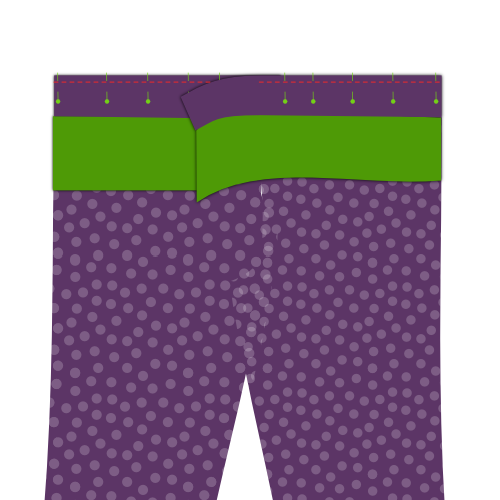

Now that the waistband is pinned to top of your trousers, sew it in place.

On the side with the curved corner, get as close to the edge as possible. On the other side, stop when you reach the edge of your fly.

### Step 44: Press waistband

Give your newly sewn seam a good press. Do not press the seam open, instead press it towards the top (put both trousers and waistband seam allowance in the waistband).

### Step 45: Prepare the belt loops

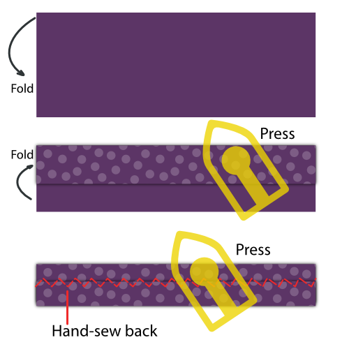

The belt loops are a part of your trousers where you can let your creativity run free. There's load of different ways to make and shape belt loops, not to mention that where you place them is also up to you.

That being said, here's what to do to make a standard belt loop:

Find the belt loop pattern part, a small rectangular piece of fabric. There should be 8 of them, and these will become your belt loops. For each of them, take these steps:

- Zig-zag (or serge) along the longest edges of the rectangle
- Fold one side back along the length, and press
- Fold the other side back, along the length, and press
- Hand sew along the back of the belt loop so that the folded sides stay in place, but the stitches do not show at the front
- Give it a final good press when you're done

<Tip>

While the width of your belt loops is not all that important, it does matter to make sure they are all the same width.

To make it easier to have a consistent width, you can fold your belt loops around a strip of cardboard, thick paper, or plastic of the desired belt loop width.

This strip can also help you with the hand sewing. Keep it in your belt loop and it will prevent your needle from piercing through all layers and your thread won't show at the front.

</Tip>

### Step 46: Attach the belt loops: Bottom

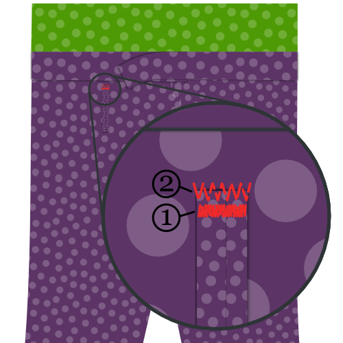

Attach the bottom of the belt loops to your trousers. Place them about 1.5 cm below your waistband, depending on your waistband width.

Place the good side of the belt loop down on the good side of the trousers (good sides together) and secure with a bar tack or narrow zig-zag.

Then, zig zag the edge of the belt loop to the trousers.

<Tip>

It is important to get the waistband lining out of the way while doing this. Make sure to attach the belt loops only to your trousers, and not to the waistband lining.

You have 8 belt loops, so you need to distribute them around your waistband. Have a look at an existing pair if you are uncertain how to do this.

Make sure to place belt hoops close to the center back, and not too close to each other at the front (for belt buckles).

</Tip>

### Step 47: Waistband facing

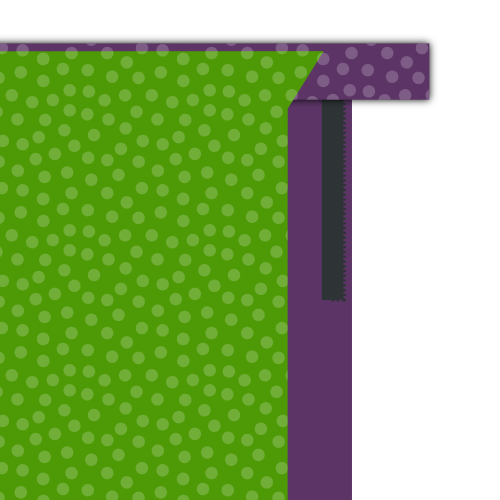

The waistband facing needs to be cut out and attached to your waistband.

This will be a lot simpler to understand if you have a look at the relevant video:

@[youtube](https://www.youtube.com/embed/8dLOuOtb18U?list=PL1gv5yv3DoZOcmOJf6f0YWi522VXXv-mM)

### Step 48: Trim waistband seam allowance

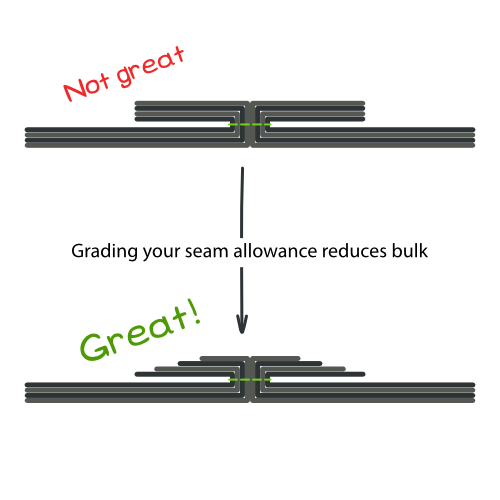

Before we finalize the waistband, we're going to trim back some of its seam allowance.

<Tip>

**About seam allowance grading**
When trimming back different layers of seam allowance, always try to cut them at different lengths so that the bulk is reduced in incremental steps.

The layer that lies closest to the good side of the garment should be the longest, so trim back from there.

Doing so will make it less likely that the outline of the seam allowance is visible from the good side.

</Tip>

### Step 49: Press and baste the waistband lining

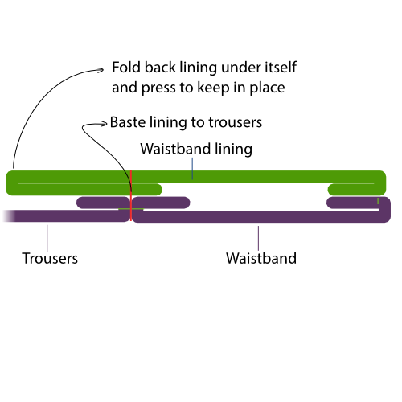

The waistband lining will be sewn from the front of the trousers on top of the seam that joins the waistband to the trousers (so called _stitch in the ditch_).

Doing so will catch the lining and secure it in place. However, since we'll be sewing this from the good side, the lining will lie beneath all other layers, and we won't see what we're doing.

That is why, to make sure it all lies clean and flat, we will first press and baste the lining.

The lining will extend downward from the top, and it needs to be folded back up under itself, so that it will get caught by the seam when we sew it in place later.

To make sure things look pretty, the distance between the top of our waistband and the (folded back) bottom edge of our lining should be constant. You can mark an even distance from the top of your trousers, and then pin back the lining at this line. Last but not least, press that fold in your lining.

When you're happy with how it looks, baste the lining in place just next to the seam joining the waistband and trousers.

<Tip>

It's best to baste next to the seam, and not actually in the seam. This will make it a lot easier to remove your basting when after we've sewn in the last step.

</Tip>

### Step 50: Sew the waistband lining in place

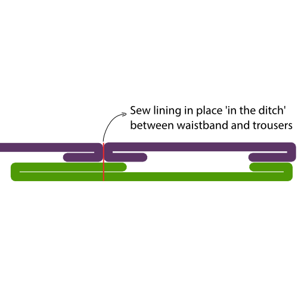

After you basted the waistband lining, sew it in place from the good side, exactly in the seam between the waistband and trousers.

### Step 51: Attach the belt loops: Top

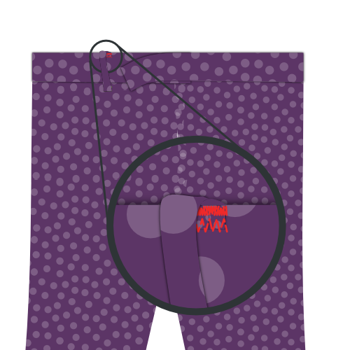

With your waistband and lining properly secured, it's time to attach the top of the belt loops.

Sew them in place just as you did at the bottom. That is, use a bar tack or close zig-zag to attach them, then zig-zag over the end to secure it.

<Tip>

Don't sew through the top of the belt loops. You'll have to work the foot of your sewing machine under the belt loop so you only sew the piece that is folded back.

Feel free to trim back the length of your belt loops after you bar tack and before you zig-zag the end of them, as they might be too long.

</Tip>

### Step 52: Finish the edge of the legs

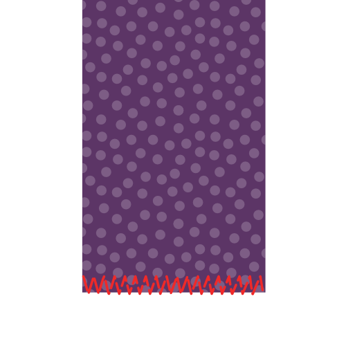

Before we hem the trousers, finish the raw edge of the legs with a zig-zag stitch or serger.

<Tip>

This would also be a good time to try on your trousers and mark exactly how long you want them to be after they are hemmed.

</Tip>

### Step 53: (Optional) Sew in a hem ribbon

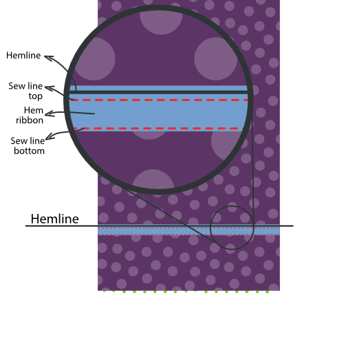

<Tip>

The hem ribbon is a ribbon that sits on the inside of your trouser hem. At the place your hem folds back, the fabric has to take a lot of abuse from bumping into shoes and other things.

Placing a ribbon inside the hem protects your fabric to some extent, and it is a neat finish.

</Tip>

Mark the hemline on your trousers (good side out).

Place the ribbon as shown in the illustration making sure that it extends a few mm above the hemline. Sew it in place all the way around the leg, making sure to sew close but not on the hemline.

### Step 54: Press the hem

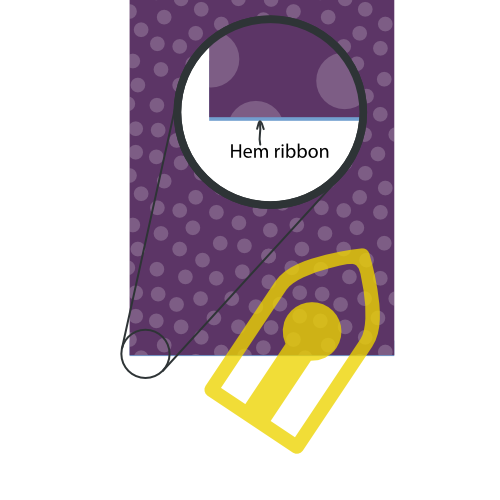

Fold back the trouser legs at the hemline, and press the hem.

<Tip>

If you've sewn in a hem ribbon, the ribbon will extend a few mm below the hem line, thereby protecting the fabric at the hem.

</Tip>

### Step 55: Hem the legs

With the hem neatly pressed, simply hand-sew the folded back part to the inside of your trousers.

<Tip>

Hemming is done by hand because it's important that the stitches don't show on the front. So when hand-sewing the hem, don't push your needle through the fabric, but just catch a few threads so your stitches don't show on the front

While there are machine alternatives, they aren't as neat (blind hem stitch) or probably not accessible to the home-sewer (industrial blind hem machine).

</Tip>

### Step 56: Trim, clean up, and press

Trim any loose threads or basting that remains, and give your trousers a good final press.
