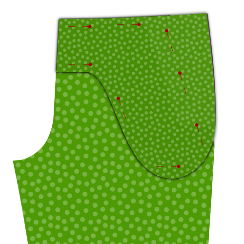
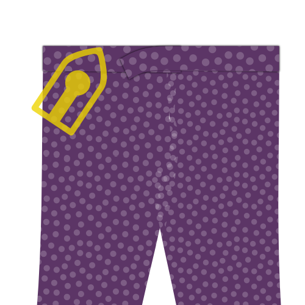

<Note>

¿Texto un poco seco para ti? Intento que los videos estén disponibles como parte de la documentación de patrones.

En este caso en particular, hay un montón de material de vídeo disponible, pero originalmente fue grabado para una versión anterior de este patrón. Aún así, buenas cosas.

</Note>

<YouTube id='PL1gv5yv3DoZOcmOJf6f0YWi522VXXv-mM' playlist />

<Note>

Muchos de los pasos siguientes deben repetirse para las patas de los pantalones.

Esto no siempre se menciona porque la vida es corta y escribir continuamente _No olvide hacer esto para ambas patas de pantalón_ se cansa muy pronto.

</Note>

### Paso 1: Baste las líneas de pliego

Lo primero que hay que hacer es golpear sobre la línea de pliegues de las piernas de los pantalones. Hazlo tanto en la parte delantera como en la parte trasera para ambas piernas.

### Paso 2: Cierra los dardos de atrás y presiona

### Cerrar los dardos traseros

Doble pieza 1 (atrás) doble para que las muñecas del dardo en la cintura estén alineadas, y un pliegue agudo corre hasta el extremo del dardo. Siéntase libre de planchar brevemente el pliegue, esto facilitará la costura del dardo.

Cierre el dardo cosiendo desde la cintura hasta el final del dardo.

Usa una pequeña longitud de banda y deja que tu stitch corra completamente hasta el final (y de) el dart luego hacer retroceso asegurándose de entrar en la costura.

#### Presiona los darts hacia el lado

Presione sus dardos de espalda planos, doblando la franquicia de costura al lado de sus pantalones.

### Paso 3: Construir los bolsillos traseros

Construye los bolsillos de doble soldadura en la parte posterior de tus pantalones, incluyendo la bolsa de bolsillo.

<Tip>

###### Bolsillos de doble soldadura

Construir un bolsillo de doble soldadura es una técnica que se utiliza es diferente de la ropa.
Por eso lo he sujetado en su propia página de documentación.

Hay documentación escrita y una serie de vídeo que muestra cómo hacerlo, así que incluso si nunca has hecho pockets de soldadura antes, estarás bien.

[A la documentación de pockets de soldadura](/docs/sewing/double-welt-pockets)

</Tip>

### Paso 4: Opcional: recorta tu revestimiento con fragmentos roscantes

Si vas a alinear tus pantalones (es opcional), necesitarás terminar el borde de tu forraje. Para ello, recorte el borde del revestimiento con esquiladas roscadas.

Tenga en cuenta que sólo necesita hacer esto para aquellos bordes de su revestimiento que no están atrapados en una costura. En otras palabras, sólo el borde inferior de su forraje.

<Tip>

Si no tienes escarchas pellizcas, puedes aplicar otro acabado como un zig-zag o usar un serger. Sin embargo, los fragmentos rosados son los mejores para este escenario porque no añaden ningún grueso, que es importante porque queremos evitar el borde del revestimiento haciendo un bache en sus pantalones.

</Tip>

### Paso 5: Recortar piezas para slant del bolsillo frontal

Alinear su bolso de frente, revestimiento y bolsa sobre el otro. Delante y de vuelta con su lado bueno hacia abajo, enganchando con el lado bueno hacia arriba.

Anclarlos juntos para asegurarse de que no se mueven. Hazlo lejos de la cortina de bolsillo para no obstaculizarse más tarde.

Recorre la bolsa de bolsa (debería estar en la parte superior) exactamente en la línea de bolsillo (marcada en el patrón).

Ahora recorta la parte frontal (debería tumbarse en la parte inferior) 3cm hacia afuera de la línea de esclerosis, paralela a ella.

Por último, recorte su forro para que se detenga 0,5 cm de distancia de alcanzar el borde de su frente.

<Tip>

El revestimiento es un poco más corto de modo que cuando se dobla, no se muestra. Pero realmente no es tan importante conseguir exactamente 0,5 cm más corto.

</Tip>

### Paso 6: Doble hacia atrás y coser slant del bolsillo frontal

Doblar el revestimiento y la parte delantera a lo largo de la línea delantera del bolsillo (y así a lo largo del borde trillado de la bolsa de bolsa. Anclar esto abajo y prensa.

Usted va a coser a lo largo del chorro de bolsillo, pero asegúrese de voltear todo primero para que usted pueda coser desde el lado bueno.

Topstitch a 0,5 cm del plegable, asegurándose de mantenerlo paralelo y no estirar su tejido.

<Tip>

Esta parte superior estará siempre en el espectáculo, así que asegúrese de coincidir con el color del hilo y hacerlo bonito.

</Tip>

<Tip>

Para evitar que sus bolsillos salgan corriendo, puede colocar una pieza de cinta sin estirar entre el pliegue. Cuando se une, también se capturará esta cinta, evitando que el bolsillo salga.

</Tip>

### Paso 7: Finalizar borde dentro del bolsillo frontal

Doblar la parte principal de la parte delantera para que pueda colocar la bolsa de bolsillo y el borde plegado de la pieza delantera.

Zig-zag el borde de la parte delantera plegada para terminarla y asegurarla al bolsillo de espalda y revestimiento.

### Paso 8: Bolsillo lateral

Cuando hayas terminado, coloca el pie delantero, revestimiento y bolsa de bolsillo plana, y dale una buena prensa.

<Tip>

Puede que sea un buen momento para recordarles que cada paso hasta este punto tenía que hacerse por ambas piernas.

Es sólo un recordatorio amistoso, los siguientes pasos deben hacerse también para ambas piernas.

</Tip>

### Paso 9: Adjuntar pieza lateral a bolsa de bolsa

Coloque la otra mitad de la bolsa de bolsa con el lado bueno, y alinear la pieza lateral con el lado bueno arriba.

Difunde un zig-zag a lo largo del borde de la pieza lateral para acabarla y sujetarla a la bolsa de bolsa.

### Paso 10: Cierre la bolsa de bolsillo

Colocar el bolso delantero con la bolsa de bolsillo arriba.

Alínea la segunda bolsa de bolsa con la pieza lateral fijada hacia abajo.

Anclar todas las piezas juntas, asegurándose de mantenerse sobre la curva inferior de la bolsa de bolsa.

Cuando todo se ancla juntos, dobla la parte delantera y el revestimiento y cierra la curva inferior de la bolsa de bolsa.

<Tip>

Cose a la curva inferior de la bolsa de bolsillo hasta el punto en que llegue a la pieza lateral

Puedes terminar la bolsa de bolsillo de varias formas, por ejemplo

- Une los lados con sarga
- Remata el borde con cinta al bies
- Cose los lados y remata el borde con una puntada en zig-zag

</Tip>

### Paso 11: Presione el bolsillo frontal

Pon todo plano con la parte frontal en la parte inferior, y dale una buena prensa.

### Paso 12: Anclar bolsillo frontal en su lugar

Anclar el bolsillo hasta la parte frontal a lo largo de la cortina y los bordes de la bolsa de bolsa. Esto le impedirá desplazarse mientras continuamos trabajando en nuestros pantalones.

### Paso 13: Termina los bordes laterales

Antes de que vayamos a coser costuras, terminar los bordes laterales sertando o ejecutando un zig-zag a lo largo de los lados de tu frente y de la parte trasera, The room was very clean and the staff were very friendly and helpful.

<Tip>

Asegúrese de incluir los bordes de la bolsa de forro y bolsa, ya que esto evitará que las cosas cambien cuando coser las costuras laterales.

</Tip>

### Paso 14: Aplasta las costuras del lado

Coloque la parte delantera y trasera de cada pierna encima de la otra, con los buenos lados juntos.

Alinear la costura lateral, más precisamente la costura lateral en el exterior, donde no hay curva de croupar.

<Tip>

Puedes fijar las piezas juntas para asegurar que las cosas permanezcan en su lugar mientras cores esta costura larga.

</Tip>

Marca la costura, partiendo de la cintura a lo largo de todo el lado de tus pantalones.

### Paso 15: Pulse abrir costura

Pulse abrir la costura a lo largo de las costuras laterales. Hágalo desde la espalda y repita desde el lado bueno del tejido.

Tómese su tiempo, asegúrese de usar suficiente calor, pero no demasiado. Usar vapor o spray en el agua para el mejor efecto.

<Tip>

Una costura lateral plana agradable se ve grande, así que tómate tu tiempo para hacerlo bien.

</Tip>

### Paso 16: Escudo de mosca para volar

Coloque su pieza de mosca en el escudo de mosca con los lados buenos juntos, y alinee el borde con la curva más grande.

Diviértete a lo largo del borde curvo, teniendo en cuenta la franquicia estándar de costura de 1 cm, para unir las dos piezas.

<Tip>

Si su revestimiento tiene algún estiramiento en él en absoluto, trate de estirarlo un poco mientras coser la curva. Esto hará más fácil conseguir que el revestimiento quede plano, sin enrollar más adelante.

</Tip>

### Paso 17: Presione el escudo de vuelo

<Tip>

Antes de apretar el tubo de la mosca, asegúrese de rodar un poco la costura para que su tela de revestimiento de pantalones se sienta un poco más, y el revestimiento sólo comienza alrededor de 2 mm del borde. Esto evitará que el revestimiento se repita en el borde.

</Tip>

Después de haber cosido la pieza de mosca y volar con el escudo, conviértalos dentro y presiona la costura que acabas de hacer.

### Paso 18: Anclar zip a la parte frontal derecha

<Tip>

Pasos 18 a 21 todos conducen a una sola fila de stitching que coser tu zip al frente, al unir la pieza de mosca y el escudo de mosca de una vez.

Esta es la costura más difícil de hacer en todo el proceso de construcción. así que me tomo mi tiempo para explicar e ilustrar esto antes de empezar a coser.

</Tip>

Coloque su pieza frontal para la pierna derecha con el buen lado arriba. Así que el revestimiento y la bolsa de bolsa delantera se sientan debajo y se mienten planos.

Tome su zip y ábrelo (descomprimirlo). Ahora dale la vuelta para que se sienta con el lado bueno. En otras palabras, con el zipper puller.

Alínea tu zip con la costura de cromo como se muestra en la ilustración. Tome en cuenta lo siguiente:

- El final de tu zip debería sentarse en la parte superior de tus pantalones donde comenzará tu cintura. Sin embargo, asegúrese de recordar que allí hay permisos de costura así que no lo alinee con la parte superior del piete delantero, pero reste 1 cm de costura permitida.
- Alinear el zip con la costura del croll. No te importa el borde del zip, ya que vienen en diferentes anchuras. En cambio, asegúrese de que puede coser junto a los dientes del zip dentro de la costura de la pieza delantera.

Anclar el zip en su lugar con unos pocos pines perpendiculares a su zip (como se muestra). En otras palabras, no se fije a lo largo del zip, sino a través del zip.

<Tip>

Si no está seguro de la colocación de su zip, póngalo lo más cerca posible del borde. Hacerlo sólo significará que su zip está un poco más lejos bajo la mosca, por lo que ciertamente no está en el espectáculo.

</Tip>

### Paso 19: Anclar escudo de mosca a zip

Toma la pieza de escudo/mosca que ensamblaste en el paso 16 & 17 y colócala con la tela que mira hacia abajo y con la defensa hacia arriba.

Invierte la capa de revestimiento superior, y alinear el borde ligeramente curvo de la tela (donde no se coser al revestimiento) con el borde de la tela de la pieza delantera.

<Tip>

Para mayor claridad, en la parte superior de la ilustración se muestra qué lado del escudo de moscas que debería estar enfrentado en una escala menor.

</Tip>

Anclar esta capa en su lugar con unos pocos pines perpendiculares a su zip (como se muestra en rojo). Asegúrate de atrapar todas las capas debajo, incluyendo el zip. De esta manera, puedes quitar tus pines del paso antes (mostrados en verde) cuando termines.

<Tip>

Si te sientes cómodo manteniendo todo esto en su lugar, puedes dejar que el revestimiento caiga y anclarlo todo, como se muestra en el siguiente paso. Eso es algo más rápido, pero más propenso a errores ya que las cosas pueden cambiar más fácilmente.

</Tip>

### Paso 20: Pin fly shield in place along zip

Dejemos que la caída del revestimiento vuelva a su lugar, y ahora coloque todas las capas juntas a lo largo del zip.

Cuando haya terminado, elimine sus pines perpendiculares anteriores.

### Paso 21: Plegar sobre escudo de mosca y anclar abajo

 

Invierte todo para que tu escudo de mosca esté en la parte inferior.

Doblar el revestimiento del escudo de mosca alrededor de la mosca, la parte delantera y el tubo de mosca Asegúrese de doblarlo para que el borde en bruto esté oculto en su interior.

Anclar esto hacia abajo, y remover tus pines anteriores.

### Paso 22: Vuelo Suelo en vuelo a lo largo de zip

Ahora puede coser a lo largo de la doble pieza de mosca doblada. Esto fijará el frente, la zip, el escudo de moscas y la pieza de mosca todo en su lugar.

<Tip>

Estarás cosiendo a lo largo de tu zip, así que asegúrate de instalar tu pie zipper para esto.

</Tip>

### Paso 23: Volar hacia atrás y presionar

Cuando hayas terminado, vuelve a doblar la mosca para que se extienda desde el pié delantero y dale una profunda pulsación desde la espalda. Y una prensa suave desde el frente.

### Paso 24: Aplicar cintura de sesgo a segunda pieza de mosca y presionar

Aplique la cintura del sesgo al borde con la curva grande de su segunda pieza de mosca.

Presione el borde acabado plano cuando haya terminado.

<Tip>

Bias tinta es una manera de terminar una costura. Si no está seguro de qué es o cómo aplicarlo, háganoslo saber.

</Tip>

### Paso 25: Pin y coser pieza de mosca a costura de cromo

Coloque la pierna izquierda con el buen lado arriba. Coloque la segunda pieza de mosca en la parte superior con el lado bueno hacia abajo, alineando la costura inacabada con la costura de cromo.

Encender la pieza de mosca en su lugar y coser a lo largo de la costura de los cruceros.

<Tip>

Cuando coja esto en su lugar, asegúrese de atrapar el revestimiento delantero.

</Tip>

Presione el borde acabado plano cuando haya terminado.

### Paso 26: Rolla la pieza de mosca hacia la espalda y presiona la costura

Doblar la pieza de mosca hacia la espalda. Antes de prensar, Asegúrese de rodar la costura un poco hacia atrás para que la parte delantera de los pantalones se sienta un poco más allá de la pieza de mosca.

De esta manera, la costura o la pieza de mosca no se mostrará desde el frente.

Démosle una buena prensa desde la espalda.

### Paso 27: Anclar y coser zip para volar

  

Coloque la pierna derecha abajo con el lado bueno arriba. Coloque la pierna encima de ella con el lado bueno abajo.

Con la alineación de las costuras de los cruces, fije el zip a lo largo del borde de la pieza de mosca con el lado bueno del zip hacia abajo.

Asegúrese de fijar el vuelo sólo al pedazo de la mosca. No a ninguna otra capa debajo.

<Tip>

Encuentro más fácil fijar el zip a través de todas las capas, y luego, cuando esté seguro en su lugar añada pines extra que lo anclan a la pieza de mosca solamente. Cuando haya terminado, puede quitar los pines que atraviesan todas las capas.

</Tip>

Por último, pero no menos importante, coser a lo largo del zip con el pie de zipper para sujetarlo a la pieza de mosca.

<Tip>

Al alinear la cremallera, asegúrate de tener en cuenta lo siguiente:

- La cremallera debe colocarse con el lado bueno hacia abajo
- La cremallera debe asentarse un poco más atrás del borde de la bragueta
- Asegúrate de alinear la parte superior de la cremallera con la otra mitad de la cremallera de la pierna derecha.

</Tip>

### Paso 28: Zig-zag el borde zip de la pieza de mosca

Con el vuelo en su lugar, ejecute un zig-zag a lo largo del borde del zip para asegurarlo hasta el pedazo de la mosca.

### Paso 29: Bar-tack ambas piezas de mosca juntos

Coloque ambas piezas de mosca juntas, y mueva las piezas delanteras del camino.

Usa un toque de barras para unirlos juntos en la parte inferior del zip. Divertirse en ambos bordes del zip, y acercarse lo más posible al zip que pueda.

<Tip>

Si tu zip es demasiado largo, puedes recortarlo debajo de la barra-ataques.

</Tip>

### Paso 30: Únete a coberturas

 

Coloque ambos frentes con los buenos lados arriba. Ahora se unen a la mosca.

Asegúrate de que la mosca esté bien cortada debajo de la mosca, y ponte los dos frentes en la parte inferior de la mosca, donde ya has tocado un bar-tacto antes. Asegúrese de que el pin está alineado al pliegue de la parte delantera.

Doblar los frentes con los lados buenos y colocarlos juntos a lo largo de la cosecha.

Necesitarás sacar los escudos de mosca, así que si has anclado a través de todas las capas antes, retire ese pin ahora, asegurándose de reemplazarlo con un pin horizontal. Esto le dirá lo lejos que hay que costar.

Sube la costura de los cruceros, comenzando en el punto cruzado y subiendo a tu pin horizontal.

<Tip>

Me resulta difícil explicar este paso, y difícil de ilustrar. Espero que tenga sentido cuando estés mirando a tu vuela. Si no es así, compruebe las instrucciones de vídeo.

</Tip>

### Paso 31: Encender la curva de mosca cerrada y bastar

Cierre la mosca y fije los frentes para asegurarse de que la mosca está bien escondida.

Vamos a subir la curva de mosca a continuación, y es una buena idea bastarla primero.

Deberías empezar un poco por encima de tu anterior tacha de barras y asegurarte de que solo coges el escudo de vuelo de la pierna izquierda.

Curva hacia arriba hacia el borde del escudo de moscas, y luego proceda en paralelo con el zip.

### Paso 32: Enlazar la curva de la mosca

Ahora enganche su curva de mosca, usando su fundición como guía.

Cuando lo haga, usted estará cerrando su frente, bolsa de bolsa de bolsillo y forrando juntos.

### Paso 33: Anclar juntos la costura interior de la pierna

Cierre las piernas con los lados buenos juntos, y agarrar juntos la costura interior de la pierna. Comience en el punto de la costura cruzada y trabaje hasta la parte inferior de las piernas.

Asegúrese de hacer esto para ambas piernas.

### Paso 34: Apagar las costuras internas de la pierna

En ambas piernas, coser las costuras internas de la pierna que acabas de anclar. Asegúrese de respetar la franquicia de costura.

### Paso 35: Presione la costura abierta de la costura interior de la pierna

Coloque su pierna dentro de su tabla de planchar y presione Abrir la costura de la costura de la costura interior.

### Paso 36: Cierra la costura cruzada

Ahora vamos a cerrar la travesía desde la parte inferior de la mosca entre las piernas, arriba de tu álbum hacia el centro de donde vas a añadir la cintura más tarde.

Para ello, enciende las piernas adentro hacia afuera, para que el lado bueno del tejido esté girado dentro, y el lado malo y el revestimiento se sienta en el exterior.

La otra pierna no debe volverse dentro, sino que debe tener su lado bueno en el exterior.

Ahora, pon la pierna que tiene el lado bueno hacia fuera (la pierna normal) en la pierna que tiene el lado malo hacia fuera (la pierna dentro).

De esta manera, los buenos lados de ambas piernas se sentarán unos contra otros, y así es como se debe coser la costura cruzada.

<Tip>

Tenga cuidado de que su pierna no se torne dentro de la otra pierna. Cuando esté en duda, vuelva a salir de la pierna de dentro, después de que haya fijado la costura cruzada para asegurarse de que todo está bien.

</Tip>

Anclar la costura cruzada en su lugar, y luego coser se cierra, comenzando por el lado de la mosca, y asegurándose de respetar la franquicia de costura.

Cuando esté hecho, presione el permiso de costura abierto.

### Paso 37: Presione el pliegue de la pierna en su lugar

Da la espalda a tus pantalones y coloque cuidadosamente una pierna en su tabla de planchar para que esté plegada exactamente en la línea de pliegue.

Cuando tenga buen aspecto, presione las líneas de pliegue de la pierna, delante de la espalda. Repita para la otra pierna.

Dale una prensa firme porque quieres que los pliegues sigan estando allí después de lavar los pantalones (para que puedas ver dónde pulsarlos de nuevo).

<Tip>

En la industria, los productos químicos se aplican a lo largo de la línea de pliegues antes de que se presione juntos. Algunos tailors usan algún tipo de martillo y yunque de madera para golpear las fibras en un pliegue permanente.

</Tip>

Dependiendo de tu tejido, tu pliegue puede durar más tiempo, pero en última instancia, Usted no puede esperar tener un pliegue que pueda soportar unos pocos lavabos sin ser reaplicado.

<Tip>

Tal vez esto no hace falta decirlo, pero también hay otra opción: No presiones el pliegue. Esto le da a sus pantalones un aspecto más informal.

</Tip>

### Paso 38: Fusionar interfaz a la cintura

Fusionar la interfase de cintura (Piece 3) a la cintura (Piece 4).

Alinear la intersección en el centro de la cintura, y asegúrese de mantenerlo bien alineado mientras lo fusionas en su lugar con su hierro.

### Paso 39: Cerrar la banda de cintura y forro de cintura

Únete a la cintura (Pieces 4a y 4b) cosiendo ambas piezas bien lados juntos.

Únete al revestimiento de la cintura (Pieces 5a y 5b) cosiendo ambas piezas bien lados juntos.

### Paso 40: Mostrando cintura a forrado de banda de cintura

Coloque su cintura en el revestimiento de la banda de cintura, los buenos lados juntos, de modo que la intersección de la cintura esté mirando hacia arriba.

Alinear el borde y fijarlos juntos.

<Tip>

Vamos a coser a lo largo del borde de la interfaz, pero vamos a coser alrededor de 3mm o 1/8 pulgadas del borde de la interfaz. Esto evitará que el revestimiento sea visible desde el frente más adelante.

</Tip>

A un lado de la cintura, termina con una curva y luego baja verticalmente a lo largo del borde de la interfase de cintura. Compruebe la ilustración para asegurarse de que lo hace en el lado correcto.

### Paso 41: Tela rolla alrededor del borde interactivo y pulsa la cintura

Antes de pulsar la cintura, asegúrese de pasar por encima de la tela alrededor del borde de la interfaz.

Remember that in the previous step your sewed 3mm from the interfacing edge? Remember that in the previous step your sewed 3mm from the interfacing edge? You need to make the fold around the edge of the interfacing so that the actual seam sits 3mm more inwards. Remember that in the previous step your sewed 3mm from the interfacing edge? You need to make the fold around the edge of the interfacing so that the actual seam sits 3mm more inwards.

Esto asegurará que nuestra tela de revestimiento nunca se muestre desde la parte delantera de sus pantalones.

### Paso 42: Anclar cintura a pantalones

Anclar el borde de la cintura (el lado al que no cores el forraje) a la parte superior de tus pantalones, buenos lados juntos.

Ponga el borde de su mosca en el extremo de la cintura con la esquina curvada. En el otro extremo de la cintura, será más largo. En otras palabras, tu cintura se solapará aquí.

<Tip>

Tenga cuidado de emparejar la alineación vertical de la cintura en el zip. Con el zip cerrado, ambos lados de la cintura deben sentarse a una altura igual. Esto es fácil de perder si no lo compruebas.

</Tip>

### Paso 43: Pierde cintura a pantalones

Ahora que la cintura está anclada a la parte superior de tus pantalones, coser en su lugar.

En el lateral con la esquina curvada, acerquese lo más posible al borde. En el otro lado, pare cuando llegue al borde de su mosca.

### Paso 44: Presione pulsera

Dale a tu nueva costura una buena prensa. No presione la costura abierta, en su lugar presione hacia la parte superior (ponga tanto pantalones como costura de cintura en la cintura).

### Paso 45: Prepara los bucles de la cinta

Los bucles de cinturón son parte de tus pantalones donde puedes dejar correr tu creatividad. Hay una gran cantidad de formas de hacer y dar forma a los bucles de cinturón, por no mencionar que donde se colocan también depende de usted.

Dicho esto, aquí está qué hacer para hacer un bucle de cinturón estándar:

Encuentra la pieza del patrón del bucle de la cinta, una pequeña pieza rectangular de la tela. Debería haber 8 de ellas, y éstas se convertirán en tus bucles de cinturón. Para cada uno de ellos, dar estos pasos:

- Zig-zag (o serge) a lo largo de los bordes más largos del rectángulo
- Doblar un lado hacia atrás a lo largo de la longitud, y presionar
- Doble el otro lado hacia atrás, a lo largo de la longitud, y presiona
- Coser a lo largo de la parte trasera del bucle de la cinta para que los lados doblados permanezcan en su lugar, pero las stitches no se muestran en la parte frontal
- Dale una buena prensa final cuando hayas terminado

<Tip>

Si bien la anchura de los bucles de la cinta no es tan importante, es importante asegurarse de que son todos del mismo ancho.

Para hacer más fácil tener una anchura consistente, puedes doblar los bucles de la cinta alrededor de una tira de cartón, papel grueso, o plástico de la anchura del bucle de la correa deseada.

Esta tira también puede ayudarle con la costura de la mano. Manténgalo en el bucle de la cinta y evitará que tu aguja perfore a través de todas las capas y tu hilo no se mostrará en la parte delantera.

</Tip>

### Paso 46: Adjuntar los bucles de la cinta: Tomás

Adjunta la parte inferior de los bucles de la cinta a tus pantalones. Colócalos a 1,5 cm por debajo de tu cintura, dependiendo de la anchura de tu cintura.

Coloque el buen lado de la correa hacia abajo en el lado bueno de los pantalones (buenos lados juntos) y asegúrese con un callejón o zig-zag estrecho.

Luego, zig zag el borde del bucle de cinturón a los pantalones.

<Tip>

Es importante sacar la cintura del camino mientras lo hace. Asegúrate de sujetar los bucles de la correa sólo a tus pantalones y no al revestimiento de la banda de cintura.

Tienes 8 bucles de cinturón, así que tienes que distribuirlos alrededor de tu cintura. Echa un vistazo a un par existente si no estás seguro de cómo hacer esto.

Asegúrese de colocar aros de cinta cerca del centro de la espalda y no demasiado cerca en la parte delantera (para los cubos de cinta).

</Tip>

### Paso 47: Waistband frente

La cara de cintura debe cortarse y pegarse a tu cintura.

Esto será mucho más fácil de entender si echamos un vistazo al vídeo relevante:

@[youtube](https://www.youtube.com/embed/8dLOuOtb18U?list=PL1gv5yv3DoZOcmOJf6f0YWi522VXXv-mM)

### Paso 48: Recortar costura de cintura

Antes de finalizar la cintura, vamos a recortar parte de su franquicia de costura.

<Tip>

**Acerca de la graduación del margen de costura**
Cuando recortes diferentes capas de margen de costura, intenta siempre cortarlas a diferentes longitudes para que el volumen se reduzca en pasos incrementales.

La capa que se encuentra más cercana al lado bueno de la prenda debe ser la más larga, así que recorta desde allí.

Hacerlo hará menos probable que el contorno de la franquicia de costura sea visible desde el lado bueno.

</Tip>

### Paso 49: Presione y funda el revestimiento de cintura

El revestimiento de cintura se coser desde la parte delantera de los pantalones en la parte superior de la costura que une la cintura a los pantalones (lo que se llama _empate en la zanja_).

Hacerlo cogerá el revestimiento y lo asegurará en su lugar. Sin embargo, como vamos a coser esto desde el lado bueno, el revestimiento se encontrará debajo de todas las demás capas, y no veremos lo que estamos haciendo.

Por eso, para asegurarnos de que todo esté limpio y plano, primero presionaremos y derribaremos el revestimiento.

El revestimiento se extenderá hacia abajo desde arriba, y necesita ser doblado por debajo de sí mismo. para que sea capturado por la costura cuando la coser en su lugar más adelante.

Para asegurarse de que las cosas se ven bonitas, la distancia entre la parte superior de nuestra cintura y el borde inferior (plegado atrás) de nuestro forro debe ser constante. Usted puede marcar una distancia uniforme desde la parte superior de sus pantalones y luego anclar el revestimiento en esta línea. Por último, pero no por ello menos importante, presione ese pliegue en su revestimiento.

Cuando estés contento con lo que parece, golpea el revestimiento en su lugar justo al lado de la costura uniéndote a la cintura y pantalones.

<Tip>

Es mejor bastar al lado de la costura, y en realidad no en la costura. Esto hará que sea mucho más fácil remover tu cocimiento cuando hayamos cosido en el último paso.

</Tip>

### Paso 50: Aplasta el revestimiento de cintura en su lugar

Después de derribar el revestimiento de cintura, coser en su lugar desde el lado bueno, exactamente en la costura entre la cintura y pantalones.

### Paso 51: Adjuntar bucles de cinta: Arriba

Con la cintura y el revestimiento asegurados adecuadamente, es hora de sujetar la parte superior de los bucles de cinta.

Las conserva en su lugar como lo hizo en la parte inferior. Es decir, use un bar tack o cierre zig-zag para sujetarlos, luego zig-zag sobre el final para asegurarlo.

<Tip>

No coser por la parte superior de los bucles de cinturón. Tendrás que trabajar el pie de tu máquina de coser bajo el ciclo de la cinta para que sólo cores la pieza que se pliegue.

Siéntete libre de recortar la longitud de tus bucles de cinturón después de tocar el bar y antes de zig-zag el final de ellos, como podrían ser demasiado largos.

</Tip>

### Paso 52: Termina el borde de las piernas

Antes de que salgamos los pantalones, acabe el borde crudo de las piernas con una zig-zag stitch o serger.

<Tip>

También sería un buen momento para probar con tus pantalones y marcar exactamente cuánto tiempo quieres que sean después de que se hemten.

</Tip>

### Paso 53: (opcional) Mezclado en una cinta de hem

<Tip>

La cinta de hem es una cinta que se sienta en el interior de su pantalón. En el lugar en el que tu húmeda se pliega hacia atrás, la tela tiene que sufrir un gran abuso, desde golpes a zapatos y otras cosas.

La colocación de una cinta dentro del tubo protege en cierta medida su tejido, y es un buen acabado.

</Tip>

Marca el cañón de tus pantalones (buen costado).

Coloque la cinta como se muestra en la ilustración asegurándose de que se extiende unos pocos mm sobre el cañón. Esmeralda en su lugar todo el camino alrededor de la pierna, asegurándose de coser cerca, pero no en el cañón.

### Paso 54: Presione el hem

Doblar las piernas de los pantalones en el cañón y pulsar el sombrero.

<Tip>

Si has cosido en un rifón de hem , la cinta se extenderá unos pocos mm por debajo de la línea de llave, protegiendo así la tela del tubo.

</Tip>

### Paso 55: Hem las piernas

Con el hem bien presionado, simplemente coser a mano la parte trasera doblada hacia el interior de sus pantalones.

<Tip>

Hemming se hace a mano porque es importante que las stitches no se muestren en el frente. Así que, al coser el dobladillo a mano, no empujes la aguja a través de la tela, sino que simplemente atrapa unos cuantos hilos para que no se vean las puntadas en la parte delantera

Aunque existen alternativas a máquina, no son tan pulcras (puntada de dobladillo invisible) o probablemente no sean accesibles para el costurero doméstico (máquina de dobladillo invisible industrial).

</Tip>

### Paso 56: Recorte, limpia y presiona

Recorta cualquier hilo o basura sueltos que queden, y da a tus pantalones una buena prensa final.
