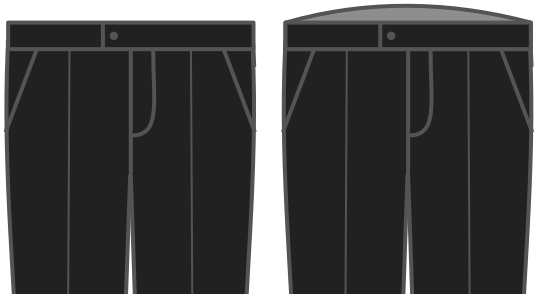

- - -
title: "Back rise"
- - -

Dies erhöht die Taille Ihrer Hose auf die Rückseite.

<Note>

Dieses Hosenmuster basiert auf der Zeichnungsmethode von Winifred Aldrich.
Eine Beschwerde bekomme ich oft, dass der Rücken der Hose zu niedrig ist.
Es ist auch eine gültige Beschwerde, es ist niedrig.

Diese Option erlaubt Ihnen, das zu mildern, ohne dramatische Änderungen am Muster.
Es erlaubt es Ihnen, einfach die Hosen zu heben.

</Note>

## Effekt dieser Option auf das Schnittmuster

