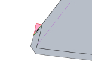
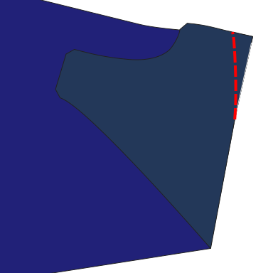
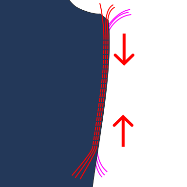
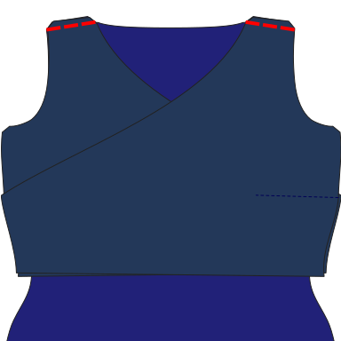
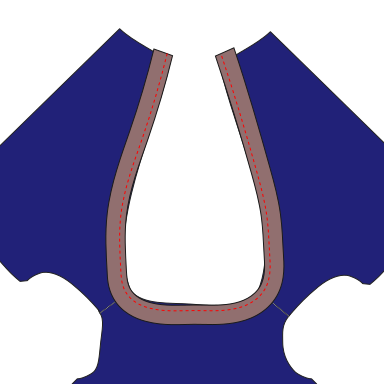
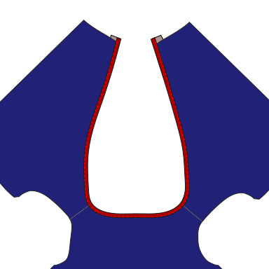
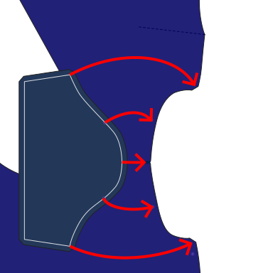
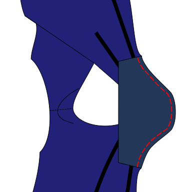
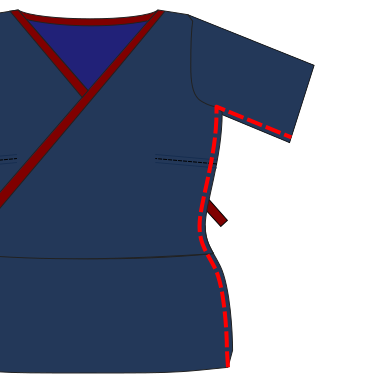

<Note>

As with all knitwear and stretch fabrics, a serger/overlock will make your life easier.
If you do not have one of those, don’t despair. You don’t really need it. 
All serged seams on Tina can also be sewn with a short, narrow zigzag stitch (~2 mm wide) on a standard sewing machine.

For the topstitching steps, a coverlock works best, but if you don't have one, a twin needle also gives nice results.
Of course, you can also use a zigzag stitch instead.

</Note>

### Step 0: Prepare the fabric

Cut out the parts including seam allowance and transfer markings and notches to the fabric.
Note that there are two different kinds of notches. You probably want to use a different notch shape or a different pen/chalk color for ×-notches.

If present, trim the highlighted triangle from the seam allowance of both front parts.
It's only present on the pattern for technical reasons and would be in the way when finishing the diagonal edge.

### Step 1: Prepare the front part

If your pattern is for someone with a larger bust, your design will likely include
either fabric gathering or a bust dart at the side seam of the front part.

If your pattern contains neither an indicated gathering section nor a dart, skip to step 2.

#### Bust darts

If the pattern was drafted with _darts_, fold your front part _good sides together_ along the center line of the dart.

Sew using an elastic stitch along the dart line from the side seam towards the bust. 
Near the dart tip, make sure to stitch as parallel to the fold line as possible while still stitching over the folded edge.

If not using a serger, cut away any unnecessary fabric from the dart and finish raw edges. 

Repeat this for both sides.

#### Gathering

If you didn't select the dart option, gather the fabric by doing 2 or 3 parallel straight stitches through the seam allowance where indicated on the pattern.
The stiches should have a longer stitch length setting, and you must *not* secure the ends by backstitching.
Keep the thread ends loose and long.

Hold the bobbin threads with one hand tight and bunch together the fabric with the other hand until
you've gathered the side seam to the same length as the distance between the notches on the back part pattern.

Secure the threads by tying a knot.

Repeat this for both sides.

<Note>

There are lots of alternative techniques for this. If the difference between the lengths isn't that large,
you could simply adjust/stretch the fabric while sewing the side seam later. Or you could pleat folds manually and pin them in place.

Experiment with different methods on scrap fabric and look up books and tutorials for tips if you are unsure.

</Note>

### Step 2: Sew the shoulder seams

Match up the front and back parts along the edges between the neck and the armholes _good sides together_ and matching raw edges.

Sew using an elastic stitch. Repeat for both sides.

### Step 3: Finish the neck and front edge

Unfold the main body piece.
Pin the knit binding piece for the neck _good sides together_ on the diagonal front edges and on the back of the neck,
matching raw edges. Add more stretch to the binding where it curves, so it stays flat against the neck later.

Adding additional stretch along the front parts can also help prevent gaping, 
but don't overdo it, as it could distort the general shape.

Topstitch both parts together.
The distance of the stitch to the raw edge is the width of the knit band divided by four.
This is not necessarily equal to the standard seam allowance.
For example, if your knit band is 6 cm wide, sew 1.5 cm from the edge.

You should have some length of knit binding left over at the end of the diagonal front edges. 
Leave them as is for now, they will be stitched into the side seam (or waistband, depending on settings) later, to secure them.

Fold the neck binding upwards and to the inside of the top.
This will create a fold at the stitch line you just created,
and another one at the original raw edge of the front and back parts.

Topstitch the neck binding in place from the outside.

Trim loose fabric on the inside to reduce bulk.
The inside edge can be left raw if you're using knit fabric.

### Step 4: Sew the sleeves

<Note>
You can optionally finish the sleeve openings now, before joining the front and back parts. 
Normally, you'd do this in step 8,
but doing it now will allow you to work on flat fabric and won't require special steps to join both ends.
This may be easier if you're a beginner or your sewing machine doesn't have a free arm.

If you want to do this, you can use knit binding as in the previous step, or do a simple folded over hem.

However, if you want a very clean look,
it is best to follow the normal instructions.
</Note>

If your design doesn't have a sleeve part, skip to the next step.

If your design has a separate sleeve part, pin the sleeve part to the main body part, _good sides together_, matching notches and raw edges. 

The hem of the sleeve points towards the neck opening.

Note that the sleeve part is not perfectly symmetrical. The ×-notch of the sleeve goes to the back part.
The round notch attaches to the front part.

Sew with an elastic stitch. Repeat for both sleeves.

### Step 5: Join the front parts

If your design has a front bottom piece, pin or baste it to both bottom edges of the triangle-shaped front parts, 
_good sides together_, matching notches and raw edges. 

If the outer sides of the front pieces have notches, also align and pin or baste them.

The front part that should be later fully visible on the outside goes towards the bottom part.

If your design has a front bottom piece, sew all three parts together along the bottom line while keeping any pins on the side seam in place. 
Otherwise, just keep them pinned or basted together for the next step.

### Step 6: Sew the side seams

With _good sides together_, pin the sides of the front parts to the sides of the back part. 
If present, also pin the bottoms of the sleeves together.

With the front parts on top, sew using an elastic stitch. Repeat for both sides. Remove any threads used for basting and gathering.

If necessary, trim any remaining loose ends of the knit binding.

### Step 7: Create the hem

#### Using a waistband

If you've chosen to finish the hem with a waistband, 
sew together the short sides of the waistband, _good sides together_,
to create a tube.

Then fold the fabric in half along its length, raw edges together, so the good sides are outside.

With the main body piece turned inside-out, pin the ribbing tube inside the bottom opening, matching raw edges. 
Mark and align quarters for a consistent stretch.
The ribbing is a bit shorter, so stretch it a bit while pinning.

Sew using an elastic stitch.

Fold the hem to the outside.

Optional: Topstitch the seam allowance towards the main body piece to keep it in place.

#### Simple hem

If you've chosen the option without a waistband, 
fold over the hem allowance to the inside and topstitch in place using an elastic stitch.

### Step 8: Finish the armholes

#### With sleeves

If your design has a sleeve part, 
follow the waistband instructions again for the cuff opening 
and either attach a piece of ribbing or do a simple folded hem.

#### Without sleeves

If your design is sleeveless or has only short cap sleeves as part of the main body, 
finish the armholes with [knit binding](/docs/sewing/knit-binding). This works similarly how we've finished the
front and neck opening of the top, but we need some extra steps to properly join the binding on the bottom of the armhole.

Follow the [linked instructions](/docs/sewing/knit-binding) when unsure.

### Step 9: Finishing

You're done. Time to try it on. If the front parts are too loose, you could bar tack them together at the neck opening.
