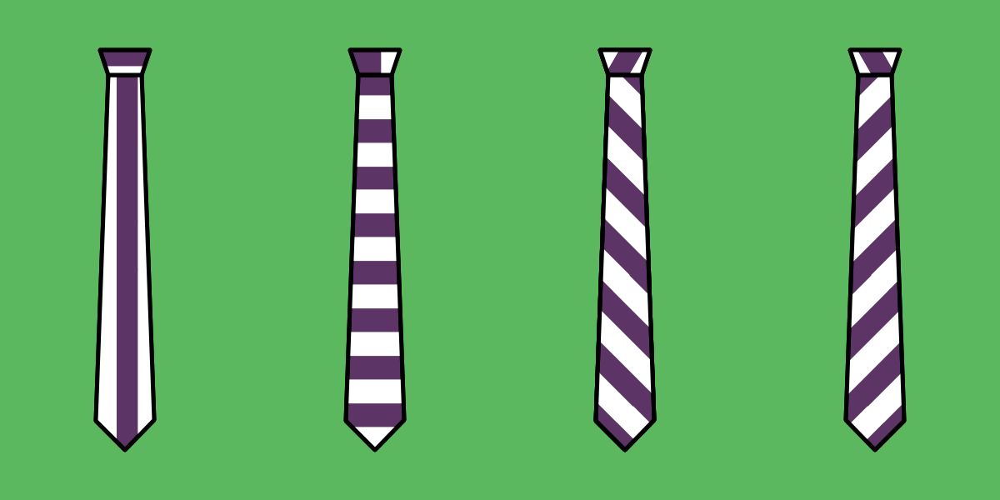

- - -
title: "Trayvon tie: Cutting Instructions"
- - -

- **Buitenstof**
  - Knip **1 punt**
  - Knip **1 staart**
- **Voering**
  - Knip **1 voering punt**
  - Knip **1 voering staart**
  - Knip **1 lus**
- **Tussenvoering**
  - Knip **1 tussenvoering punt**
  - Knip **1 tussenvoering staart**

<Warning>

###### Caveat

- There is no seam allowance on the **interfacing** parts and the **loop**
- The **lining** **tip** and **tail** have only seam allowance at the tip
- The **fabric** **tip** and **tail** have only seam allowance at the tip and center

</Warning>

<Tip>

######Kies de draadrichting van je das

Dit patroon heeft geen draadrichting. Normaal gezien wordt de draadrichting op het patroon geprint om je te tonen hoe je het patroon op de stof moet leggen, afhankelijk van de draadrichting.

Voor een das is dit niet echt een regel, eerder een persoonlijke keuze. Daarom staat er geen draadrichting op het patroon. Je kan doen wat je wil.

Dit gezegd zijnde zijn veel dassen schuin van draad geknipt, aangezien dit het mooiste valt. Als je niet zeker bent wat te doen, knip je das dan misschien schuin van draad.

Als dit allemaal erg verwarrend vindt kan ik je aanraden onze pagina over <a href="/en/docs/sewing/fabric-grain">Draadrichting</a> eens te bekijken).

</Tip>
