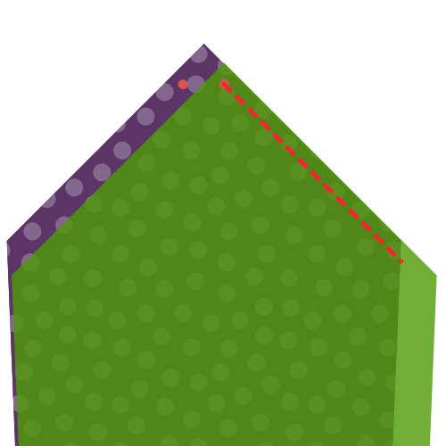
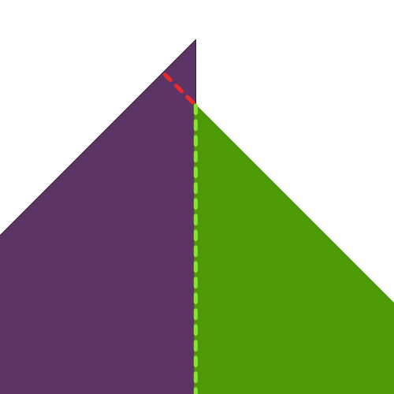

<Tip>

###### Nur der Tipp

ist der empfindlichste Teil der Krawatte.
Wenn du noch nie eine Bindung gemacht hast Ich empfehle Ihnen, ein paar Krawattenspitzen im Schrottgewebe zu machen, bevor Sie Schere und Nadeln zu Ihrem schönen Krawattengewebe nehmen.

Um Tipps zu üben führen führen Sie Konstruktionen Schritt 1 bis 4 ein paar Male, bis Sie den Hang davon.

</Tip>

<Tip>

###### Drücke weise

später in den Bauschritten, du wirst aufgefordert, deinen Stoff zu drücken. Bitte achten Sie darauf, dass Sie nicht zu viel Wärme auf einem empfindlichen Stoff verwenden, der es nicht verarbeiten kann.

Es ist immer eine gute Idee, dein Bügeleisen auf ein paar Stoffresten zu testen. Auf diese Weise können Sie herausfinden, was eine gute Wärmeeinstellung für den Stoff, den Sie verwenden.

</Tip>

### Schritt 1: Nähen Sie die erste Seite Ihres Krawattenschwanzes

Ausrichten des Futter Schwanzes (Teil 6) auf dem Stoff Schwanz (Teil 4), gute Seiten zusammen

Verschieben Sie den Futter-Schwanz entlang einer Seite, die den Schwanz nach oben zieht, bis die Note auf dem Futterschwanz mit der Note auf dem Stoff übereinstimmt.

Nähen Sie am Platz, beginnend genau an der gleichnamigen Stelle, entlang der Kante. Achten Sie darauf, dass Sie auf beiden Seiten Backtack betreiben.

Zwei Noten sind nun an der gleichen Stelle fixiert.

### Schritt 2: Nähen Sie die zweite Seite Ihres Krawattenschwanzes

Verschieben Sie den Stoff Schwanz, so dass die zweite Schicht mit der Note auf dem Futter Schwanz (dem Ort, an dem Ihre erste Naht begonnen hat).

Dazu musst du ein bisschen aus dem Stoff herausklappen, unter der Naht, die du in Schritt eins machst.

Nähen Sie am Platz, beginnend genau an der passenden Note, um einen geraden Winkel mit Ihrer Naht von Schritt 1 zu erhalten.

Jetzt sind alle drei Noten an der gleichen Stelle fixiert.

### Schritt 3: Beende den Krawatten

Falten Sie Ihre Krawatte offen, so dass die beiden Nähte, die Sie in Schritt 1 und 2 gemacht haben, übereinander liegen. Achten Sie darauf, sie präzise zu falten; die gefalteten Kanten sollten einen geraden Winkel bilden.

Nähen Sie den Punkt, an dem sich die drei Nocken und Ihre beiden Nähte an den gefalteten Rand der Stoffspitze aneinander (Teil 4, auf der linken Seite im Bild).

### Schritt 4: Schalte den Schwanz inside-out und überprüfe deine Arbeit

Nachdem Sie alle Fäden ausgeschnitten haben, werfen Sie Ihren Schwanz nach innen sorgfältig aus (technisch gesehen wenden Sie ihn draußen aus, da er jetzt draussen ist).

Bei Bedarf können Sie den Tipp vorsichtig mit einem Lineal ausschieben.

Ihr Schwanz sollte wie das Bild aussehen, mit einem scharfen Punkt und geraden Kanten.

Die Naht, in der der Stoff mit dem Krawattenfutter trifft, sitzt nicht am Rand der Krawatte, sondern sitzt ein bisschen zurück aus dem Blickwinkel zu bleiben.

Wenn Sie all dies geschafft haben, können Sie es wieder für die Spitze Ihrer Krawatte tun.

### Schritt 5: Nähen Sie die erste Seite Ihrer Krawatte

Aussenspitze ausrichten (Teil 5) oben auf der Stoffspitze (Teil 3), gute Seiten zusammen

Verschieben Sie den Futterspitze entlang einer Seite, die den Tipp nach oben zieht, bis die Aussenspitze mit der Aussenspitze übereinstimmt.

Nähen Sie am Platz, beginnend genau an der gleichnamigen Stelle, entlang der Kante. Achten Sie darauf, dass Sie auf beiden Seiten Backtack betreiben.

Zwei Noten sind nun an der gleichen Stelle fixiert.

### Schritt 6: Nähen Sie die zweite Seite Ihres Krawattentipps

Verschieben Sie die Stoffspitze so dass die zweite Stirn mit der Note auf der Aussenspitze (die Stelle, an der Ihre erste Naht begonnen hat).

Dazu musst du ein bisschen aus dem Stoff herausklappen, unter der Naht, die du in Schritt 5 herstellst.

Nähen Sie am Platz, beginnend genau an der passenden Note, um einen geraden Winkel mit Ihrer Naht aus Schritt 5 zu erhalten.

Jetzt sind alle drei Noten an der gleichen Stelle fixiert.

### Schritt 7: Beende den Krawatte Tipp

Falten Sie Ihre Krawatte offen, so dass die beiden Nähte, die Sie in Schritt 5 und 6 gemacht haben, übereinander liegen. Achten Sie darauf, sie präzise zu falten; die gefalteten Kanten sollten einen geraden Winkel bilden.

Nähen Sie den Punkt, an dem sich die drei Nocken und Ihre beiden Nähte an den gefalteten Rand der Stoffspitze aneinander (Teil 3, auf der linken Seite im Bild).

### Schritt 8: Schalte den Tipp inside-out und überprüfe deine Arbeit

Nachdem Sie alle Fäden ausgeschnitten haben, werfen Sie vorsichtig Ihren Tipp inside-out (technisch sind Sie dabei, ihn nach außen zu kippen, da er jetzt draussen ist).

Bei Bedarf können Sie den Tipp vorsichtig mit einem Lineal ausschieben.

Ihr Tipp sollte wie das Bild aussehen, mit einem scharfen Punkt und geraden Kanten.

Die Naht, in der der Stoff mit dem Krawattenfutter trifft, sitzt nicht am Rand der Krawatte, sondern sitzt ein bisschen zurück aus dem Blickwinkel zu bleiben.

### Schritt 9: Join the tie interfacing

Schließen Sie die Schnittstellenspitze (Teil 1) und den Interfacing Schwanz (Teil 2) zusammen auf der nicht punktuellen Seite, passend zur Note.

> **Or don't** To be honest, I never join the interfacing. Ich lasse nur beide Hälften ohne Anhang.
> 
> Auf diese Weise können Sie nie die Länge Ihrer Bindung falsch halten und Sie können die Schnittstellen einfach übereinander schieben. Darüber hinaus erzeugt es weniger Massen in der Mitte und es ist weniger Arbeit.
> 
> Also kannst du diesen Schritt einfach überspringen, es ist was ich tue.

### Schritt 10: Schließe dich dem Stoff an

> Mit der Nähung der Schnittstelle wird nun die Länge unserer Krawatte festgelegt. Messen Sie die Krawatte zu Spitze und stellen Sie sicher, dass Sie die Stoffstücke in der richtigen Länge verbinden.

Schließen Sie die Spitze und den Heckstoff zusammen auf der non-pointy Seite.

### Schritt 11: Stelle deine Schlingschleife her

Wir werden jetzt die Schleife bauen (Teil 7) unserer Krawatte.

Falten Sie den Stoff wie in der Illustration gezeigt. Du musst am Ende einen schmalen Stoffstreifen haben, der seine Enden an der Innenseite verklebt hat.

Achten Sie darauf, eine Kante ein wenig kürzer zu haben. Dies wird die Rückseite sein.

Während des falten, erreichen Sie für Ihr Eisen und geben es eine gute Presse, so dass die Dinge in Platz. Drücken Sie auch die Endschleife vor dem Nähen.

> Vorsicht beim Drängen, denken Sie an den dringenden Rat, den ich vorhin gegeben habe

Wenn du zufrieden bist mit der Art und Weise, wie du deine Schleife geklappt und gedrückt hast, die Hand am Rand mit einem Slipstitch näht, um die Dinge an der Stelle zu halten.

### Schritt 12: Ordnen Sie Ihre Bindung an

Es ist Zeit, die Dinge zusammenzustellen. Legen Sie Ihre Krawatte auf eine flache Oberfläche, gut seitlich runter, aufstellen.

Nun nehmen Sie Ihre Krawatte und legen Sie sie in Ihrer Krawatte mit der Nahtzuweisung in der Mitte nach oben. Achten Sie darauf, dass Sie ihn zwischen Ihrem Stoff und Futter auf jeder Seite gleiten, bis zur Spitze.

### Schritt 13: Fallen und drücken Sie Ihr Krawatt

Mit der in Ihrem Krawattengewebe eingesetzten Verbindung, falten Sie über eine Seite des Stoffes über die Schnittstelle.

Sie wollen ihn schräg um die Schnittstelle falten, aber ohne die Schnittstelle, die in der Mitte bleiben soll.

Wenn Sie fertig sind, drücken Sie Ihren Falten. Wegen der Krawatten-Schnittstelle drückst du hier keine scharfe Falte der Hauptpunkt ist es, den Stoff so zu formen, dass er eifriger ist, um den Ordner um die Schnittstelle zu halten.

> Da wir hier keine scharfe Frechheit drücken, sondern den Stoff stärker formen, funktioniert ein Dampfeisen am besten.

Wenn Sie die eine Seite abgeschlossen haben, klappen Sie die andere Seite, und Dampf wieder zurück.

Schließlich, falten Sie die obere Ebene entlang der Mitte der Krawatte, und drücken Sie an Ort und Stelle. Dieses Mal machen Sie eine scharfe Frechheit entlang der Mitte der Krawatte.

> Um den Unterschied zwischen den beiden letzten Falten zu klären, Ich habe eine dunkle Linie in das Bild eingefügt, die den Rand des Stoffes markiert.
> 
> Wie Sie sehen, falten wir zum ersten Mal den Stoff zurück, und er erstreckt sich über die Mitte der Krawatte.
> 
> Beim zweiten Mal falten wir sie wieder in der Mitte, dem Ort, an dem wir sie nähen.

### Schritt 14: Bereite die Schleife vor

Falte deine Schleife so dass der Schwanz deiner Krawatte mit etwas Platz durch sie gehen kann.

Markiere den Punkt, an dem die Schleife endet, und nähe sie zusammen.

Drücken Sie schließlich Ihre Schleife offen, damit die Naht in der Mitte sitzt und die Enden auf eine Seite zeigen.

### Schritt 15: Steckstich und Schleife einfügen

Nähen Sie mit einem Rutschstich Ihren Krawatten entlang der Rückenlänge.

> Ihr Rutschstich sollte nur den Stoff auf der Rückseite fangen. Refrain von der Ausführung durch die Krawatten-Schnittstelle.
> 
> Seien Sie vorsichtig, wenn Sie den Stich zu tief, es könnte auf der Vorderseite zeigen und zerstören Sie Ihre Krawatte.

Achten Sie darauf, dass Sie in Ihre Schleife gleiten, etwa 1/5 der Krawatte Länge, beginnend von der Spitze.

Benutzen Sie Ihren Schlaufstich um die Schleife an der Mitte zu befestigen; wir fixieren die Kanten der Schleife im nächsten Schritt.

### Schritt 16: Sichere die Schleifenkanten

Hand nähen Sie die Kanten der Schleife an Ihre Krawatte, so dass sie an Ort und Stelle bleibt.

Stellen Sie sicher, dass Sie nur die untere Schicht der Schleife nähen, so dass die Hefte nicht auf der Schleife angezeigt werden.

Und noch einmal: Seien Sie vorsichtig und lassen Sie Ihre Nähte nicht durch Ihre Krawatte laufen. Sei flach.

### Schritt 17: Trimmen und aufräumen

Schneiden Sie alle losen Threads die Sie haben könnten.
