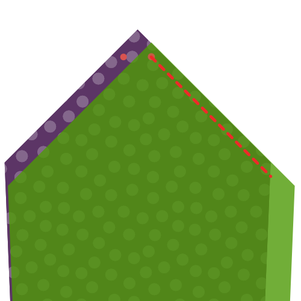
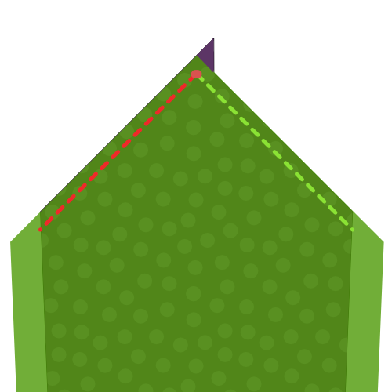
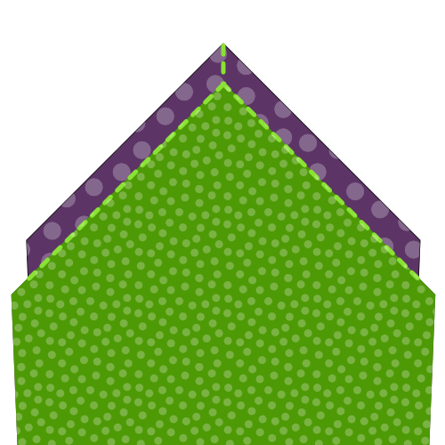
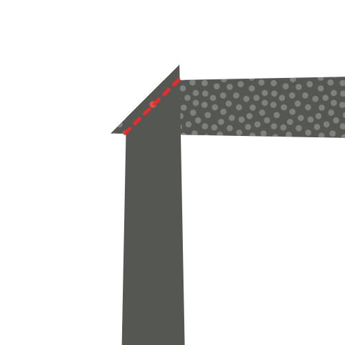
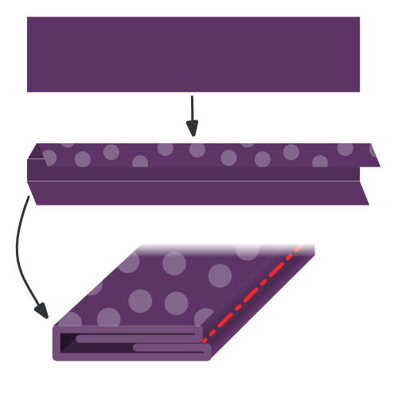
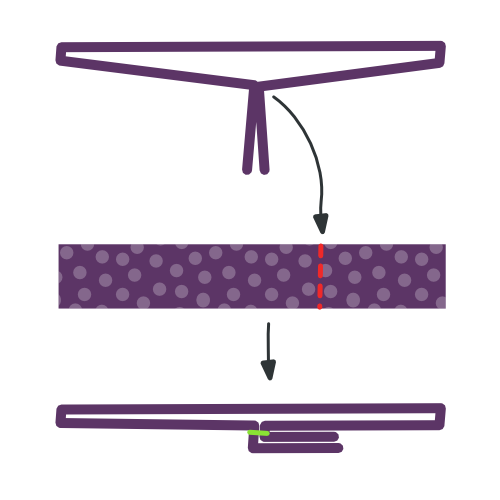
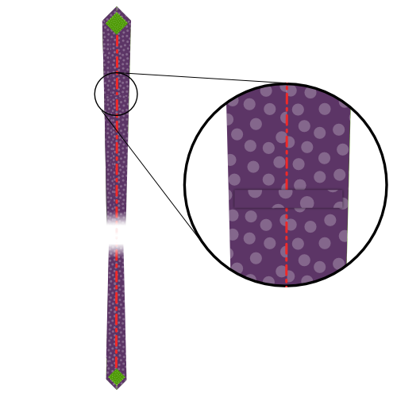
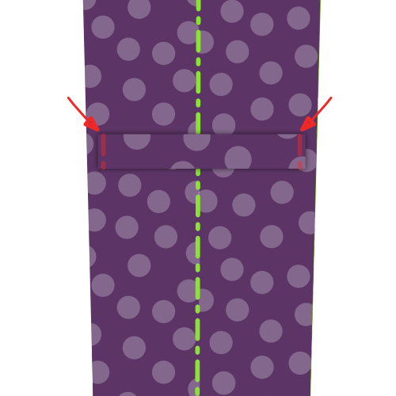

<Tip>

###### Solo la punta

La punta es la parte más sensible del empate.
Si nunca has hecho un empate antes, Le aconsejo que haga algunas puntas de empatado en tela de basura antes de llevar tijeras y agujas a su agradable tejido de empate.

Para practicar la elaboración de consejos, ejecute las construcciones pasos 1 a 4 un par de veces hasta que se le cuelgue el colmillo.

</Tip>

<Tip>

###### Presiona sabiamente

Más tarde en los pasos de construcción, se te pedirá que presiones tu tela. Por favor, tenga cuidado de no utilizar demasiado calor en un tejido delicado que no puede manejarlo.

Es una buena idea intentar presionar algunos restos de tela antes de empezar. Esto le permitirá averiguar qué es un buen ajuste de calor para el tejido que está utilizando.

</Tip>

### Paso 1: Pase el primer lado de su cola de empatado

Align the lining tail (piece 6) on top of the fabric tail (piece 4), good sides together

Shift the lining tail along a side running up the tail until the notch on the lining tail matches the notch on the fabric tail.

Sew in place, starting precisely at the matched notch, along the edge. Make sure to backtack on both sides.

Two notches are now fixed the same spot.

### Paso 2: Pase el segundo lado de su cola de empatado

Shift the fabric tail so that the second notch lines up with the notch on the lining tail (the place where your first seam started).

This will require you to fold a bit of the tie fabric out of the way, under the seam you make in step one.

Sew in place, starting precisely at the matched notch, making sure to get a straight angle with your seam from step 1.

Now, all three notches are fixed the same spot.

### Paso 3: Termina la cola de empatado

Fold your tie open so that the two seams you made in step 1 and 2 lie on top of each other. Take care to fold it precisely; the folded edges should make a straight angle.

Sew the point where the three notches and your two seams converge to the folded edge of the Fabric tip (part 4, on the left in the image).

### Paso 4: Da la cola en el interior e inspecciona tu trabajo

After you've trimmed all threads, carefully flip your tail inside-out (technically you are flipping it outside-out as it is inside out now).

If needed, you can gently push out the tip with a ruler.

Your tail should look like the picture, with a sharp point and straight edges.

The seam where the tie fabric meets the tie lining does not sit at the edge of the tie but it sits a bit back, staying out of sight.

If you managed to do all of this, you can do it again for the tip of your tie.

### Paso 5: Empata la primera cara de tu punta de empata

Align the lining tip (piece 5) on top of the fabric tip (piece 3), good sides together

Shift the lining tip along a side running up the tip until the notch on the lining tip matches the notch on the fabric tip.

Sew in place, starting precisely at the matched notch, along the edge. Make sure to backtack on both sides.

Two notches are now fixed the same spot.

### Paso 6: Agarra el segundo lado de tu punta de empatado

Shift the fabric tip so that the second notch lines up with the notch on the lining tip (the place where your first seam started).

This will require you to fold a bit of the tie fabric out of the way, under the seam you make in step five.

Sew in place, starting precisely at the matched notch, making sure to get a straight angle with your seam from step 5.

Now, all three notches are fixed the same spot.

### Paso 7: Termina la punta de la corbata

Fold your tie open so that the two seams you made in step 5 and 6 lie on top of each other. Take care to fold it precisely; the folded edges should make a straight angle.

Sew the point where the three notches and your two seams converge to the folded edge of the Fabric tip (part 3, on the left in the image).

### Paso 8: Vuelve la punta dentro e inspecciona tu trabajo

After you've trimmed all threads, carefully flip your tip inside-out (technically you are flipping it outside-out as it is inside out now).

If needed, you can gently push out the tip with a ruler.

Your tip should look like the picture, with a sharp point and straight edges.

The seam where the tie fabric meets the tie lining does not sit at the edge of the tie but it sits a bit back, staying out of sight.

### Paso 9: Únete a la interfaz de empatado

Join Interfacing tip (piece 1) and Interfacing tail (piece 2) together on the non-pointy side, matching the notch.

> **Or don't** To be honest, I never join the interfacing. Dejo las dos mitades sin ajustes.
> 
> De esta manera, nunca se puede malinterpretar la longitud de la corbata, y sólo se puede deslizar las partes que se interrelacionan entre sí. Además, crea menos masa en el medio, y es menos trabajo.
> 
> Así que puedes saltarte este paso, es lo que hago.

### Paso 10: Únete a la tela de empatado

> Con la interfacción coser juntos, la longitud de nuestra corbata ahora está determinada. Medir la punta de la corbata a la punta y asegurarse de que usted se une a las piezas de la tela a la longitud correcta.

Join the tip and tail fabric together on the non-pointy side.

### Paso 11: Haz tu bucle de empatado

We are going to construct the Loop (piece 7) of our tie now.

Fold the fabric as shown in the illustration. You need to end up with a narrow strip of fabric that has its ends tucked to the inside.

Make sure to have one edge a little bit shorter. This will be the back side.

While folding, reach for your iron and give it a good press so things stay in place. Also press the final loop before sewing it.

> Cuidado al pulsar, recuerda el consejo que di anteriormente

When you're happy with how you folded and pressed your loop, hand-sew along the edge with a slipstitch to keep things in place.

### Paso 12: ensamblar tu corbata

Time to start putting things together. Place your tie on a flat surface, good side down, lining up.

Now take your tie interfacing, and place it in your tie with the seam allowance in the middle facing upwards. Make sure to slide it between your fabric and lining on each side, all the way to the tip.

### Paso 13: Doble y presiona tu empata

With your tie interfacing inserted in your tie fabric, fold over one side of the fabric over the interfacing.

You want to fold it snugly around the interfacing, but without moving the interfacing, which should stay in the middle.

When you're done, press your fold. Because of the tie interfacing, you're not pressing a sharp crease here, the main point is to shape the fabric to be more eager to stay folder around the interfacing.

> Como no estamos presionando un pliegue afilado aquí, sino más dando forma a la tela, un hierro a vapor funciona mejor.

When you have completed one side, fold back the other side, and steam again.

Finally, fold back the top layer along the middle of your tie, and press in place. This time, you are making a sharp crease along the middle of the tie.

> Para aclarar la diferencia entre los dos últimos pliegues, He incluido una línea oscura en la imagen que marca el borde del tejido, o doblar.
> 
> Como se puede ver, la primera vez que doblamos la tela hacia atrás, y se extiende por encima del centro de la corbata.
> 
> La segunda vez, la volvemos a doblar en el medio, el lugar donde la cosecharemos en su lugar.

### Paso 14: Prepara el bucle

Fold your loop so the tail of your tie can pass through it with some room.

Mark the point where the loop ends join, and sew them together.

Finally, press your loop open so the seam sits in the middle, and the ends point to one side.

### Paso 15: Deslizar empate, e insertar bucle

Use a slip stitch to hand sew your tie all along the length of the back.

> Tu slipch solo debería atrapar la tela de la corbata en la espalda. Refrain de ejecutarlo a través de la interfaz de empate.
> 
> Ten cuidado por si corres la banda demasiado profunda, puede que se muestre en el frente, y arruine tu corbata.

Make sure to slide in your loop, somewhere around 1/5th of the tie length, starting from the tip.

Use your slip stitch to secure the loop in place on the center seam; we'll fix the edges of the loop in the next step.

### Paso 16: Asegure los bordes del bucle

Hand sew the edges of the loop to your tie, so it stays in place nicely.

Make sure to sew only the bottom layer of the loop, so the stitches don't show on the loop.

And, once again, be careful not to run your stitches through your tie. Be shallow.

### Paso 17: Recortar y limpiar

Trim any loose threads you might have.
