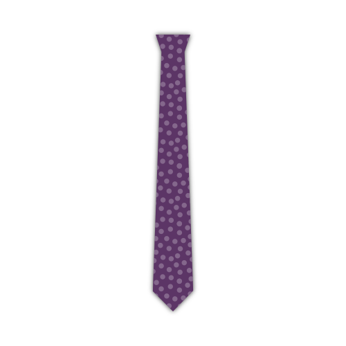

<Tip>

###### Juste le pourboire

Le pourboire est la partie la plus sensible de la cravate.
Si vous n'avez jamais fait de cravate avant, Je vous conseille de faire quelques pointes de cravate en tissu de ferraille avant de prendre des ciseaux et des aiguilles sur votre beau tissu de cravate.

Pour pratiquer la fabrication d'outils, exécutez les étapes 1 à 4 fois jusqu'à ce que vous en obtiez.

</Tip>

<Tip>

###### Appuyez sagement

Plus tard dans les étapes de construction, il vous sera demandé de presser votre tissu. Faites attention à que vous n'utilisez pas trop de chaleur sur un tissu délicat qui pourrait ne pas le supporter.

C'est une bonne idée de faire des essais sur quelques morceaux de tissu avant de commencer. Cela vous permettra de déterminer le bon réglage de chaleur pour le tissu que vous utilisez.

</Tip>

### Étape 1 : Coudre le premier côté de votre queue

Align the lining tail (piece 6) on top of the fabric tail (piece 4), good sides together

Shift the lining tail along a side running up the tail until the notch on the lining tail matches the notch on the fabric tail.

Sew in place, starting precisely at the matched notch, along the edge. Make sure to backtack on both sides.

Two notches are now fixed the same spot.

### Étape 2 : Coudre le deuxième côté de votre queue

Shift the fabric tail so that the second notch lines up with the notch on the lining tail (the place where your first seam started).

This will require you to fold a bit of the tie fabric out of the way, under the seam you make in step one.

Sew in place, starting precisely at the matched notch, making sure to get a straight angle with your seam from step 1.

Now, all three notches are fixed the same spot.

### Étape 3 : Terminer la queue

Fold your tie open so that the two seams you made in step 1 and 2 lie on top of each other. Take care to fold it precisely; the folded edges should make a straight angle.

Sew the point where the three notches and your two seams converge to the folded edge of the Fabric tip (part 4, on the left in the image).

### Étape 4 : Retournez la queue et inspectez votre travail

After you've trimmed all threads, carefully flip your tail inside-out (technically you are flipping it outside-out as it is inside out now).

If needed, you can gently push out the tip with a ruler.

Your tail should look like the picture, with a sharp point and straight edges.

The seam where the tie fabric meets the tie lining does not sit at the edge of the tie but it sits a bit back, staying out of sight.

If you managed to do all of this, you can do it again for the tip of your tie.

### Étape 5 : coudre le premier côté de la pointe de votre cravate

Align the lining tip (piece 5) on top of the fabric tip (piece 3), good sides together

Shift the lining tip along a side running up the tip until the notch on the lining tip matches the notch on the fabric tip.

Sew in place, starting precisely at the matched notch, along the edge. Make sure to backtack on both sides.

Two notches are now fixed the same spot.

### Étape 6: Coudre le deuxième côté de la pointe de votre cravate

Shift the fabric tip so that the second notch lines up with the notch on the lining tip (the place where your first seam started).

This will require you to fold a bit of the tie fabric out of the way, under the seam you make in step five.

Sew in place, starting precisely at the matched notch, making sure to get a straight angle with your seam from step 5.

Now, all three notches are fixed the same spot.

### Étape 7 : Terminer le cravate

Fold your tie open so that the two seams you made in step 5 and 6 lie on top of each other. Take care to fold it precisely; the folded edges should make a straight angle.

Sew the point where the three notches and your two seams converge to the folded edge of the Fabric tip (part 3, on the left in the image).

### Étape 8 : Insérez la pointe et inspectez votre travail

After you've trimmed all threads, carefully flip your tip inside-out (technically you are flipping it outside-out as it is inside out now).

If needed, you can gently push out the tip with a ruler.

Your tip should look like the picture, with a sharp point and straight edges.

The seam where the tie fabric meets the tie lining does not sit at the edge of the tie but it sits a bit back, staying out of sight.

### Étape 9 : Rejoignez l'interfaçage de la cravate

Join Interfacing tip (piece 1) and Interfacing tail (piece 2) together on the non-pointy side, matching the notch.

> **Or don't** To be honest, I never join the interfacing. Je laisse les deux moitiés sans attache.
> 
> De cette façon, vous ne pourrez jamais avoir la longueur de votre cravate, et vous pourrez simplement faire glisser les parties entre elles. En outre, il crée moins de masse au milieu, et c'est moins de travail.
> 
> Alors vous pouvez simplement sauter cette étape, c'est ce que je fais.

### Étape 10 : Rejoignez le tissu de cravate

> Avec l'interfaçage cousu ensemble, la longueur de notre cravate est maintenant déterminée. Mesurez la pointe de la cravate sur le bout de la cravate et assurez-vous de joindre les pièces de tissu à la bonne longueur.

Join the tip and tail fabric together on the non-pointy side.

### Étape 11: Rend ta boucle cravate

We are going to construct the Loop (piece 7) of our tie now.

Fold the fabric as shown in the illustration. You need to end up with a narrow strip of fabric that has its ends tucked to the inside.

Make sure to have one edge a little bit shorter. This will be the back side.

While folding, reach for your iron and give it a good press so things stay in place. Also press the final loop before sewing it.

> Attention, rappelez-vous les conseils pressants que j'ai donnés plus tôt

When you're happy with how you folded and pressed your loop, hand-sew along the edge with a slipstitch to keep things in place.

### Étape 12 : Assemblez votre cravate

Time to start putting things together. Place your tie on a flat surface, good side down, lining up.

Now take your tie interfacing, and place it in your tie with the seam allowance in the middle facing upwards. Make sure to slide it between your fabric and lining on each side, all the way to the tip.

### Étape 13: Pliez et appuyez sur votre cravate

With your tie interfacing inserted in your tie fabric, fold over one side of the fabric over the interfacing.

You want to fold it snugly around the interfacing, but without moving the interfacing, which should stay in the middle.

When you're done, press your fold. Because of the tie interfacing, you're not pressing a sharp crease here, the main point is to shape the fabric to be more eager to stay folder around the interfacing.

> Comme nous ne sommes pas en train de presser un pli tranchant, mais plutôt de façonner le tissu, un fer à vapeur fonctionne le mieux.

When you have completed one side, fold back the other side, and steam again.

Finally, fold back the top layer along the middle of your tie, and press in place. This time, you are making a sharp crease along the middle of the tie.

> Pour clarifier la différence entre les deux derniers plis, J'ai inclus une ligne sombre dans l'image qui marque le bord du tissu, ou plié.
> 
> Comme vous pouvez le voir, la première fois que nous plions simplement le tissu en arrière, et il étend le centre de la cravate.
> 
> La deuxième fois, nous la plions à nouveau au milieu, l'endroit où nous la coudrons en place.

### Étape 14: Préparer la boucle

Fold your loop so the tail of your tie can pass through it with some room.

Mark the point where the loop ends join, and sew them together.

Finally, press your loop open so the seam sits in the middle, and the ends point to one side.

### Étape 15 : glissez la cravate et insérez la boucle

Use a slip stitch to hand sew your tie all along the length of the back.

> Votre point de dérapage devrait seulement accrocher le tissu de cravate sur le dos. Refuser de le faire passer à travers l'interface des cravates.
> 
> Faites attention car si vous courez le point trop profond, il pourrait apparaître sur le devant, et ruiner votre cravate.

Make sure to slide in your loop, somewhere around 1/5th of the tie length, starting from the tip.

Use your slip stitch to secure the loop in place on the center seam; we'll fix the edges of the loop in the next step.

### Étape 16 : Sécuriser les bords de la boucle

Hand sew the edges of the loop to your tie, so it stays in place nicely.

Make sure to sew only the bottom layer of the loop, so the stitches don't show on the loop.

And, once again, be careful not to run your stitches through your tie. Be shallow.

### Étape 17 : Dégarnir et nettoyer

Trim any loose threads you might have.
