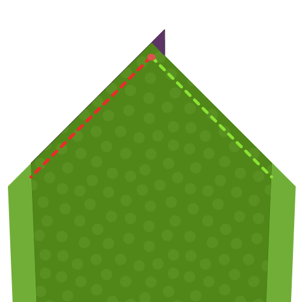
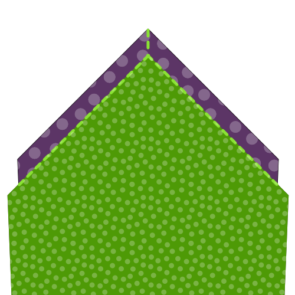
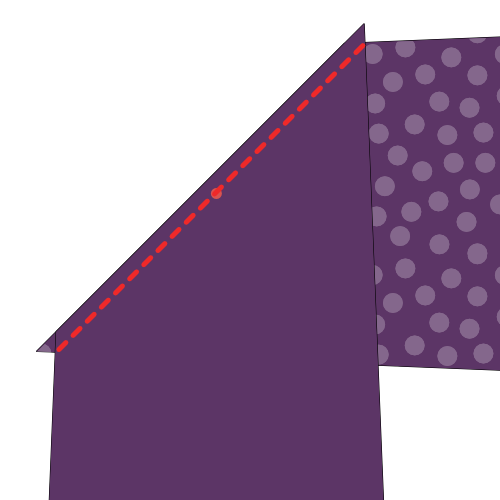
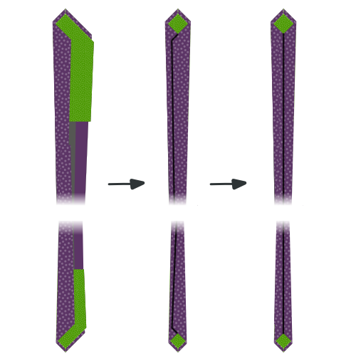
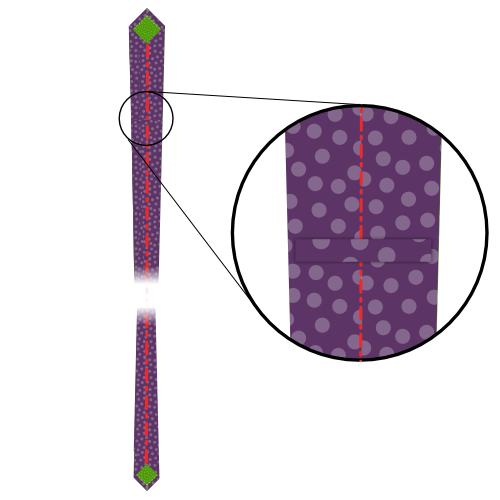

<Tip>

###### Juste le pourboire

Le pourboire est la partie la plus sensible de la cravate.
Si vous n'avez jamais fait de cravate avant, Je vous conseille de faire quelques pointes de cravate en tissu de ferraille avant de prendre des ciseaux et des aiguilles sur votre beau tissu de cravate.

Pour pratiquer la fabrication d'outils, exécutez les étapes 1 à 4 fois jusqu'à ce que vous en obtiez.

</Tip>

<Tip>

###### Appuyez sagement

Plus tard dans les étapes de construction, il vous sera demandé de presser votre tissu. Faites attention à que vous n'utilisez pas trop de chaleur sur un tissu délicat qui pourrait ne pas le supporter.

C'est une bonne idée de faire des essais sur quelques morceaux de tissu avant de commencer. Cela vous permettra de déterminer le bon réglage de chaleur pour le tissu que vous utilisez.

</Tip>

### Étape 1 : Coudre le premier côté de votre queue

Alignez la queue de doublure (pièce 6) sur la queue de tissu (pièce 4), les bons côtés ensemble

Déplacez la queue de doublure le long d'un côté qui monte la queue jusqu'à ce que l'encoche sur la queue de la doublure corresponde à l'encoche sur la queue du tissu.

Coudre en place, en commençant précisément à l'encoche correspondante, le long du bord. Assurez-vous de faire un backtack sur les deux côtés.

Deux encoches sont maintenant fixées au même endroit.

### Étape 2 : Coudre le deuxième côté de votre queue

Déplacez la queue du tissu de sorte que la deuxième encoche se range avec l'encoche de la queue de la doublure (l'endroit où votre première couture a commencé).

Cela vous demandera de plier un peu le tissu de la cravate, sous la couture que vous fabriquez dans la première étape.

Coudre en place, en commençant précisément par l'encoche correspondante, assurez-vous d'obtenir un angle droit avec votre couture à partir de l'étape 1.

Les trois encoches sont maintenant fixées au même endroit.

### Étape 3 : Terminer la queue

Pliez votre cravate ouverte de sorte que les deux coutures que vous avez faites à l'étape 1 et 2 se trouvent les unes sur les autres. Prenez soin de le plier avec précision; les bords pliés doivent faire un angle droit.

Coudre le point où les trois entailles et vos deux coutures convergent vers le bord plié du bout du tissu (partie 4, sur la gauche dans l'image).

### Étape 4 : Retournez la queue et inspectez votre travail

Une fois que vous avez coupé tous les fils, retournez soigneusement votre queue (techniquement vous la renversez en dehors comme elle se fait à l'intérieur).

Si nécessaire, vous pouvez pousser doucement la pointe avec une règle.

Votre queue devrait ressembler à la photo, avec une pointe pointue et des bords droit.

La couture où le tissu de cravate correspond à la doublure de la cravate ne se trouve pas au bord de la cravate, mais elle est assise un peu en arrière, rester en dehors de la vue.

Si vous avez réussi à faire tout cela, vous pouvez le faire à nouveau pour la pointe de votre cravate.

### Étape 5 : coudre le premier côté de la pointe de votre cravate

Alignez la pointe de la doublure (pièce 5) sur la pointe du tissu (pièce 3), les bons côtés ensemble

Déplacez la pointe de la doublure le long d'un côté qui monte la pointe jusqu'à ce que l'encoche sur la pointe de la doublure corresponde à l'encoche sur le bout de tissu.

Coudre en place, en commençant précisément à l'encoche correspondante, le long du bord. Assurez-vous de faire un backtack sur les deux côtés.

Deux encoches sont maintenant fixées au même endroit.

### Étape 6: Coudre le deuxième côté de la pointe de votre cravate

Déplacez le bout du tissu de sorte que le deuxième encoche s'aligne avec l'encoche sur la pointe de la doublure (l'endroit où votre première couture a commencé).

Cela vous demandera de plier un peu la toile de cravate du chemin, sous la couture que vous faites à l'étape cinq.

Coudre en place, en commençant précisément par l'encoche correspondante, assurez-vous d'obtenir un angle droit avec votre couture à partir de l'étape 5.

Les trois encoches sont maintenant fixées au même endroit.

### Étape 7 : Terminer le cravate

Pliez votre cravate ouverte de sorte que les deux coutures que vous avez faites à l'étape 5 et 6 se trouvent les unes sur les autres. Prenez soin de le plier avec précision; les bords pliés doivent faire un angle droit.

Coudre le point où les trois entailles et vos deux coutures convergent vers le bord plié du bout du tissu (partie 3, sur la gauche dans l'image).

### Étape 8 : Insérez la pointe et inspectez votre travail

Une fois que vous avez coupé tous les fils, retournez soigneusement votre pointe (techniquement vous la renversez hors de portée comme elle est à l'intérieur).

Si nécessaire, vous pouvez pousser doucement la pointe avec une règle.

Votre pourboire devrait ressembler à la photo, avec un point pointu et des bords droit.

La couture où le tissu de cravate correspond à la doublure de la cravate ne se trouve pas au bord de la cravate, mais elle est assise un peu en arrière, rester en dehors de la vue.

### Étape 9 : Rejoignez l'interfaçage de la cravate

Rejoignez la pointe Interfacing (pièce 1) et la queue Interfacing (pièce 2) sur le côté non pointu, assortie à l'encoche.

> **Or don't** To be honest, I never join the interfacing. Je laisse les deux moitiés sans attache.
> 
> De cette façon, vous ne pourrez jamais avoir la longueur de votre cravate, et vous pourrez simplement faire glisser les parties entre elles. En outre, il crée moins de masse au milieu, et c'est moins de travail.
> 
> Alors vous pouvez simplement sauter cette étape, c'est ce que je fais.

### Étape 10 : Rejoignez le tissu de cravate

> Avec l'interfaçage cousu ensemble, la longueur de notre cravate est maintenant déterminée. Mesurez la pointe de la cravate sur le bout de la cravate et assurez-vous de joindre les pièces de tissu à la bonne longueur.

Reliez le bout et le tissu de queue ensemble sur le côté non pointu.

### Étape 11: Rend ta boucle cravate

Nous allons construire la boucle (pièce 7) de notre cravate maintenant.

Plier le tissu comme indiqué dans l'illustration. Vous devez finir avec une étroite bande de tissu qui a ses extrémités enfermées à l'intérieur.

Assurez-vous d'avoir un bord un peu plus court. Ce sera le verso.

Pendant le pliage, atteignez votre fer et donnez-lui une bonne presse pour que les choses restent en place. Appuyez également sur la boucle finale avant de la coudre.

> Attention, rappelez-vous les conseils pressants que j'ai donnés plus tôt

Quand tu es satisfait de la façon dont tu as plié et pressé ta boucle, coudre la main le long du bord avec un point de glissement pour garder les choses en place.

### Étape 12 : Assemblez votre cravate

Il est temps de commencer à assembler les choses. Placez votre cravate sur une surface plate, un bon côté vers le bas, alignant vers le haut.

Maintenant, prenez votre cravate et placez-la dans votre cravate avec la marge de couture au milieu vers le haut. Assurez-vous de le faire glisser entre votre tissu et la doublure de chaque côté, jusqu'à la pointe de la souris.

### Étape 13: Pliez et appuyez sur votre cravate

Avec l'interfaçage de votre cravate insérée dans le tissu de votre cravate, pliez sur un côté du tissu sur l'interface.

Vous voulez le plier en un clin d'oeil autour de l'interface, mais sans bouger l'interface, qui devrait rester au milieu.

Lorsque vous avez terminé, appuyez sur votre pli. En raison de l'interface de cravate, vous n'appuyez pas sur un pli pointu ici, le point principal est de façonner le tissu pour être plus désireux de rester le dossier autour de l'interface.

> Comme nous ne sommes pas en train de presser un pli tranchant, mais plutôt de façonner le tissu, un fer à vapeur fonctionne le mieux.

Une fois que vous avez terminé un côté, repliez l'autre côté, et reprenez la vapeur.

Enfin, repliez la couche supérieure au milieu de votre cravate, puis appuyez sur la place. Cette fois-ci, vous faites un pli pointu au milieu de la cravate.

> Pour clarifier la différence entre les deux derniers plis, J'ai inclus une ligne sombre dans l'image qui marque le bord du tissu, ou plié.
> 
> Comme vous pouvez le voir, la première fois que nous plions simplement le tissu en arrière, et il étend le centre de la cravate.
> 
> La deuxième fois, nous la plions à nouveau au milieu, l'endroit où nous la coudrons en place.

### Étape 14: Préparer la boucle

Pliez votre boucle pour que la queue de votre cravate puisse passer à travers elle avec une certaine pièce.

Marque le point où la boucle se termine, et les coudre ensemble.

Enfin, appuyez sur votre boucle ouverte pour que la couture se trouve au milieu, et les extrémités pointent sur un côté.

### Étape 15 : glissez la cravate et insérez la boucle

Utilisez un point de glissement pour coudre votre cravate tout au long de la longueur du dos.

> Votre point de dérapage devrait seulement accrocher le tissu de cravate sur le dos. Refuser de le faire passer à travers l'interface des cravates.
> 
> Faites attention car si vous courez le point trop profond, il pourrait apparaître sur le devant, et ruiner votre cravate.

Assurez-vous de glisser dans votre boucle, quelque part autour du 1/5e de la longueur de la cravate, à partir de la pointe de la cravate.

Utilise ton point de glissement pour sécuriser la boucle en place sur la couture centrale; nous réparerons les bords de la boucle à l'étape suivante.

### Étape 16 : Sécuriser les bords de la boucle

Coudre les bords de la boucle à votre cravate, donc elle reste bien en place.

Assurez-vous de ne coudre que la couche inférieure de la boucle, de sorte que les points ne s'affichent pas sur la boucle.

Et, une fois de plus, faites attention à ne pas faire passer vos mailles à travers votre cravate. Soyez peu profond.

### Étape 17 : Dégarnir et nettoyer

Ajuster tous les fils de discussion que vous pourriez avoir.
