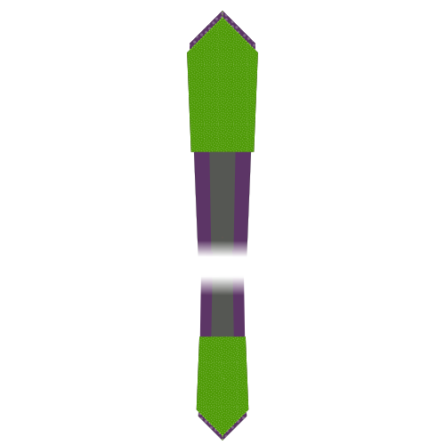

- - -
title: "Trayvon tie: Sewing Instructions"
- - -

<Tip>

###### De punt is het fijnste stukje van een das.
Als je nog nooit een das gemaakt hebt zou ik je aanraden een paar punten te maken in restjes stof voor je schaar en naald in je mooie stof zet.

Om dit te oefenen voer je stap 1 tot 4 een paar keer uit tot je het beet hebt.

</Tip>

<Tip>

###### Tijdens de constructie zal gevraagd worden je stof te strijken. Wees voorzichtig en gebruik niet te veel hitte op een delicate stof die daar niet tegen kan.

Het is een goed idee om een paar restjes stof te strijken voor je begint. Zo kan je zien wat de beste temperatuur is voor de stof die je gebruikt.

</Tip>

### Stap 1: Stik de eerste kant van je staart

Align the lining tail (piece 6) on top of the fabric tail (piece 4), good sides together

Shift the lining tail along a side running up the tail until the notch on the lining tail matches the notch on the fabric tail.

Sew in place, starting precisely at the matched notch, along the edge. Make sure to backtack on both sides.

Two notches are now fixed the same spot.

### Stap 2: Stik de tweede kant van je staart

Shift the fabric tail so that the second notch lines up with the notch on the lining tail (the place where your first seam started).

This will require you to fold a bit of the tie fabric out of the way, under the seam you make in step one.

Sew in place, starting precisely at the matched notch, making sure to get a straight angle with your seam from step 1.

Now, all three notches are fixed the same spot.

### Stap 3: Werk de staart af

Fold your tie open so that the two seams you made in step 1 and 2 lie on top of each other. Take care to fold it precisely; the folded edges should make a straight angle.

Sew the point where the three notches and your two seams converge to the folded edge of the Fabric tip (part 4, on the left in the image).

### Stap 4: Keer de das binnenstebuiten en inspecteer je werk

After you've trimmed all threads, carefully flip your tail inside-out (technically you are flipping it outside-out as it is inside out now).

If needed, you can gently push out the tip with a ruler.

Your tail should look like the picture, with a sharp point and straight edges.

The seam where the tie fabric meets the tie lining does not sit at the edge of the tie but it sits a bit back, staying out of sight.

If you managed to do all of this, you can do it again for the tip of your tie.

### Stap5: Stik de eerste kant van je punt

Align the lining tip (piece 5) on top of the fabric tip (piece 3), good sides together

Shift the lining tip along a side running up the tip until the notch on the lining tip matches the notch on the fabric tip.

Sew in place, starting precisely at the matched notch, along the edge. Make sure to backtack on both sides.

Two notches are now fixed the same spot.

### Stap 6: Stik de tweede kant van je punt

Shift the fabric tip so that the second notch lines up with the notch on the lining tip (the place where your first seam started).

This will require you to fold a bit of the tie fabric out of the way, under the seam you make in step five.

Sew in place, starting precisely at the matched notch, making sure to get a straight angle with your seam from step 5.

Now, all three notches are fixed the same spot.

### Stap 7: Werk de punt af

Fold your tie open so that the two seams you made in step 5 and 6 lie on top of each other. Take care to fold it precisely; the folded edges should make a straight angle.

Sew the point where the three notches and your two seams converge to the folded edge of the Fabric tip (part 3, on the left in the image).

### Stap 8: Keer de punt binnenstebuiten en inspecteer je werk

After you've trimmed all threads, carefully flip your tip inside-out (technically you are flipping it outside-out as it is inside out now).

If needed, you can gently push out the tip with a ruler.

Your tip should look like the picture, with a sharp point and straight edges.

The seam where the tie fabric meets the tie lining does not sit at the edge of the tie but it sits a bit back, staying out of sight.

### Stap 9: Bevestig de tussenvoering

Join Interfacing tip (piece 1) and Interfacing tail (piece 2) together on the non-pointy side, matching the notch.

> **Of niet**   Om eerlijk te zijn stik ik de tussenvoering nooit aan elkaar. Ik laat de twee helften gewoon los.
> 
> Op deze manier kan de lengte van je das nooit fout zijn, en kan je de stukken tussenvoering gewoon over elkaar heen schuiven. Daarnaast zorgt het voor minder bulk in het midden en is het minder werk.
> 
> Je kan deze stap dus gewoon overslaan, dat doe ik ook.

### Stap 10: Bevestig de stof van de das

> Als de tussenvoering vastgenaaid is, ligt de lengte van de das ook vast. Meet de das van punt tot punt, en let op dat je de stofdelen op de correcte lengte aan elkaar zet.

Join the tip and tail fabric together on the non-pointy side.

### Stap 11: maak je lus

We are going to construct the Loop (piece 7) of our tie now.

Fold the fabric as shown in the illustration. You need to end up with a narrow strip of fabric that has its ends tucked to the inside.

Make sure to have one edge a little bit shorter. This will be the back side.

While folding, reach for your iron and give it a good press so things stay in place. Also press the final loop before sewing it.

> Voorzichtig met strijken, denk aan het strijkadvies van eerder

When you're happy with how you folded and pressed your loop, hand-sew along the edge with a slipstitch to keep things in place.

### Stap 12: Stel je das samen

Time to start putting things together. Place your tie on a flat surface, good side down, lining up.

Now take your tie interfacing, and place it in your tie with the seam allowance in the middle facing upwards. Make sure to slide it between your fabric and lining on each side, all the way to the tip.

### Stap 13: Plooi en strijk je das

With your tie interfacing inserted in your tie fabric, fold over one side of the fabric over the interfacing.

You want to fold it snugly around the interfacing, but without moving the interfacing, which should stay in the middle.

When you're done, press your fold. Because of the tie interfacing, you're not pressing a sharp crease here, the main point is to shape the fabric to be more eager to stay folder around the interfacing.

> Aangezien we geen scherpe vouw strijken maar eerder de stof vormgeven werkt een stoomstrijkijzer hier het best.

When you have completed one side, fold back the other side, and steam again.

Finally, fold back the top layer along the middle of your tie, and press in place. This time, you are making a sharp crease along the middle of the tie.

> Om het verschil tussen de laatste twee plooien duidelijk te maken heb ik een donkere lijn aan de tekening toegevoegd die de rand van de stof of vouw aangeeft.
> 
> Zoals je kan zien plooien we eerst enkel de stof terug, en komt de rand voorbij het midden van de das.
> 
> De tweede keer plooien we de stof terug in het midden, waar ze later vastgenaaid wordt.

### Stap 14: Bereid de lus voor

Fold your loop so the tail of your tie can pass through it with some room.

Mark the point where the loop ends join, and sew them together.

Finally, press your loop open so the seam sits in the middle, and the ends point to one side.

### Stap 15: Blinde zoomsteek, en bevestig de lus

Use a slip stitch to hand sew your tie all along the length of the back.

> De blinde zoomsteek gaat alleen door de stof aan de achterkant. Probeer de steken niet door de tussenvoering te halen.
> 
> Wees ook voorzichtig: als de steken te diep gaan zie je ze aan de voorkant, en verpest je de das.

Make sure to slide in your loop, somewhere around 1/5th of the tie length, starting from the tip.

Use your slip stitch to secure the loop in place on the center seam; we'll fix the edges of the loop in the next step.

### Stap 16: Maak de randen van de lus vast

Hand sew the edges of the loop to your tie, so it stays in place nicely.

Make sure to sew only the bottom layer of the loop, so the stitches don't show on the loop.

And, once again, be careful not to run your stitches through your tie. Be shallow.

### Stap 17: Knip bij en kuis op

Trim any loose threads you might have.
