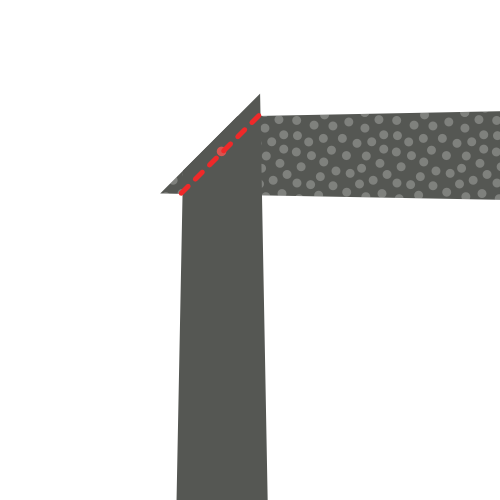
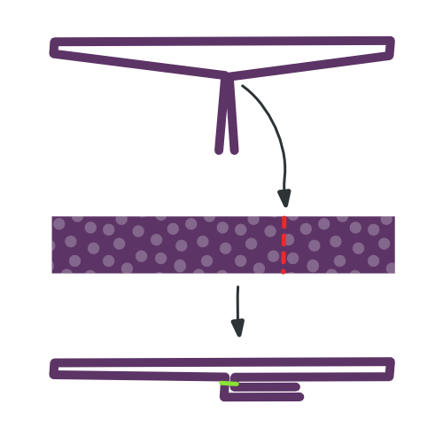

<Tip>

###### Just the tip

The tip is the most sensitive part of the tie.
If you have never made a tie before, I would advise you to make a few tie tips in scrap fabric before taking scissors and needles to your nice tie fabric.

To practice tip-making, execute constructions steps 1 through 4 a couple of times until you get the hang of it.

</Tip>

<Tip>

###### Press wisely

Later in the construction steps, you will be asked to press your fabric. Please be careful that you are not using too much heat on a delicate fabric that can't handle it.

It's a good idea to try pressing some fabric scraps before you start. This will allow you to figure out what is a good heat setting for the fabric you are using.

</Tip>

### Step 1: Sew the first side of your tie tail

Align the lining tail (piece 6) on top of the fabric tail (piece 4), good sides together

Shift the lining tail along a side running up the tail until the notch on the lining tail matches the notch on the fabric tail.

Sew in place, starting precisely at the matched notch, along the edge. Make sure to backtack on both sides.

Two notches are now fixed the same spot.

### Step 2: Sew the second side of your tie tail

Shift the fabric tail so that the second notch lines up with the notch on the lining tail (the place where your first seam started).

This will require you to fold a bit of the tie fabric out of the way, under the seam you make in step one.

Sew in place, starting precisely at the matched notch, making sure to get a straight angle with your seam from step 1.

Now, all three notches are fixed the same spot.

### Step 3: Finish the tie tail

Fold your tie open so that the two seams you made in step 1 and 2 lie on top of each other. Take care to fold it precisely; the folded edges should make a straight angle.

Sew the point where the three notches and your two seams converge to the folded edge of the Fabric tip (part 4, on the left in the image).

### Step 4: Turn the tail inside-out and inspect your work

After you've trimmed all threads, carefully flip your tail inside-out (technically you are flipping it outside-out as it is inside out now).

If needed, you can gently push out the tip with a ruler.

Your tail should look like the picture, with a sharp point and straight edges.

The seam where the tie fabric meets the tie lining does not sit at the edge of the tie but it sits a bit back, staying out of sight.

If you managed to do all of this, you can do it again for the tip of your tie.

### Step 5: Sew the first side of your tie tip

Align the lining tip (piece 5) on top of the fabric tip (piece 3), good sides together

Shift the lining tip along a side running up the tip until the notch on the lining tip matches the notch on the fabric tip.

Sew in place, starting precisely at the matched notch, along the edge. Make sure to backtack on both sides.

Two notches are now fixed the same spot.

### Step 6: Sew the second side of your tie tip

Shift the fabric tip so that the second notch lines up with the notch on the lining tip (the place where your first seam started).

This will require you to fold a bit of the tie fabric out of the way, under the seam you make in step five.

Sew in place, starting precisely at the matched notch, making sure to get a straight angle with your seam from step 5.

Now, all three notches are fixed the same spot.

### Step 7: Finish the tie tip

Fold your tie open so that the two seams you made in step 5 and 6 lie on top of each other. Take care to fold it precisely; the folded edges should make a straight angle.

Sew the point where the three notches and your two seams converge to the folded edge of the Fabric tip (part 3, on the left in the image).

### Step 8: Turn the tip inside-out and inspect your work

After you've trimmed all threads, carefully flip your tip inside-out (technically you are flipping it outside-out as it is inside out now).

If needed, you can gently push out the tip with a ruler.

Your tip should look like the picture, with a sharp point and straight edges.

The seam where the tie fabric meets the tie lining does not sit at the edge of the tie but it sits a bit back, staying out of sight.

### Step 9: Join the tie interfacing

Join Interfacing tip (piece 1) and Interfacing tail (piece 2) together on the non-pointy side, matching the notch.

> **Or don't** To be honest, I never join the interfacing. I just leave both halves unattached.
> 
> This way, you can never get the length of your tie wrong, and you can just slide the interfacing parts over each other. In addition, it creates less bulk in the middle, and it's less work.
> 
> So you can just skip this step, it's what I do.

### Step 10: Join the tie fabric

> With the interfacing sewn together, the length of our tie is now determined. Measure the tie tip to tip, and make sure that you join the fabric pieces at the correct length.

Join the tip and tail fabric together on the non-pointy side.

### Step 11: Make your tie loop

We are going to construct the Loop (piece 7) of our tie now.

Fold the fabric as shown in the illustration. You need to end up with a narrow strip of fabric that has its ends tucked to the inside.

Make sure to have one edge a little bit shorter. This will be the back side.

While folding, reach for your iron and give it a good press so things stay in place. Also press the final loop before sewing it.

> Careful when pressing, remember the pressing advice I gave earlier

When you're happy with how you folded and pressed your loop, hand-sew along the edge with a slipstitch to keep things in place.

### Step 12: Assemble your tie

Time to start putting things together. Place your tie on a flat surface, good side down, lining up.

Now take your tie interfacing, and place it in your tie with the seam allowance in the middle facing upwards. Make sure to slide it between your fabric and lining on each side, all the way to the tip.

### Step 13: Fold and press your tie

With your tie interfacing inserted in your tie fabric, fold over one side of the fabric over the interfacing.

You want to fold it snugly around the interfacing, but without moving the interfacing, which should stay in the middle.

When you're done, press your fold. Because of the tie interfacing, you're not pressing a sharp crease here, the main point is to shape the fabric to be more eager to stay folder around the interfacing.

> As we are not pressing a sharp crease here, but more shaping the fabric, a steam iron works best.

When you have completed one side, fold back the other side, and steam again.

Finally, fold back the top layer along the middle of your tie, and press in place. This time, you are making a sharp crease along the middle of the tie.

> To clarify the difference between the two last folds, I have included a dark line in the image that marks the edge of the fabric, or fold.
> 
> As you can see, the first time we merely fold the fabric back, and it extends passed the center of the tie.
> 
> The second time, we fold it back again in the middle, the place where we'll sew it in place.

### Step 14: Prepare the loop

Fold your loop so the tail of your tie can pass through it with some room.

Mark the point where the loop ends join, and sew them together.

Finally, press your loop open so the seam sits in the middle, and the ends point to one side.

### Step 15: Slip stitch tie, and insert loop

Use a slip stitch to hand sew your tie all along the length of the back.

> Your slip stitch should only catch the tie fabric on the back. Refrain from running it through the tie interfacing.
> 
> Be careful for is you run the stitch too deep, it might show on the front, and ruin your tie.

Make sure to slide in your loop, somewhere around 1/5th of the tie length, starting from the tip.

Use your slip stitch to secure the loop in place on the center seam; we'll fix the edges of the loop in the next step.

### Step 16: Secure the loop edges

Hand sew the edges of the loop to your tie, so it stays in place nicely.

Make sure to sew only the bottom layer of the loop, so the stitches don't show on the loop.

And, once again, be careful not to run your stitches through your tie. Be shallow.

### Step 17: Trim and clean up

Trim any loose threads you might have.
