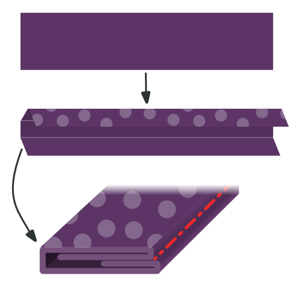

<Tip>

###### Тільки кінчик

Кінчик - найчутливіша частина краватки.
Якщо ви ніколи раніше не робили краватку, я б порадив вам зробити кілька краваток з обрізків тканини, перш ніж братися за ножиці та голки, щоб зробити гарну краватку з тканини.

Щоб потренуватися у створенні чайових, виконайте кроки з 1 по 4 кілька разів, поки не наб'єте руку на цьому.

</Tip>

<Tip>

###### Притискайте з розумом

На наступних етапах побудови вам буде запропоновано притиснути тканину. Будь ласка, будьте обережні, щоб не використовувати занадто сильне нагрівання на делікатній тканині, яка не може цього витримати.

Перед початком роботи варто спробувати віджати кілька клаптиків тканини. Це дозволить вам з'ясувати, яке налаштування нагріву є оптимальним для тканини, яку ви використовуєте.

</Tip>

### Крок 1: Зшийте перший бік хвостика краватки

Накладіть хвостик підкладки (деталь 6) на хвостик тканини (деталь 4) лицьовим боком до лицьового боку

Перемістіть хвіст підкладки вздовж сторони, що йде вгору по хвосту, так, щоб надсічка на хвості підкладки збіглася з надсічкою на хвості тканини.

Пришийте на місці, починаючи точно з відповідного надрізу, вздовж краю. Переконайтеся, що ви прошили з обох боків.

Дві насічки тепер фіксують одне й те саме місце.

### Крок 2: Зшийте другу сторону хвостика краватки

Перемістіть хвостик тканини так, щоб друга надсічка збіглася з надсічкою на хвостику підкладки (місце, де починався перший шов).

Для цього вам потрібно буде відігнути трохи тканини краватки вбік, під швом, який ви зробили на першому кроці.

Пришийте на місці, починаючи точно з відповідного надрізу, переконавшись, що ваш шов з кроку 1 утворює прямий кут.

Тепер усі три насічки зафіксовані в одному місці.

### Крок 3: Закінчіть хвіст краватки

Складіть краватку так, щоб два шви, які ви зробили на кроках 1 і 2, лежали один на одному. Складіть його акуратно; складені краї повинні утворювати прямий кут.

Пришийте місце, де сходяться три надсічки і два шви, до складеного краю тканинного наконечника (частина 4, зліва на зображенні).

### Крок 4: Виверніть хвіст навиворіт і перевірте свою роботу

Після того, як ви обрізали всі нитки, обережно переверніть хвіст навиворіт (технічно ви перевертаєте його назовні, оскільки зараз він навиворіт).

Якщо потрібно, можна акуратно виштовхнути кінчик лінійкою.

Ваш хвіст повинен виглядати, як на картинці, з гострим кінчиком і прямими краями.

Шов, де тканина краватки з'єднується з підкладкою, проходить не по краю краватки, а трохи ззаду, залишаючись поза увагою.

Якщо вам вдалося зробити все це, ви можете повторити це для кінчика краватки.

### Крок 5: Пришийте перший бік кінчика краватки

Вирівняйте кінчик підкладки (деталь 5) поверх кінчика тканини (деталь 3), лицьовими сторонами разом

Перемістіть наконечник підкладки вздовж сторони, що йде вгору, доки виїмка на наконечнику підкладки не збігатиметься з виїмкою на наконечнику тканини.

Пришийте на місці, починаючи точно з відповідного надрізу, вздовж краю. Переконайтеся, що ви прошили з обох боків.

Дві насічки тепер фіксують одне й те саме місце.

### Крок 6: Пришийте другу сторону кінчика краватки

Змістіть кінчик тканини так, щоб друга надсічка збіглася з надсічкою на кінчику підкладки (місце, де починався перший шов).

Для цього вам потрібно буде відігнути трохи тканини краватки вбік, під швом, який ви зробили на п'ятому кроці.

Пришийте на місці, починаючи точно з відповідного надрізу, переконавшись, що ваш шов утворює прямий кут з кроком 5.

Тепер усі три насічки зафіксовані в одному місці.

### Крок 7: Обробіть кінчик краватки

Складіть краватку так, щоб два шви, які ви зробили на кроках 5 і 6, лежали один на одному. Складіть його акуратно; складені краї повинні утворювати прямий кут.

Пришийте місце, де сходяться три надсічки і два шви, до складеного краю тканинного наконечника (частина 3, зліва на зображенні).

### Крок 8: Виверніть наконечник навиворіт і перевірте свою роботу

Після того, як ви обрізали всі нитки, обережно переверніть кінчик навиворіт (технічно ви перевертаєте його назовні, оскільки зараз він навиворіт).

Якщо потрібно, можна акуратно виштовхнути кінчик лінійкою.

Ваш кінчик повинен виглядати як на малюнку, з гострим кінчиком і прямими краями.

Шов, де тканина краватки з'єднується з підкладкою, проходить не по краю краватки, а трохи ззаду, залишаючись поза увагою.

### Крок 9: З'єднайте краватку між собою

З'єднайте між собою наконечник інтерфейсу (деталь 1) і хвіст інтерфейсу (деталь 2) разом на незагостреній стороні, збігаючись з виїмкою.

> **Або не** Чесно кажучи, я ніколи не приєднуюся до інтерфейсів. Я просто залишаю обидві половинки не з'єднаними.
> 
> Таким чином, ви ніколи не помилитеся з довжиною краватки, і зможете просто насунути частини, що перетинаються, одна на одну. Крім того, це створює менше об'єму в середині, і це менше роботи.
> 
> Тож ви можете просто пропустити цей крок, я так і роблю.

### Крок 10: З'єднайте тканину краватки

> Після того, як прокладки зшиті між собою, довжина нашої краватки визначена. Виміряйте краватку від кінчика до кінчика і переконайтеся, що ви з'єднуєте шматки тканини правильної довжини.

З'єднайте тканину кінчика і хвоста разом на не загостреному боці.

### Крок 11: Зробіть петлю для краватки

Тепер ми створимо петлю (деталь 7) нашої краватки.

Складіть тканину, як показано на малюнку. У вас повинна вийти вузька смужка тканини, кінці якої заправлені всередину.

Переконайтеся, що один край трохи коротший. Це буде зворотний бік.

Під час складання простягніть руку до праски і добре притисніть її, щоб речі залишалися на своїх місцях. Також притисніть останню петлю перед тим, як пришити її.

> Будьте обережні при натисканні, пам'ятайте нагальну пораду, яку я давав раніше

Коли ви задоволені тим, як склали і притиснули петлю, прошийте вручну по краю стьожковим швом, щоб утримати все на місці.

### Крок 12: Зберіть краватку

Час починати збирати речі докупи. Покладіть краватку на рівну поверхню лицьовим боком донизу.

Тепер візьміть інтерфейс краватки і вкладіть його в краватку припуском на шов посередині догори. Переконайтеся, що ви просунули її між тканиною і підкладкою з обох боків, аж до самого кінчика.

### Крок 13: Складіть і притисніть краватку

Вставивши прокладку для краватки в тканину краватки, загніть один бік тканини над прокладкою.

Ви хочете скласти його щільно навколо інтерфейсу, але не рухаючи інтерфейс, який повинен залишатися посередині.

Закінчивши, натисніть на згин. Через те, що краватка переплітається з тканиною, тут не потрібно робити різких складок, головне - надати тканині форму, щоб вона охочіше залишалася складкою навколо перехрестя.

> Оскільки тут ми не притискаємо різку складку, а більше надаємо тканині форму, найкраще підійде парова праска.

Коли ви закінчите з одним боком, відверніть інший бік і знову відпарюйте.

Нарешті, складіть верхній шар уздовж середини краватки і притисніть його на місці. Цього разу ви робите різку складку вздовж середини краватки.

> Щоб пояснити різницю між двома останніми складками, я включив темну лінію на зображенні, яка позначає край тканини, або складку.
> 
> Як бачите, перший раз ми просто відгинаємо тканину назад, і вона простягається повз центр краватки.
> 
> Вдруге складаємо посередині, в тому місці, де будемо пришивати.

### Крок 14: Підготуйте петлю

Складіть петлю так, щоб хвіст краватки міг пройти крізь неї з деяким запасом.

Позначте місце з'єднання кінців петель і зшийте їх разом.

Нарешті, розправте петлю так, щоб шов був посередині, а кінці були спрямовані в один бік.

### Крок 15: Протягніть зав'язку і вставте петлю

Пришийте краватку вручну по всій довжині спинки потайним швом.

> Шов "ковзання" повинен захоплювати тканину краватки тільки з тильного боку. Утримайтеся від проходження через стяжку, що з'єднує краватку.
> 
> Будьте обережні, адже якщо ви зробите занадто глибокий стібок, він може виявитися спереду і зіпсувати краватку.

Переконайтеся, що ви просунули петлю приблизно на 1/5 довжини краватки, починаючи від кінчика.

За допомогою потайного стібка закріпіть петлю на центральному шві; ми закріпимо краї петлі на наступному кроці.

### Крок 16: Закріпіть краї петлі

Пришийте краї петлі до краватки вручну, щоб вона добре трималася на місці.

Переконайтеся, що ви прошиваєте тільки нижній шар петлі, щоб стібки не були помітні на петлі.

І, знову ж таки, будьте обережні, щоб не протягнути стібки через краватку. Будь неглибоким.

### Крок 17: Обріжте та почистіть

Обріжте всі вільні нитки, які можуть залишитися.
