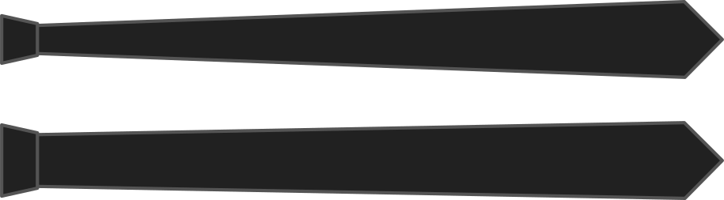

De breedte van de knoop is de breedte in het midden van de das, waar je de knoop maakt.

De breedte van je das in het midden heeft invloed op de knoop van de das. Ga breed voor grote en dikke knopen, ga smal voor kleinere knopen.

<Note>

Maak de breedte van de knoop niet groter dan de breedte van de punt

</Note>

## Effect van deze optie op het patroon

