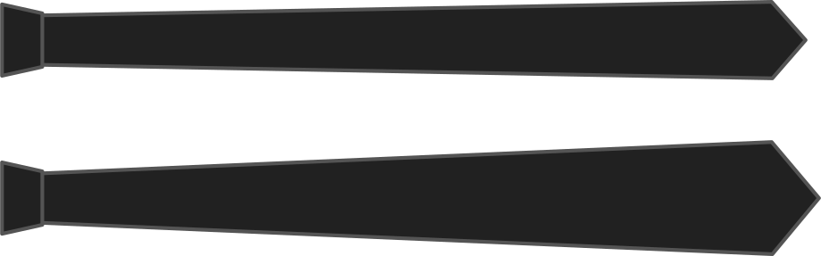

El ancho de la punta es el ancho en la punta del empate.

Cuán ancho es su corbata en la punta es una elección de estilo.

<Note>

No hacer que el ancho de la punta sea menor que el ancho del nudo

</Note>

## Efecto de esta opción en el patrón

