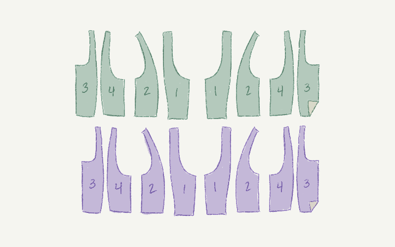
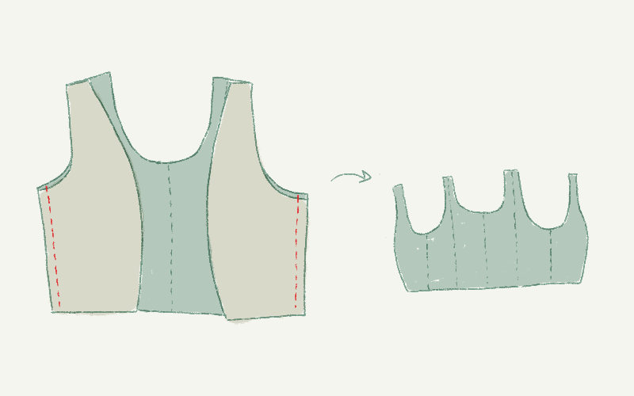
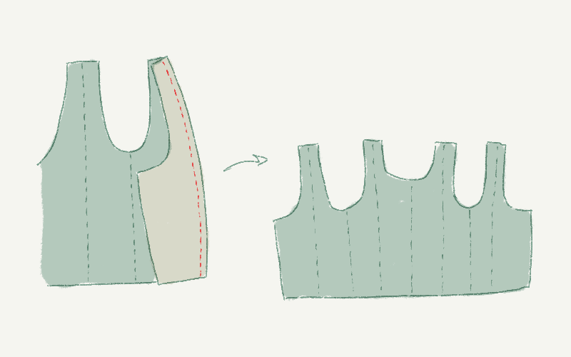
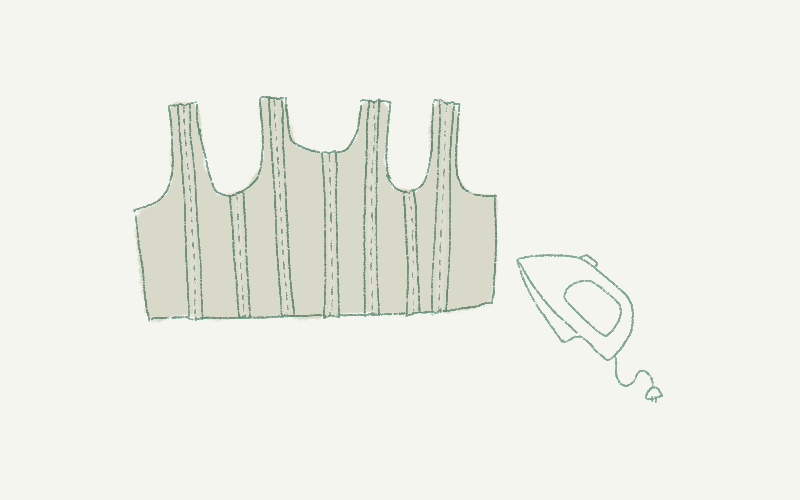
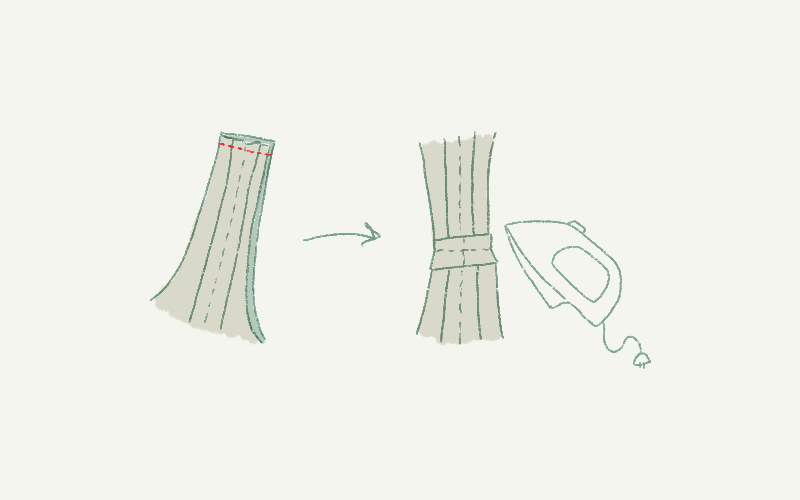
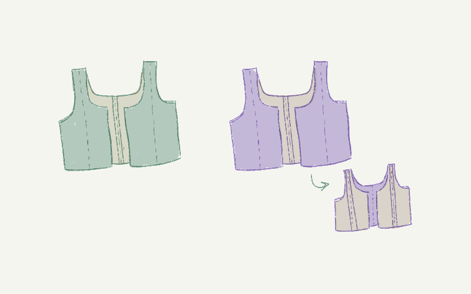
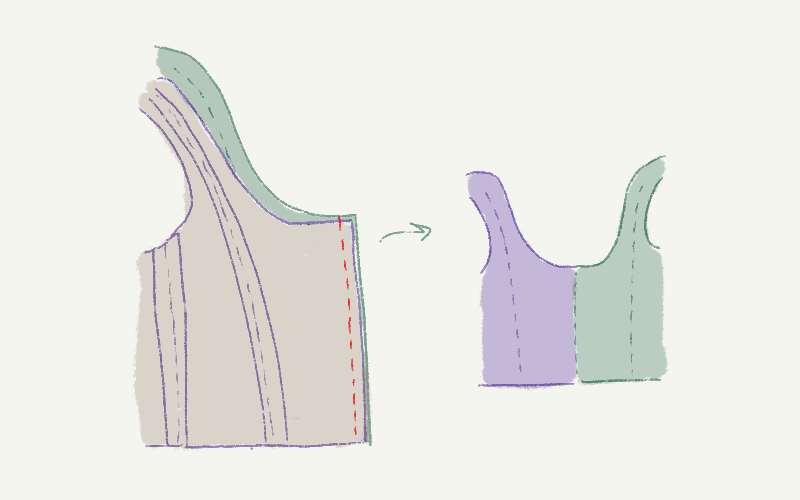
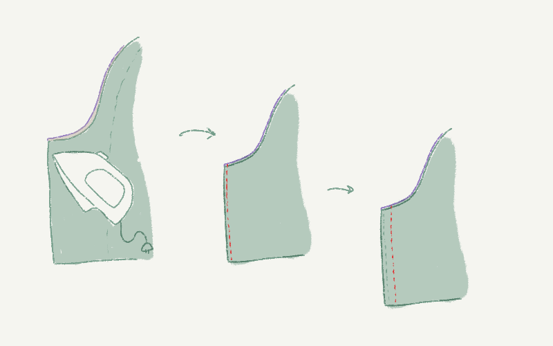

<Note>
##### There are many ways to sew a Tristan
These instructions are for a lined Tristan top with a center-front lacing closure and bias binding at the neckline, armhole, and hem.
</Note>

### Step 1: Cut your pieces

Cut your pattern pieces. If you would like to add embroidery or other decoration, now is a good time to do so.

<Note>

##### Finishing methods affect the seam allowance

If using bias binding, you should cut the neckline and armholes without seam allowance.

</Note>

### Step 2: Sew the back inside parts together at center back

Align the back inside (Part 3) parts at center back. Sew them together with _good sides together_.

### Step 3: Attach back outside parts

Attach one back outside (Part 4) part to its matching back inside (Part 3) part, _good sides together_, making sure to match any notches.

Do the same for the other back outside (Part 4) part.

### Step 4: Attach front outside parts at the side seams

Attach one front outside (Part 2) part to its matching back outside (Part 3) part, _good sides together_.

Do the same for the other front outside (Part 2) part.

### Step 5: Attach front inside parts

Finally, attach one front inside (Part 1) part to its matching front inside (Part 2) part, _good sides together_.

Do the same for the other front inside (Part 1) part.

Press all the seam allowances flat.

### Step 6: Sew at the shoulders

Sew at the shoulders to complete each armhole. Sew _good sides together_.

Repassez la couture avec les marges ouvertes.

<Note>
##### Check the fit
This is a good time to try on your garment and make any small adjustments. For example, if your shoulders have a different slope, you could make one shoulder strap a little shorter.
</Note>

### Step 7: Repeat with lining fabric

Repeat Steps 1 through 6 with your lining fabric.

You will now have two identical pieces, one with your main fabric and one with your lining.

Turn your lining piece inside out.

The red arrows in the illustration are to help you identify the center insides in the next step.

### Step 8: Begin the closure by sewing down center front

Place the center insides of the main and lining together, _good sides together_. This will become one side of your front opening.

Sew down center front.

Ouvrir à plat.

### Step 9: Sew your first boning channel

Turn right side out -- that is, put the two pieces together, _bad sides together_ -- and press.

Sew 2 mm (0.1 inch) in from center edge.

Allow enough space for your boning, then sew again.

Repeat Steps 8 through 10 on the other side.

<Note>
##### Leave enough room for your boning
Leave enough wiggle room to allow you to insert your boning. You want the channel to be snug, but not too tight.
</Note>

### Step 10: Sew your second boning channel

Mark the locations of your eyelets. Allow enough space to install these later, then sew again.

Allow enough space for another row of boning, then sew again.

Répéter de l'autre côté.

### Step 11: Insert your boning

Cap your boning if appropriate for the type of boning used. Then insert boning in the boning channels.

### Step 12: Install your eyelets

Install your eyelets between the two boning channels.

### Step 13: Bind and lace up your top

Apply bias binding to the neck hole, armholes, and hem.

Lace up your top.

### Étape 14: Vous avez terminé !

Enjoy your Tristan top!
