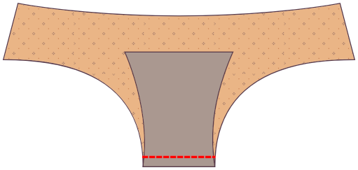
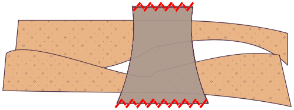
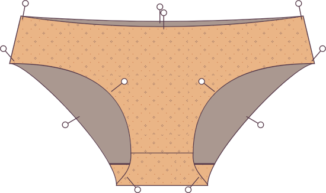

### Step 1: Pin/baste the front to the first gusset piece

Coloca una de las piezas de chispa en la parte delantera _lados buenos juntos_, de modo que las costuras de los croquis estén alineadas. Fijar o bastar en la costura de la costura.

### Paso 2: Abrir plano

Abrir plano. Puedes pulsar si quieres, pero ¿quién presiona el interior?

### Step 3: Pin/baste the back to the first gusset piece

Coloque la parte trasera en el chorro de chorro juntos. Fijar o bastar en la costura de la costura.

### Paso 4: Abrir plano

Abrir plano.

## Paso 5: Adjuntar la segunda pieza de chispa

Saca las piezas delanteras y traseras haciéndolas girar hacia el centro.

Coloque la segunda pieza de chispa bien juntos en la parte superior para que se alinee con la primera pieza de chispa. Las piezas enrolladas del frontal y de la parte trasera deben ser sándwicked entre tus rebanadas.

Ponga las costuras de la parte frontal y trasera en su franquicia de costura usando un serger o un zigzag stitch.

## Paso 6: Girar a la derecha

Gire a los unidos a la derecha. Todas las costuras de gusset deben estar adjuntas.

### Paso 7: Aplasta las costuras del lado

Anclar el lado costura buenos lados juntos. Ponga las costuras en su costura usando un serger o un zigzag stitch.

<Note>

¡Buen trabajo! Técnicamente puedes dejar los bordes en bruto, ya que los tejidos de tejidos no se frustran, Pero para ayudar a que sus undies se mantengan arriba, probablemente debería añadir elástico a las piernas y la cintura. Sigue adelante.

</Note>

### Paso 8: Preparar elástico

Sobrepasa los bordes de cada pieza de elástico por su franquicia de costura y junta juntos. Deberías tener tres piezas elásticas: una para la cintura y dos para las piernas.

Para asegurar que se estire el elástico uniformemente, divida el elástico en cuatro trimestres y marque los puntos con pines o chalco. Haz lo mismo con las aberturas de cintura y piernas, marcando los puntos de cuarto.

### Paso 9: Empuñadura elástica al exterior de la ropa

Pin el elástico a la cintura y a las aberturas de las piernas en el lado bueno del tejido, asegurando que se alinean las marcas trimestrales. Si tu elástico tiene un borde decorativo, Asegúrese de alinear el borde plano (no el borde decorativo) del elástico al borde de la tela. El borde decorativo debe estar apuntando hacia la prenda, no lejos de ella.

Difunde el elástico a la prenda usando un zigzag stitch. Tendrás que estirar un poco el elástico a medida que coser para que quede plana contra la tela. Evite estirar el tejido en sí.

Recorta cualquier tejido sobrante que cause granel o salga de la elástica.

### Paso 10: Doblar el elástico y coser de nuevo

Doblar el elástico y la tela al interior, encerrando el borde crudo de la tela bajo la elástica. Usted debería mirar el exterior de los undies, un borde plegado con un poco de la elástica mirando. Difunde usando un zigzag stitch.

Repita estos pasos para cada una de las aberturas de cintura y piernas.

¡Lo ha conseguido!
