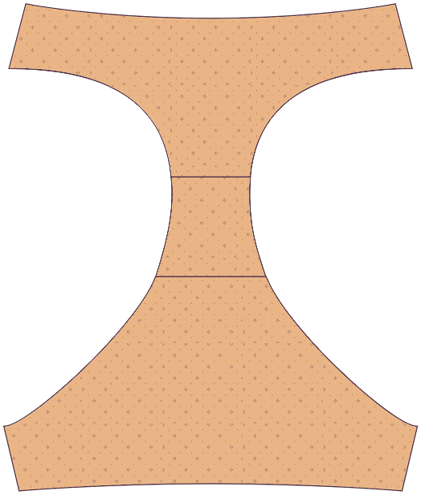
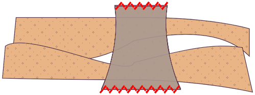
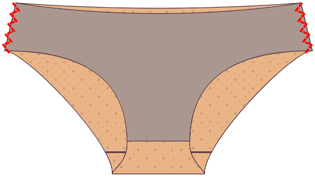
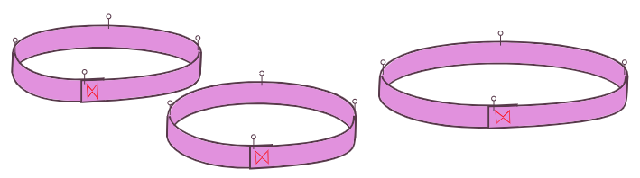
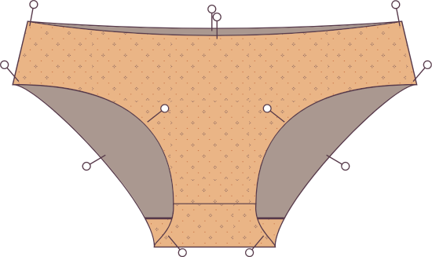
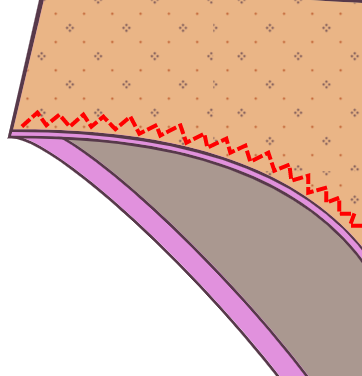

### Étape 1 : épingle/bâtis le devant au premier morceau de gousset

Place l'une des pièces du gousset sur la pièce avant, _bons côtés ensemble_, de façon à ce que les coutures de l'entrejambe soient alignées. Épingle ou bâtis au niveau de la marge de couture.

### Étape 2 : Ouvrir à plat

Ouvrir à plat. Vous pouvez repasser si vous le souhaitez, mais qui repasse les sous-vêtements ?

### Étape 3 : épingle/bâtis l'arrière au premier morceau de gousset

Place la pièce arrière sur le gousset, bons côtés ensemble. Épingle ou bâtis au niveau de la marge de couture.

### Étape 4 : Ouvrir à plat

Ouvrir à plat.

## Étape 5 : Attachez la deuxième pièce de gousset

Dégage les pièces avant et arrière du chemin en les roulant vers le centre.

Placer la seconde pièce de gousset bon cotés ensemble sur le dessus de sorte à ce qu'elle s'aligne sur la première pièce de gousset. Les pièces avant et arrière roulées doivent être sandwichées entre vos morceaux de gousset.

Coudre les coutures avant et arrières du gousset à votre marge de couture à l'aide d'une surjeteuse ou d'un point zigzag.

## Étape 6 : Retourner a l'endroit

Retourne les sous-vêtements à l'endroit. Toutes les coutures de gousset doivent être enfermés.

### Étape 7: Coudre les coutures latérales

Épingler les côtés, endroit contre endroit. Coudre les coutures latérales à votre marge de couture à l'aide d'une surjeteuse ou d'un point zigzag.

<Note>

Bon travail ! Techniquement, vous pouvez laisser les bords bruts car les tissus tricotés ne s'effilochent pas, mais pour aider vos sous-vêtements à tenir, vous devriez probablement ajouter de l'élastique aux jambes et à la taille. Continuez à avancer.

</Note>

### Étape 8 : Préparer l'élastique

Superposez les bords de chaque morceau d'élastique par votre marge de couture et cousez-les ensemble. Vous devriez avoir trois morceaux d'élastiques : un pour la ceinture et deux pour les jambes.

Pour vous assurer que vous étirez l'élastique uniformément, divisez l'élastique en quatre quarts et marquez les points avec des épingles ou de la craie. Faites la même chose avec la taille et les ouvertures des jambes, marquant les points de quart.

### Étape 9 : Coudre l'élastique à l'extérieur du vêtement

Épingler l'élastique à la taille et aux ouvertures des jambes sur le bon côté du tissu, en vous assurant d'aligner les marquages des quarts. Si votre élastique a un bord décoratif, Assurez-vous d'aligner le bord ordinaire (pas le bord décoratif) de l'élastique sur le bord du tissu. Le bord décoratif devrait être orienté vers le vêtement, pas loin de lui.

Coudre l'élastique au vêtement à l'aide d'un point de couture en zigzag. Vous devrez étirer légèrement l'élastique pendant la couture pour qu'il soit plat contre le tissu. Évitez d’étirer le tissu lui-même.

Couper tout tissus en trop qui fait des bosses ou qui sort de l’élastique.

### Étape 10 : Pliez l'élastique et cousez-le à nouveau

Pliez l'élastique et le tissu à l'intérieur, enfermant le bord brut du tissu sous l'élastique. Vous devriez voir à l'extérieur de vos sous-vêtements, un bord plié avec un peu de l'élastique en train de sortir. Coudre en utilisant un point en zigzag.

Répétez ces étapes pour chacune des ouvertures de la taille et des jambes.

Vous avez réussi !
