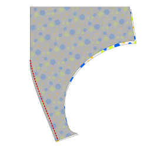
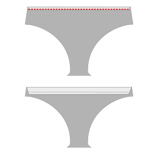
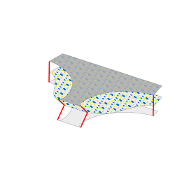
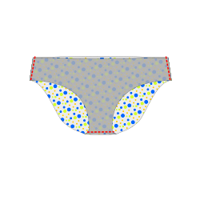
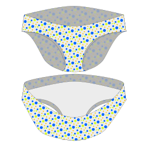
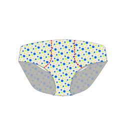
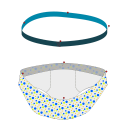
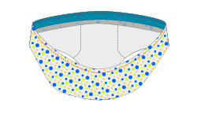
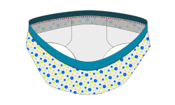

### Step 1: Sew the bulge

If you have selected the bulge option, sew together the seam/dart between the bulge split and the crotch with _good sides together_. Do this for both front pieces separately. Trim seam allowance if necessary.

Skip this step if your design doesn't have a bulge.

### Step 2: Prepare pocket

If you don't want pockets, skip to step 3.

#### If you want to have inside pockets

On the front piece from the lining fabric, fold down the seam allowance on the top edge, _bad sides together_, then fix using an elastic stitch.

Create an additional fold, around 1.5 cm below the top or around the marked edge to the same side. Press that fold, but do not sew. 

#### If you want to have zipper pockets

Of the front piece of the main fabric, insert twp zippers at the marked location. 
There are various techniques to do this. You may want to add some fusible interfacing on the bad side to make the fabric around the zipper more robust and less elastic.

### Step 3: Stack fabrics

Stack the parts in the following way, aligning and pinning the side seams and the crotch seams.

* On the table, place the front part with lining fabric, _good side up_
* On top of that, place the back part, _good side up_
* On top of that, place the front part with main fabric, _bad side up_

To double-check, the main fabric front part and the back part should have their _good sides together_ and the good side of the lining fabric should point towards the middle piece. The front parts on the outside of the stack should have their respective bad side pointing outwards, away from the back piece in the middle. 

Depending on your settings, the middle (back) part in your stack has likely a shorter crotch part and wider sides than the outer parts. Make sure to sandwich all three layers together on the future seams. You probably have to bunch up the fabric a bit.

### Step 4: Sew the parts together

Sew the crotch seam and both side seams together. Use a serger or a flexible stitch.

### Step 5: Turn it the right side out

Take only the main fabric front part (on top of the stack) and reverse the crotch part of it through the waistline opening, so that the bad sides of both front pieces are together. All seams should now be hidden between both front pieces.

This should now roughly look like underwear.

### Step 6: Create Pocket seams

If you have selected a pocket option, sew front and lining together along the marked pocket seams using a coverstitch or an elastic stitch.

### Step 7: Finish the leg seams

You have several options for finishing the leg openings. 

#### Option A: Fold it over

If you don't want to use an elastic band for the legs, you can as a simple option fold the seam allowance to the inside of the briefs and fix it using an elastic stitch. However some fabrics could warp with bad presser foot pressure and thread tension settings, so while this option is easy, it might not give the best results.

#### Option B: Use an elastic band

Another better option is to use a decorative elastic band. In this case follow [steps 8 to 10 from the Uma instructions](/docs/designs/uma/instructions#step-8-prepare-elastic) for the leg openings.

#### Option C: Bias tape 

You can also use elastic fold-over bias tape, in which case you should trim all seam allowances on the leg openings to keep the intended shape.

### Step 8: Prepare elastic for the waist

Overlap the edges of each piece of your waistband elastic by your seam allowance and stitch together.

To ensure that you stretch the elastic evenly, divide the waistband opening and your elastic into four quarters and mark the points with pins or chalk.

### Step 9: Sew elastic for the waistband

Choose if you want to have the elastic on the inside or on the outside on the finished undies. Smaller elastic bands should typically go on the inside, larger ones on the outside. The following pictures assume you want the elastic on the outside.

If you want to have the elastic on the outside, pin the bad side of the elastics to the bad side of the fabric. If you want to have the elastic on the inside, join both good sides.

If your elastic has a decorative edge, make sure that you line up the plain edge (not the decorative edge) of the elastic to the raw edge of the fabric. The decorative edge should be pointing towards the garment, not away from it.

Pin the elastic to the waist opening of the fabric on the selected side, ensuring that you line up the quarter markings. It can be very helpful to stitch it on by hand so your elastic is kept in place properly for the next step.

Sew the elastic to the garment using an elastic stitch. You will have to stretch the elastic slightly as you sew to make it lay flat against the fabric. Avoid stretching the fabric itself.

Trim away any excess fabric that causes bulk or sticks out from the elastic.

### Step 10: Fold the elastic inwards and sew it down again

Fold the elastic and fabric to the other side, enclosing the raw edge of the fabric under the elastic. Sew again using an elastic stitch.

You did it!
