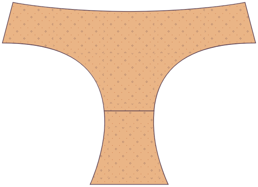
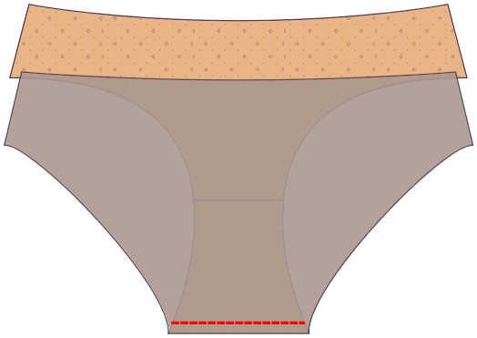

### Étape 1 : Coudre le devant à la première pièce de la rafale

Place one of the gusset pieces on the front piece, _good sides together_, so that the crotch seams are aligned. Pin or baste at the seam allowance.

### Étape 2 : Ouvrir à plat

Open flat. You can press if you want to, but who presses underwear?

### Étape 3 : Coudre le dos à la première pièce de gusset

Place the back piece on the gusset, good sides together. Pin or baste at the seam allowance.

### Étape 4 : Ouvrir à plat

Open flat.

## Étape 5 : Attachez la deuxième pièce de gusset

Get the front and back pieces out of the way by rolling them to the center.

Place the second gusset piece good sides together on top so that it lines up with the first gusset piece. The rolled-up front and back pieces should be sandwiched between your gusset pieces.

Sew the front and back gusset seams at your seam allowance using a serger or a zigzag stitch.

## Étape 6 : Sortir du côté droit

Turn the undies right side out. All gusset seams should be enclosed.

### Étape 7: Coudre les coutures latérales

Pin the side seams good sides together. Sew the side seams at your seam allowance using a serger or a zigzag stitch.

<Note>

Bon travail ! Techniquement, vous pouvez laisser les bords bruts car les tissus tricotés ne s'effilochent pas, mais pour aider vos unis à rester debout, vous devriez probablement ajouter de l'élastique aux jambes et à la taille. Continuez à avancer.

</Note>

### Étape 8 : Préparer l'élastique

Overlap the edges of each piece of elastic by your seam allowance and stitch together. You should have three elastic pieces: one for the waistband and two for the legs.

To ensure that you stretch the elastic evenly, divide the elastic into four quarters and mark the points with pins or chalk. Do the same to the waist and leg openings, marking the quarter points.

### Étape 9 : Coudre l'élastique à l'extérieur du vêtement

Pin the elastic to the waist and leg openings on the good side of the fabric, ensuring that you line up the quarter markings. If your elastic has a decorative edge, make sure that you line up the plain edge (not the decorative edge) of the elastic to the edge of the fabric. The decorative edge should be pointing towards the garment, not away from it.

Sew the elastic to the garment using a zigzag stitch. You will have to stretch the elastic slightly as you sew to make it lay flat against the fabric. Avoid stretching the fabric itself.

Trim away any excess fabric that causes bulk or sticks out from the elastic.

### Étape 10 : Pliez l'élastique et courez-le à nouveau

Fold the elastic and fabric to the inside, enclosing the raw edge of the fabric under the elastic. You should be looking at the outside of the undies, a folded edge with a bit of the elastic peeking out. Sew using a zigzag stitch.

Repeat these steps for each of the waist and leg openings.

You did it!
