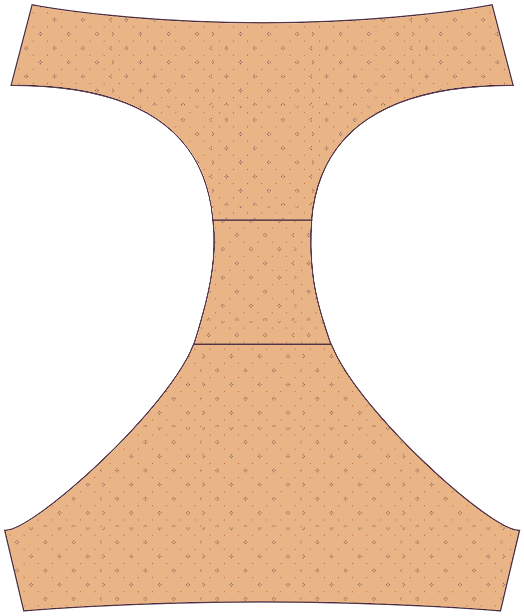

### Step 1: Pin/baste the front to the first gusset piece

Покладіть одну з ластовиць на передню частину, _лицьовими сторонами разом_, так, щоб шви в області паху були суміщені. Приколіть або приметайте на припуски швів.

### Крок 2: Відкриваємо квартиру

Відкрита квартира. Ви можете натискати, якщо хочете, але хто ж натискає нижню білизну?

### Step 3: Pin/baste the back to the first gusset piece

Покладіть задню частину на ластовицю лицьовими боками разом. Приколіть або приметайте на припуски швів.

### Крок 4: Відкриваємо квартиру

Відкрита квартира.

## Крок 5: Прикріпіть другу частину ластовиці

Складіть передню і задню частини, згорнувши їх до центру.

Покладіть другу деталь ластовиці лицьовим боком до лицьового боку так, щоб вона була на одній лінії з першою деталлю ластовиці. Згорнуті в рулон передню і задню частини слід затиснути між шматками ластовиці.

Зшийте передній і задній шви ластовиці на припусках за допомогою серветки або зигзагоподібної строчки.

## Крок 6: Виверніть праву сторону назовні

Виверніть труси на виворітну сторону. Всі шви ластовиці повинні бути закриті.

### Крок 7: Зшийте бічні шви

Бокові шви приколіть лицьовими сторонами один до одного. Зшийте бічні шви на припусках за допомогою серветки або зигзагоподібної строчки.

<Note>

Молодець! Технічно ви можете залишити краї необробленими, оскільки трикотажні тканини не рвуться, але щоб труси залишалися на місці, вам, мабуть, варто додати еластичну стрічку на ногах і талії. Не зупиняйся.

</Note>

### Крок 8: Готуємо гумку

Накладіть краї кожного шматка гумки на припуски і зшийте разом. У вас повинно бути три еластичних шматки: один для пояса і два для ніг.

Щоб переконатися, що ви розтягуєте резинку рівномірно, розділіть її на чотири чверті і позначте точки шпильками або крейдою. Зробіть те ж саме з прорізами для талії і ніг, позначивши чверть точки.

### Крок 9: Пришийте резинку до зовнішньої сторони одягу

Приколіть резинку до прорізів для талії і штанин з виворітного боку тканини, переконавшись, що вирівняли розмітку чвертей. Якщо ваша резинка має декоративний край, переконайтеся, що ви вирівняли звичайний (не декоративний) край резинки з краєм тканини. Декоративний край повинен бути спрямований до одягу, а не від нього.

Пришийте резинку до одягу зигзагоподібним швом. Вам доведеться злегка розтягнути резинку під час шиття, щоб вона щільно прилягала до тканини. Уникайте розтягування самої тканини.

Обріжте зайву тканину, яка створює об'єм або стирчить з гумки.

### Крок 10: Складіть гумку всередину і знову пришийте її

Складіть гумку і тканину всередину, загорнувши необроблений край тканини під гумку. Ви повинні дивитися на зовнішній бік трусів, на складений край, з якого визирає трохи еластичної стрічки. Зшийте зигзагоподібним швом.

Повторіть ці кроки для кожного з прорізів для талії і ніг.

У тебе вийшло!
