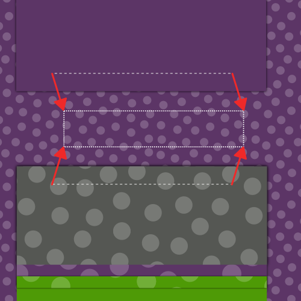
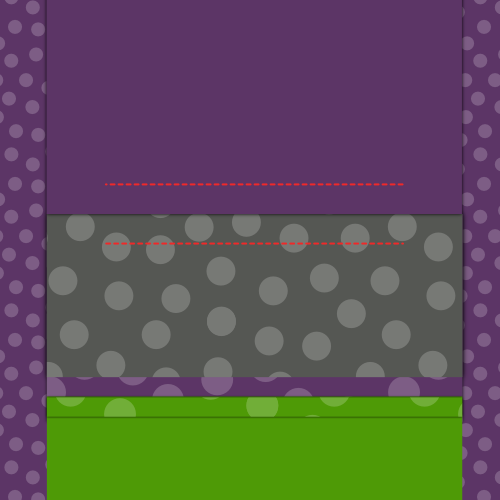
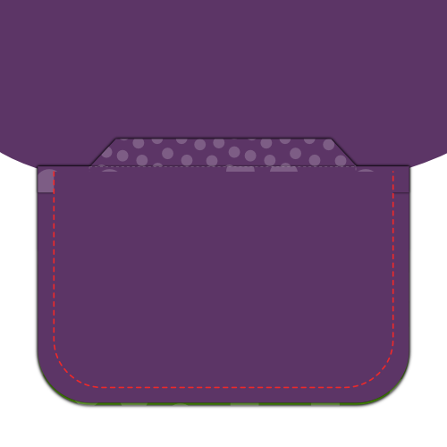

### Schritt 1: Sicherungsschnittstelle

#### Druckschnittstelle zu Taschenwelten

Platzieren Sie Ihre Taschenwelt mit der guten Seite nach unten und Ihrer Taschenschnittstelle nach oben.

Die Schnittstelle ist ein bisschen kürzer als die Welle, also achten Sie darauf, die Seite, die die Hilfezeile auf der Seite markiert hat, auszurichten.

Drücken Sie für jede Tasche auf die schlechte Seite der Taschenwelle.

#### Druckschnittstelle an Fronten

Platzieren Sie Ihre Vorderseite mit der guten Seite nach unten und Ihre Schnittstelle nach oben.

Drücken Sie die Schnittstelle an der Stelle.

> **Nehmen Sie sich Zeit**
> 
> Ziehen Sie das nicht einfach aus, um es zu bekommen, sondern drücken Sie die Schnittstelle wirklich auf Ihren Stoff, damit er gut verschmolzen kann.
> 
> Legen Sie Ihr Eisen ab und lehnen Sie es 10 Sekunden lang an, bevor Sie zum nächsten Punkt gehen, um den Vorgang zu wiederholen.

### Schritt 2: Frontseite und Futter beitreten

#### Nähen nach Futter

Platzieren Sie Ihre Front und Futter mit guten Seiten zusammen. Nähen Sie die Kanten der Verkleidung/Verkleidungsgrenze.

Nähen Sie sie zusammen.

#### Öffne Naht drücken

Drücken Sie die Naht zwischen Auflage und Verkleidung.

### Schritt 3: Alle Darts schließen

#### Rückwärtsmuster schließen

Falte deinen Rücken mit guten Seiten zusammen und nähe den Rückendart.

> Vergiss nicht, dasselbe für das Futter zu tun

#### Front-Darts schließen

Falte deine Vorderseite (und die Schnittstelle, die mit ihr verbunden ist) mit guten Seiten zusammen, und nähe den Vorderdart.

### Schritt 4: Drücken Sie alle Darts

#### Drag & Drop

Nach dem Ausschnitt öffnen, drücken Sie die Front Darts öffnen.

#### Dart nach hinten drücken

Wenn Sie die Rückendarten öffnen, drücken Sie sie offen. Wenn nicht, drücken Sie sie zur Seite.

> Vergiss nicht, dasselbe für das Futter zu tun

### Schritt 5: Konstruiere die Taschen

#### Befestige die Tasche an die Taschenwelt

Legen Sie Ihre Tasche mit der guten Seite nach unten und Ihre Taschenwelt mit der guten Seite darauf auf.

Die geradlinige Seite der Tasche mit der Seite der Welt ausrichten, die keine Schnittstelle hat, und nähen sie zusammen mit der Standardnahtzugabe.

#### Drücke Naht offen

Wenn Sie fertig sind, drücken Sie diese Naht öffnen.

#### Markieren, wohin deine Tasche gehen muss

Ihr Frontmusterstück hat eine Helpline um zu zeigen, wohin die Welttasche gehen soll. Es sind zwei halbe Rechtecke, die zusammengeführt wurden, als du den Dart geschlossen hast, um die Form deiner Welttasche zu formen.

Wenn du die vier Ecken dieses Rechtecks noch nicht markiert hast, solltest du das jetzt tun.

> Die Tasche sitzt in einem leichten Winkel auf deinem Muster. Vorwärts, in den Abbildungen werde ich die Tasche gerade ziehen, da das die Dinge einfacher macht.

#### Taschenwelt und Tasche anhängen

 

Platzieren Sie Ihr Frontstück mit der guten Seite. Wir werden die Welt an die untere Linie Ihrer Taschenumrissenumrissenlinie anschließen und die Verkleidung an der oberen Linie.

> Wenn Sie noch nie eine Welttasche gemacht haben, kann es ein bisschen kontraintuitiv sein, die Tasche an der Außenseite des Kleidungsstücks zu befestigen. Tasche sollte auf der Innenseite, nicht wahr?
> 
> Entspannen, die Tasche landet auf der Innenseite

Sowohl Ihre Taschenwelt als auch Ihre Tasche nach oben haben eine Hilfestellung. Diese Linie muss den langen Kanten Ihrer Tasche entsprechen.

Platzieren Sie die Taschenwelt unten und die Tasche nach oben, beide mit ihrer guten Seite.

Richten Sie ihre Helpline sorgfältig auf den Taschenumrissen aus. Sie sollten jetzt nebeneinander sitzen und sich in der Mitte der Tasche aneinander stoßen.

Nähen Sie nun entlang der Helpline, die den langen Rand Ihrer Tasche markiert.

> Es ist wichtig, dass die Linien, die Sie nähen, jetzt die langen Kanten eines perfekten Rechtecks bilden. Dies bestimmt die Form Ihrer Tasche, wenn Sie also eine Zeile länger als die andere machen oder wenn sie nicht parallel oder falsch ausgerichtet sind, sieht die Tasche schlecht aus.

#### Die Tasche öffnen

Zeit, die Tasche sorgfältig zu öffnen. Beginnen Sie in der Mitte der Tasche und schneiden Sie entlang der längsten Kanten zur Seite.

An den Kanten Ihrer Tasche müssen Sie aufhören, die Mitte zu öffnen und stattdessen gegen das Ende Ihrer Linie von Nähten unter 45 Grad zu schneiden.

> Dieses kleine Dreieck, das Sie am Ende schneiden, ist wichtig. Achten Sie darauf, dass Sie genau so abschneiden, wie Sie bis zum Ende der Nähte schneiden sollten, ohne in die Nähte zu schneiden.

#### Öffne die Naht

Drücken Sie die Naht entlang der langen Kanten der Tasche zu öffnen.

#### Bring die Tasche nach hinten und drücke

Die Tasche nach hinten drehen und nach unten drücken.

#### Drücke die Dreiecke an den kurzen Seiten nach unten

Move your pocket facing out of the way to reveal those little triangles at the side of your pocket.

Falte sie zurück, um sicherzustellen, dass deine Tasche ein sauberes Rechteck öffnet, und drücke sie herunter.

#### Bring die Taschenwelt auf den Rücken, falten und drücken

 

Klappe den Taschenrahmen mit der aufgesetzten Tasche auf die Rückseite.

Falte deine Welt an der Stelle, an der sie die Spitze der Tasche erreicht. Die Welt sollte die gesamte Taschenöffnung abdecken.

> Die Illustration zeigt dies von hinten an, da es einfacher ist zu sehen, was auf diese Weise geschieht. Allerdings sollten Sie von vorne überprüfen, um sicherzustellen, dass Ihre Tasche gut aussieht.

#### Dreiecke der Tasche nach unten

Legen Sie Ihre Vorderseite mit der guten Seite nach oben und stellen Sie sicher, dass die Tasche und Welt flach liegen.

Falte deine Vorderseite vertikal am Rand deiner Tasche und zeige das kleine Dreieck an der kurzen Seite deiner Taschenöffnung auf.

Nähen Sie dieses Dreieck durch Nähen direkt neben der Falte und Taschenkante.

#### Tasche schließen

Nähen Sie Ihre Tasche mit der Tasche an die Tasche, um Ihre Tasche zu beenden.

> Das sollte selbstverständlich sein, aber achten Sie darauf, dass Sie Ihre Tasche nicht an die Vorderseite Ihrer Weste nähen.

#### Drücke deine fertige Tasche

Wenn du fertig bist, gib deiner Tasche eine gute Abschlussprüfung.

### Schritt 6: Mitte der Naht

Legen Sie Ihre beiden hinteren Stücke mit ihrer guten Seite zusammen und nähen Sie die Mitte nach hinten.

Wenn du fertig bist, drücke diese Naht öffnen.

> Vergiss nicht, dasselbe für das Futter zu tun

### Schritt 7: An Fronten zurücktreten

Legen Sie den Rücken nach unten mit der guten Seite nach oben und legen Sie Ihre Fronten mit der guten Seite. Die Seitennaht, Pin und Nähte ausrichten.

Wenn du fertig bist, drücke diese Nähte öffnen.

### Schritt 8: Trete den Schultern bei

Die Schulternaht ausrichten, nähen und die Naht öffnen.

> Vergiss nicht, dasselbe für das Futter zu tun

### Schritt 9: Fügen Sie das Futter ein

#### Gleitfutter in den Waschnack

Legen Sie Ihr Futter in die Weste, gute Seiten zusammen. Mit anderen Worten, die Weste sollte die gute und schlechte Seite haben. Das Futter sollte die schlechte Seite in und gute Seite haben.

#### Futter an Stoff anheften

Legen Sie das Futter mit der Gewebekante an und befestigen Sie es an der Stelle.

Beginnen Sie mit der Mitte nach hinten, und folgen Sie der Halslinie nach unten der vorderen Schließung. Bearbeite dich um den Saum herum, aber hinterlasse eine 15 cm tiefe Lücke in der Mitte.

#### Futter für Stoff nähen

Das Futter ist sauber angehängt, Nähfutter und Gewebe sind zusammengesetzt.

Vergessen Sie nicht, dass 15 cm Lücke in der Mitte zurück zu lassen.

#### Weste drehen und Kanten drücken

Erreiche durch die Lücke, die du links am Saum geöffnet hast, und drehe deine Weste.

Drücken Sie die Kanten, die Sie gerade genäht haben, und stellen Sie sicher, dass Sie den Stoff ein bisschen rollen, damit das Futter immer versteckt ist.

### Schritt 10: Beende die Armlöcher

#### Nähte die Stoffnaht zurück

Entlang des Armlochs die Naht der Weste rücken. Halten Sie dabei Ihr Futter aus dem Weg.

#### Verkleidung nach unten anheften

falten Sie nun das Futter ein bisschen vor dem Rand des Armlochs zurück und pinnen es nach unten.

#### Handnähen Sie das Futter für den Stoff

Benutzen Sie einen Hausschuh, um das Futter an den Stoff entlang des Armlochs zu nähen.

### Schritt 11: Beende den Saum

Denken Sie daran, dass wir in Schritt 9 nicht geschlossen haben? Es ist Zeit, es zu schließen.

Benutzen Sie einen Slipstitch, um das Futter mit der Hand zu nähen und den Saum zu schließen.

### Schritt 12: Erstelle die Schaltflächen

Falls du das noch nicht getan hast, übertrage die Buttonloch-Platzierung von deinem Muster auf deinen Stoff.

Mach diese Knopflöcher.

### Schritt 13: Füge die Tasten hinzu

Legen Sie die Weste geschlossen an und übertragen Sie die Position Ihrer Buttonlöcher auf die Tastenseite.

Nähen Sie diese Schaltflächen.

> Sie können auch die Position der Tasten aus dem Muster übertragen. Das Übertragen der Tastenlöcher sichert Ihnen jedoch, dass sich die Tasten und Tasten aneinander anordnen werden. auch wenn Ihr Knopfloch je so leicht abgestellt ist/sind.

### Schritt 14: Optional: Nähen Sie die Kanten

Wenn Sie möchten, können Sie sich um die Kanten Ihrer Weste heften.

Das Nähen muss von Hand erfolgen. Sie führen einen einfachen Heftstich ein paar mm von den Kanten Ihrer Weste aus, lassen aber nur für ein paar Fäden Ihre Nähtfläche. Sie haben es sicherlich als Finish auf Anzug Jacken gesehen.

> Sie können den Faden mit der gleichen Farbe pflücken oder eine kontrastierende Farbe verwenden, wenn Sie sich kühn fühlen.

> Während das Nähen ein unverwechselbares Aussehen verleiht, verriegelt es auch den Stoff an das Futter/Gesicht, was verhindert, dass sich die Dinge umdrehen.

Danach solltest du wahrscheinlich deine Weste bügeln.
