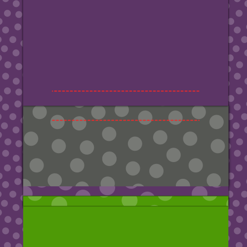
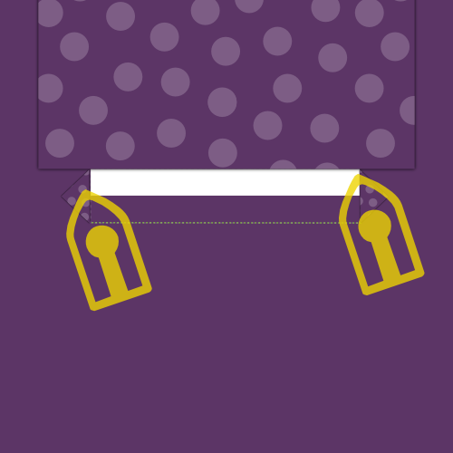
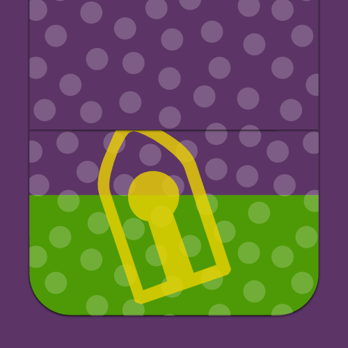

### Step 1: Fuse interfacing

#### Press interfacing to pocket welts

Place your pocket welt with the good side down, and your pocket interfacing on top.

The interfacing is a bit shorter than the welt, so make sure to align the side that has the help line marked on it.

For each pocket, press the interfacing piece to the bad side of the pocket welt.

#### Press interfacing to fronts

Place your front with the good side down, and your interfacing on top.

Press the interfacing in place.

> **Take your time**
>
> Don't just iron this on to get it over with, you want to really press that interfacing onto your fabric so that it fuses well.
>
> Place your iron down and lean on it for 10 seconds or so before you move on to the next spot to repeat the process.

### Step 2: Join front facing and lining

#### Sew facing to lining

Place your front facing and lining with good sides together. Pin the edges of the facing/lining boundary in place.

Sew them together.

#### Press open seam allowance

Press open the seam allowance between facing and lining.

### Step 3: Close all darts

#### Close back darts

Fold your back with good sides together, and sew the back dart.

> Don't forget to do the same for the lining

#### Close front darts

Fold your front (and the interfacing fused to it) with good sides together, and sew the front dart.

### Step 4: Press all darts

#### Press the front darts

Once cut open, press the front darts open.

#### Press the back darts

If you cut open the back darts, press them open. If not, press them to the side.

> Don't forget to do the same for the lining

### Step 5: Construct the pockets

#### Attach the pocket bag to the pocket welt

Place your pocket bag down with the good side up, and your pocket welt on top of it with the good side down.

Align the straight side of the bag with the side of the welt that has no interfacing, and sew them together at the standard seam allowance.

#### Press seam open

When you are done, press open this seam.

#### Mark where your pocket needs to go

Your front pattern piece has a helpline on it to show where the welt pocket should go. It's two half rectangles that got joined together when you closed the dart to form the shape of your welt pocket.

If you haven't marked the four corners of that rectangle yet, you should do so now.

> The pocket sits under a slight angle on your pattern. Going forward, in the illustrations, I will draw the pocket straight as that makes things easier.

#### Attach pocket welt and pocket facing

Place your front piece down with the good side up. We're going to attach the welt to the bottom line of your pocket outline, and the facing to the top line.

> If you've never made a welt pocket before, it can be a bit counterintuitive to attach the pocket on the outside of the garment. Pocket should be on the inside, right?
>
> Relax, the pocket will end up on the inside

Both your pocket welt and your pocket facing have a help line on them. That line needs to line up with the long edges of your pocket.

Place the pocket welt at the bottom, and the pocket facing on the top, both with their good side down.

Carefully align their helpline on the pocket outline. They should now sit side by side, and just bump into each other at the middle of your pocket.

Now sew along the helpline which marks the long edge of your pocket.

> It is important that the lines you sew now form the long edges of a perfect rectangle. This will determine the shape of your pocket, so if you make one line longer than the other, or if they are not parallel or mis-aligned, you pocket will look bad.

#### Cut open the pocket

Time to carefully cut open the pocket. Start in the middle of the pocket, and cut towards along the longest edges towards the side.

At the edges of your pocket you need to stop cutting open the center and instead cut towards the end of your line of stitches under 45 degrees.

> This small triangle you are cutting at the end is important. Make sure to aim carefully as you should cut right up to the end of your stitches, without cutting into the stitches.

#### Press open the seam allowance

Press open the seam allowance along the long edges of your pocket.

#### Bring the pocket facing to the back and press

Flip the pocket facing to the back side and press it down.

#### Press down the triangles at the short sides

Move your pocket facing out of the way to reveal those little traingles at the side of your pocket.

Fold them back making sure you to keep your pocket opening a clean rectangle, and press them down.

#### Bring the pocket welt to the back, fold and press

Flip the pocket welt with the attached pocket back tot he back side.

Fold your welt down at the point where it reaches the top of the pocket. The welt should cover the entire pocket opening.

> The illustration shows this from the back as it's easier to see what is going on this way. However, you should check from the front to make sure your welt pocket looks good.

#### Sew down the pocket triangles

Put your front down with the good side up and make sure the pocket facing and welt lie flat.

Fold your front over vertically at the edge of your pocket to reveal that little triangle at the short side of your pocket opening.

Sew this triangle down by sewing right next to the fold, and pocket edge.

#### Close the pocket bag

Sew your pocket facing to the pocket bag to finish your pocket.

> This should go without saying, but be careful not to sew your pocket bag to the front of your waistcoat.

#### Press your completed pocket

When you're done, give your pocket a good final press.

### Step 6: Center back seam

Put your two back pieces with their good side together and sew the center back seam.

When you're done, press open this seam.

> Don't forget to do the same for the lining

### Step 7: Join back to fronts

Put your back down with the good side up and put your fronts on it with the good side down. Align the side seams, pin and sew.

When you're done, press open these seams.

### Step 8: Join the shoulders

Align the shoulder seams, sew them, and press open the seam allowance.

> Don't forget to do the same for the lining

### Step 9: Insert the lining

#### Slide lining into the wasitcoat

Place your lining in your waistcoat, good sides together. In other words, the waistcoat should have the good side in and bad side out. The lining should have the bad side in and good side out.

#### Pin lining to fabric

Align the lining with the fabric edge, and pin it in place.

Start at center back, and follow the neckline down the front closure. Work your way around the hem, but leave about a 15cm gap at the center back.

#### Sew lining to fabric

With your lining pinned neatly in place, sew lining and fabric together.

Do not forget to leave that 15cm gap at the center back.

#### Turn waistcoat and press edges

Reach through the gap you left open at the hem, and turn your waistcoat.

Press the edges you've just sewn, making sure to roll the fabric a bit so that the lining is always hidden.

### Step 10: Finish the armholes

#### Pin back the fabric seam allowance

All along the armhole, pin back the seam allowance of your waistcoat fabric. While doing so, keep your lining out of the way.

#### Pin down lining

Now fold back your lining a bit before the edge of the armhole and pin it down.

#### Hand-sew the lining to the fabric

Use a slipstitch to hand-sew the lining to the fabric all along the armhole.

### Step 11: Finish the hem

Remember that gap we didn't close in step 9? Time to close it.

Use a slipstitch to hand-sew the lining to the fabric and close the hem.

### Step 12: Make the buttonholes

If you haven't done so yet, transfer the buttonhole placement from your pattern onto your fabric.

Make those buttonholes.

### Step 13: Attach the buttons

Pin your waistcoat closed and transfer the location of your buttonholes to the button side.

Sew on those buttons.

> You could also transfer the location of the buttons from the pattern. However, transferring the buttonholes you just made assures you that the buttons and buttonholes will line up, even if your buttonhole(s) is/are ever so slightly off.

### Step 14: Optional: Pick-stitch the edges

If you'd like, you can pick-stitch around the edges of your waistcoat.

Pick-stitching needs to be done by hand. You run a simple stitch a few mm from the edges of your waistcoat, but only let your stitches surface for a few threads. You've certainly seen it as a finish on suit jackets.

> You can pick-stitch with thread of the same colour, or use a contrasting colour if you're feeling bold.

> While pick-stitching adds a distinctive look, it also locks your fabric to your lining/facing which prevents things from shifting around.

After this, you probably want to iron your waistcoat.
