- - -
title: "Wahid waistcoat: Sewing Instructions"
- - -

### Paso 1: Fusionar interfaz

#### Interfaz de prensa para soldaduras de bolsillo

Place your pocket welt with the good side down, and your pocket interfacing on top.

The interfacing is a bit shorter than the welt, so make sure to align the side that has the help line marked on it.

For each pocket, press the interfacing piece to the bad side of the pocket welt.

#### Interfaz de prensa para frontales

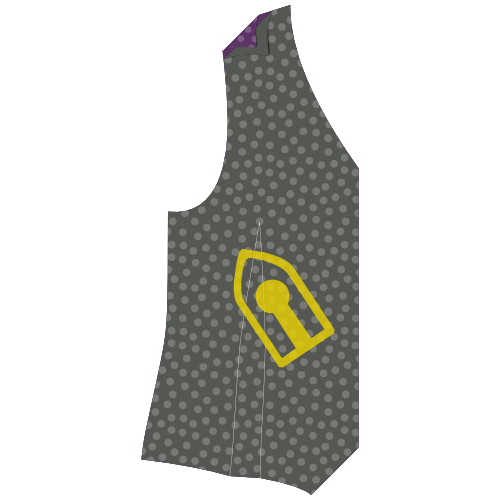

Place your front with the good side down, and your interfacing on top.

Press the interfacing in place.

> **Tómate tu tiempo**
> 
> No sólo planee esto para arreglarlo, quiere realmente presionar esa interconexión en su tela para que se fusione bien.
> 
> Coloque su hierro abajo y se incline sobre él durante 10 segundos o así antes de pasar al siguiente lugar para repetir el proceso.

### Paso 2: Unir frente y revestimiento

#### Marca hacia el revestimiento

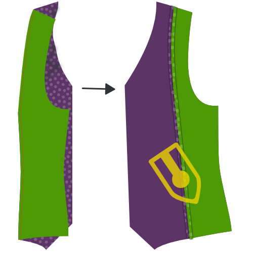

Place your front facing and lining with good sides together. Pin the edges of the facing/lining boundary in place.

Sew them together.

#### Pulse abrir costura

Press open the seam allowance between facing and lining.

### Paso 3: Cerrar todos los darts

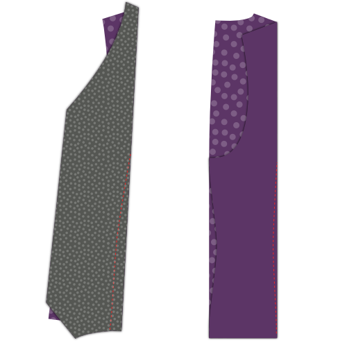

#### Cerrar dardos

Fold your back with good sides together, and sew the back dart.

> No te olvides de hacer lo mismo para el revestimiento

#### Cerrar dardos frontales

Fold your front (and the interfacing fused to it) with good sides together, and sew the front dart.

### Paso 4: Presione todos los darts

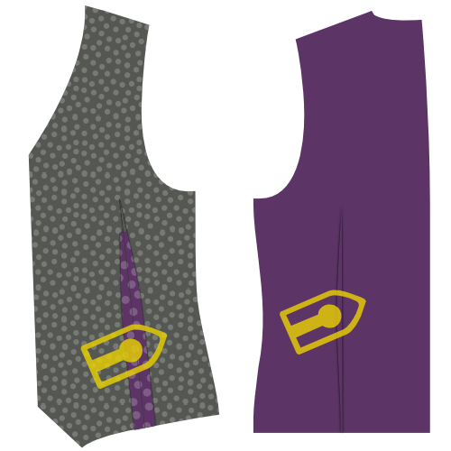

#### Presiona los dardos frontales

Once cut open, press the front darts open.

#### Presiona el reverso de los dardos

If you cut open the back darts, press them open. If not, press them to the side.

> No te olvides de hacer lo mismo para el revestimiento

### Paso 5: Construir los pockets

#### Adjuntar la bolsa de bolsillo a la soldadura del bolsillo

Place your pocket bag down with the good side up, and your pocket welt on top of it with the good side down.

Align the straight side of the bag with the side of the welt that has no interfacing, and sew them together at the standard seam allowance.

#### Presione costura abierta

When you are done, press open this seam.

#### Marca a dónde tiene que ir tu bolsillo

Your front pattern piece has a helpline on it to show where the welt pocket should go. It's two half rectangles that got joined together when you closed the dart to form the shape of your welt pocket.

If you haven't marked the four corners of that rectangle yet, you should do so now.

> El bolsillo se sienta bajo un pequeño ángulo en tu patrón. Siguiendo adelante, en las ilustraciones, dibujaré el bolsillo recto como que hace las cosas más fáciles.

#### Adjuntar soldadura de pocket y mirar al pocket

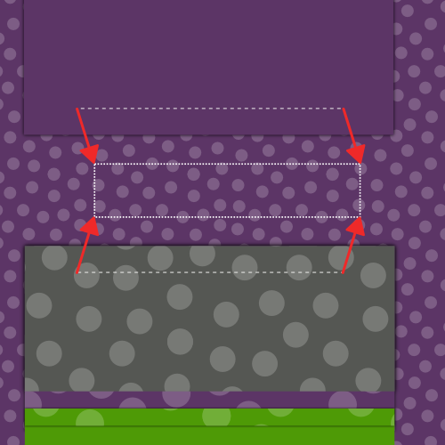 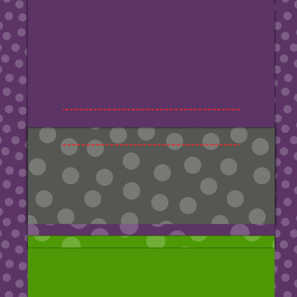

Place your front piece down with the good side up. We're going to attach the welt to the bottom line of your pocket outline, and the facing to the top line.

> Si nunca has hecho un bolsillo de soldadura antes, puede ser un poco contraintuitivo para colocar el bolsillo en el exterior de la prenda. Pocket debe estar en el interior, ¿verdad?
> 
> Relajar, el bolsillo terminará en el interior

Both your pocket welt and your pocket facing have a help line on them. That line needs to line up with the long edges of your pocket.

Place the pocket welt at the bottom, and the pocket facing on the top, both with their good side down.

Carefully align their helpline on the pocket outline. They should now sit side by side, and just bump into each other at the middle of your pocket.

Now sew along the helpline which marks the long edge of your pocket.

> Es importante que las líneas que coser ahora formen los bordes largos de un rectángulo perfecto. Esto determinará la forma de tu bolsillo, así que si haces una línea más larga que la otra, o si no son paralelos o mal alineados, el bolsillo se verá mal.

#### Cortar el bolsillo

Time to carefully cut open the pocket. Start in the middle of the pocket, and cut towards along the longest edges towards the side.

At the edges of your pocket you need to stop cutting open the center and instead cut towards the end of your line of stitches under 45 degrees.

> Este pequeño triángulo que cortas al final es importante. Asegúrate de apuntar cuidadosamente, ya que deberías cortar hasta el final de tus piernas, sin cortar en las piernas.

#### Pulse abrir la costura

Press open the seam allowance along the long edges of your pocket.

#### Trae el bolsillo hacia la parte trasera y presiona

Flip the pocket facing to the back side and press it down.

#### Pulsa abajo los triángulos en los lados cortos

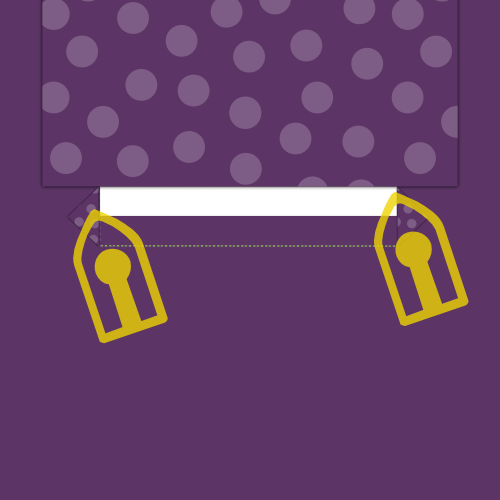

Move your pocket facing out of the way to reveal those little traingles at the side of your pocket.

Fold them back making sure you to keep your pocket opening a clean rectangle, and press them down.

#### Trae la soldadura del bolsillo a la espalda, pliega y presiona

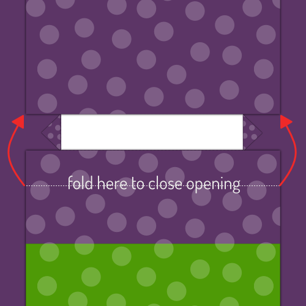 

Flip the pocket welt with the attached pocket back tot he back side.

Fold your welt down at the point where it reaches the top of the pocket. The welt should cover the entire pocket opening.

> La ilustración lo muestra desde la espalda ya que es más fácil ver lo que está pasando de esta manera. Sin embargo, debería comprobar desde el frente para asegurarse de que su pocket de soldadura se ve bien.

#### Navega por los triángulos del bolsillo

Put your front down with the good side up and make sure the pocket facing and welt lie flat.

Fold your front over vertically at the edge of your pocket to reveal that little triangle at the short side of your pocket opening.

Sew this triangle down by sewing right next to the fold, and pocket edge.

#### Cerrar la bolsa de bolsa

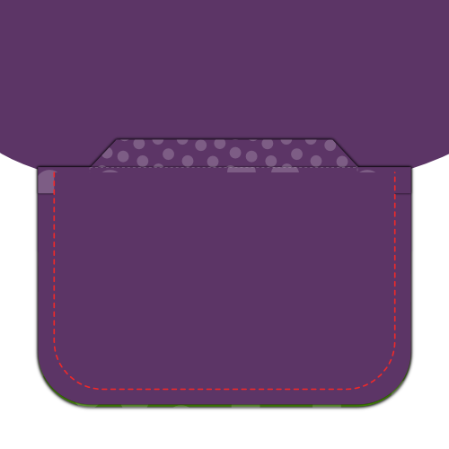

Sew your pocket facing to the pocket bag to finish your pocket.

> Esto debe ser evidente, pero tenga cuidado de no coser su bolsa de bolsillo en la parte delantera de su cintura.

#### Presione su bolsillo completado

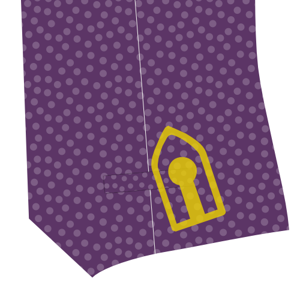

When you're done, give your pocket a good final press.

### Paso 6: Centrar costura trasera

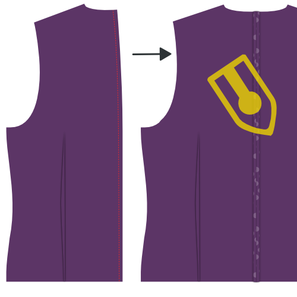

Put your two back pieces with their good side together and sew the center back seam.

When you're done, press open this seam.

> No te olvides de hacer lo mismo para el revestimiento

### Paso 7: Unirse a los frentes

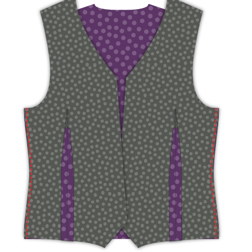

Put your back down with the good side up and put your fronts on it with the good side down. Align the side seams, pin and sew.

When you're done, press open these seams.

### Paso 8: Únete a los hombros

Align the shoulder seams, sew them, and press open the seam allowance.

> No te olvides de hacer lo mismo para el revestimiento

### Paso 9: Inserte el revestimiento

#### Desliza el revestimiento en el lavabo

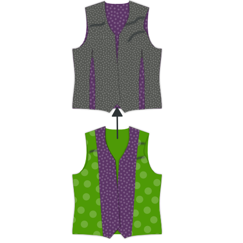

Place your lining in your waistcoat, good sides together. In other words, the waistcoat should have the good side in and bad side out. The lining should have the bad side in and good side out.

#### Fijar forro a tela

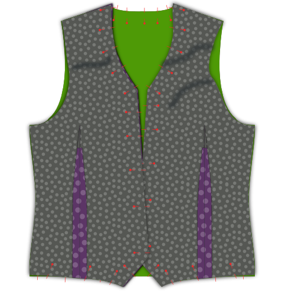

Align the lining with the fabric edge, and pin it in place.

Start at center back, and follow the neckline down the front closure. Work your way around the hem, but leave about a 15cm gap at the center back.

#### Manejar el revestimiento a la tela

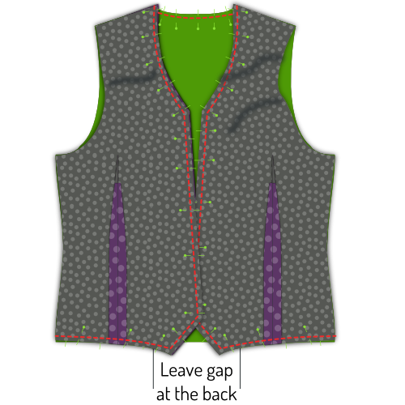

With your lining pinned neatly in place, sew lining and fabric together.

Do not forget to leave that 15cm gap at the center back.

#### Girar cinturón y pulsar bordes

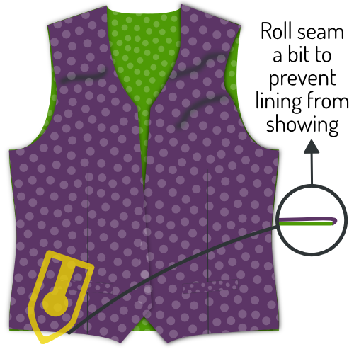

Reach through the gap you left open at the hem, and turn your waistcoat.

Press the edges you've just sewn, making sure to roll the fabric a bit so that the lining is always hidden.

### Paso 10: Termina los orificios

#### Anclar atrás la posibilidad de costura de la tela

All along the armhole, pin back the seam allowance of your waistcoat fabric. While doing so, keep your lining out of the way.

#### Anclar línea hacia abajo

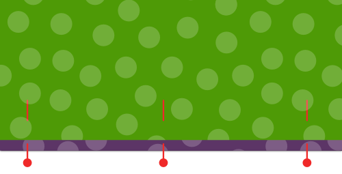

Now fold back your lining a bit before the edge of the armhole and pin it down.

#### Coser a mano el revestimiento de la tela

Use a slipstitch to hand-sew the lining to the fabric all along the armhole.

### Paso 11: Termina la lluvia

Remember that gap we didn't close in step 9? Time to close it. Time to close it.

Use a slipstitch to hand-sew the lining to the fabric and close the hem.

### Paso 12: Hacer los agujeros de botones

If you haven't done so yet, transfer the buttonhole placement from your pattern onto your fabric.

Make those buttonholes.

### Paso 13: Adjuntar los botones

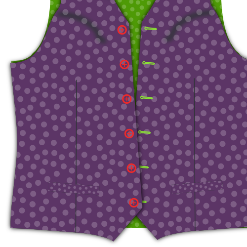

Pin your waistcoat closed and transfer the location of your buttonholes to the button side.

Sew on those buttons.

> También puedes transferir la ubicación de los botones desde el patrón. Sin embargo, la transferencia de los agujeros de botones que acabas de hacer te reconoce que los botones y agujeros de botones se alinearán, incluso si su(s) botón(es) está/están tan ligeramente apagados.

### Paso 14: Opcional: unir los bordes

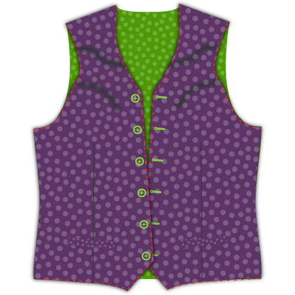

If you'd like, you can pick-stitch around the edges of your waistcoat.

Pick-stitching needs to be done by hand. You run a simple stitch a few mm from the edges of your waistcoat, but only let your stitches surface for a few threads. You've certainly seen it as a finish on suit jackets.

> Si te sientes valiente, puedes cogerla con el hilo del mismo color, o usar un color de contraste si te sientes audaz.

> Al mismo tiempo que el enganche añade un aspecto distintivo, también bloquea tu tejido a tu revestimiento/revestimiento que evita que las cosas cambien de lugar.

After this, you probably want to iron your waistcoat.
