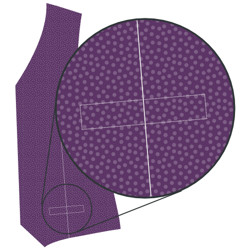

### Paso 1: Fusionar interfaz

#### Interfaz de prensa para soldaduras de bolsillo

Coloca tu soldadura de pocket con el lado bueno hacia abajo, y tu pocket interface arriba.

La interfaz es un poco más corta que la soldada, así que asegúrese de alinear el lado que tiene la línea de ayuda marcada en ella.

Para cada bolsillo, presione la pieza de enlace al lado malo de la soldadura del bolsillo.

#### Interfaz de prensa para frontales

Coloca tu frente con el buen lado hacia abajo, y tu interfaz en la parte superior.

Presione la interfaz en su lugar.

> **Tómate tu tiempo**
> 
> No sólo planee esto para arreglarlo, quiere realmente presionar esa interconexión en su tela para que se fusione bien.
> 
> Coloque su hierro abajo y se incline sobre él durante 10 segundos o así antes de pasar al siguiente lugar para repetir el proceso.

### Paso 2: Unir frente y revestimiento

#### Marca hacia el revestimiento

Coloque su frente y revestimiento con buenos lados juntos. Anclar los bordes del límite de fachada/revestimiento en su lugar.

Los espolvorean juntos.

#### Pulse abrir costura

Pulse abrir la franquicia de costura entre la cara y el revestimiento.

### Paso 3: Cerrar todos los darts

#### Cerrar dardos

Doblar la espalda con buenos lados y coser el dardo.

> No te olvides de hacer lo mismo para el revestimiento

#### Cerrar dardos frontales

Doblar la parte delantera (y la intersección se fusionó con ella) con buenos lados juntos, y coser la parte delantera.

### Paso 4: Presione todos los darts

#### Presiona los dardos frontales

Una vez cortado abierto, presione las artes frontales abiertas.

#### Presiona el reverso de los dardos

Si cortas las tinieblas, pulsa abrirlas. Si no es así, preséntalos al lado.

> No te olvides de hacer lo mismo para el revestimiento

### Paso 5: Construir los pockets

#### Adjuntar la bolsa de bolsillo a la soldadura del bolsillo

Coloque su bolsa de bolsillo abajo con el buen costado, y su bolsillo se soltó en la parte superior con el lado bueno abajo.

Alinear el lado derecho de la bolsa con el lado de la soldadura que no tiene interfaces, y coser juntos en la costura estándar.

#### Presione costura abierta

Cuando haya terminado, presione Abrir esta costura.

#### Marca a dónde tiene que ir tu bolsillo

Su pieza de patrón frontal tiene una línea de ayuda en ella para mostrar a dónde debe ir el bolsillo de soldadura. Son dos mitad rectángulos que se unieron cuando cerraste el dardo para formar la forma de tu bolsillo de soldadura.

Si aún no has marcado las cuatro esquinas de ese rectángulo, deberías hacerlo ahora.

> El bolsillo se sienta bajo un pequeño ángulo en tu patrón. Siguiendo adelante, en las ilustraciones, dibujaré el bolsillo recto como que hace las cosas más fáciles.

#### Adjuntar soldadura de pocket y mirar al pocket

 

Coloca tu parte delantera abajo con el buen lado arriba. Vamos a conectar la soldadura al fondo de tu contorno de bolsillo y la cara a la línea superior.

> Si nunca has hecho un bolsillo de soldadura antes, puede ser un poco contraintuitivo para colocar el bolsillo en el exterior de la prenda. Pocket debe estar en el interior, ¿verdad?
> 
> Relajar, el bolsillo terminará en el interior

Tanto tu soldadura de pocket como tu cara de pocket tienen una línea de ayuda en ellos. Esa línea necesita alinearse con los bordes largos de su bolsillo.

Coloque la soldadura del bolsillo en el fondo, y el bolsillo mirando en la parte superior, ambos con su buena cara hacia abajo.

Alinear cuidadosamente su línea de ayuda en el contorno del bolsillo. Ahora deberían sentarse codo con codo y simplemente meterse en el medio de tu bolsillo.

Ahora coser a lo largo de la línea de ayuda que marca el largo borde de tu bolsillo.

> Es importante que las líneas que coser ahora formen los bordes largos de un rectángulo perfecto. Esto determinará la forma de tu bolsillo, así que si haces una línea más larga que la otra, o si no son paralelos o mal alineados, el bolsillo se verá mal.

#### Cortar el bolsillo

Es hora de cortar cuidadosamente el bolsillo. Empezar en el centro del bolsillo y cortar hacia los bordes más largos hacia el lado.

En los bordes de su bolsillo usted necesita dejar de cortar el centro y en su lugar cortar hacia el final de su línea de stitches menores de 45 grados.

> Este pequeño triángulo que cortas al final es importante. Asegúrate de apuntar cuidadosamente, ya que deberías cortar hasta el final de tus piernas, sin cortar en las piernas.

#### Pulse abrir la costura

Pulse abrir la costura a lo largo de los bordes largos de su bolsillo.

#### Trae el bolsillo hacia la parte trasera y presiona

Girar el bolsillo hacia la parte trasera y presionarlo hacia abajo.

#### Pulsa abajo los triángulos en los lados cortos

Move your pocket facing out of the way to reveal those little triangles at the side of your pocket.

Doblarlos asegurándote de mantener tu bolsillo abriendo un rectángulo limpio y presionándolos hacia abajo.

#### Trae la soldadura del bolsillo a la espalda, pliega y presiona

 

Da la vuelta al ribete del bolsillo con el bolsillo unido hacia atrás.

Doblar su soldadura en el punto donde llega a la parte superior del bolsillo. La soldadura debe cubrir toda la abertura del bolsillo.

> La ilustración lo muestra desde la espalda ya que es más fácil ver lo que está pasando de esta manera. Sin embargo, debería comprobar desde el frente para asegurarse de que su pocket de soldadura se ve bien.

#### Navega por los triángulos del bolsillo

Ponga la parte delantera con el lado bueno arriba y asegúrese de que la cara del bolsillo y la soldadura están planas.

Doblar tu frente verticalmente al borde de tu bolsillo para revelar ese pequeño triángulo en el lado corto de tu bolsillo.

Mantenga este triángulo abajo coser justo al lado del pliegue, y el borde del bolsillo.

#### Cerrar la bolsa de bolsa

Mantenga su bolsillo mirando a la bolsa de bolsillo para terminar su bolso.

> Esto debe ser evidente, pero tenga cuidado de no coser su bolsa de bolsillo en la parte delantera de su cintura.

#### Presione su bolsillo completado

Cuando hayas terminado, dale a tu bolsillo una buena prensa final.

### Paso 6: Centrar costura trasera

Coloque sus dos trozos traseros con su lado bueno y coser la costura trasera del centro.

Cuando hayas terminado, presiona Abrir esta costura.

> No te olvides de hacer lo mismo para el revestimiento

### Paso 7: Unirse a los frentes

Ponga la espalda con el lado bueno arriba y ponga sus frentes en ella con el lado bueno abajo. Alinear las costuras laterales, el pin y la costura.

Cuando hayas terminado, presiona Abrir estas costuras.

### Paso 8: Únete a los hombros

Alínea la costura del hombro, coser y presionar abrir la costura.

> No te olvides de hacer lo mismo para el revestimiento

### Paso 9: Inserte el revestimiento

#### Desliza el revestimiento en el lavabo

Coloque el revestimiento en la cintura, los lados buenos juntos. En otras palabras, la capa de cintura debe tener el lado bueno dentro y el lado malo. El revestimiento debe tener el lado malo dentro y hacia fuera.

#### Fijar forro a tela

Alinear el revestimiento con el borde de la tela, y fijarlo en su lugar.

Empiece en el centro de atrás y siga la línea del cuello por el cierre delantero. Trabaja tu camino alrededor del sombrero, pero deja alrededor de un espacio de 15 cm en el centro de la espalda.

#### Manejar el revestimiento a la tela

Con su forro anclado bien en su lugar, revestimiento de coser y tejido juntos.

No olvide dejar ese hueco de 15 cm en la parte trasera del centro.

#### Girar cinturón y pulsar bordes

Alcanza el hueco que dejaste abierto en el sombrero y gira tu cinturón.

Presione los bordes que acaba de coser, asegurándose de rodar el tejido un poco para que el revestimiento esté siempre oculto.

### Paso 10: Termina los orificios

#### Anclar atrás la posibilidad de costura de la tela

A lo largo del orificio de armadura, enganchar la costura de su tela de cintura. Mientras lo haga, mantén tu alineación fuera de lugar.

#### Anclar línea hacia abajo

Ahora doblar el revestimiento un poco antes del borde del orificio y sujetarlo hacia abajo.

#### Coser a mano el revestimiento de la tela

Utilice un trozo de deslizamiento para coser a mano el forro a la tela a lo largo del orificio.

### Paso 11: Termina la lluvia

Remember that gap we didn't close in step 9? Time to close it. Es hora de cerrarlo.

Utilice un deslizamiento para coser a mano el forro a la tela y cerrar el sombrero.

### Paso 12: Hacer los agujeros de botones

Si aún no lo ha hecho, transfiera la colocación del orificio del botón de su patrón a su tejido.

Hacer esos agujeros de botón.

### Paso 13: Adjuntar los botones

Anclar la capa de cintura cerrada y transferir la ubicación de los agujeros de los botones al lado del botón.

Difusión en esos botones.

> También puedes transferir la ubicación de los botones desde el patrón. Sin embargo, la transferencia de los agujeros de botones que acabas de hacer te reconoce que los botones y agujeros de botones se alinearán, incluso si su(s) botón(es) está/están tan ligeramente apagados.

### Paso 14: Opcional: unir los bordes

Si lo deseas, puedes coger los bordes de tu cintura.

La recolección debe hacerse a mano. Corres un simple empate a unos pocos mm de los bordes de tu cinturón, pero sólo deja que tus pedazos superen para unos pocos temas. Ciertamente lo has visto como un acabado en jaquetas de traje.

> Si te sientes valiente, puedes cogerla con el hilo del mismo color, o usar un color de contraste si te sientes audaz.

> Al mismo tiempo que el enganche añade un aspecto distintivo, también bloquea tu tejido a tu revestimiento/revestimiento que evita que las cosas cambien de lugar.

Después de esto, probablemente quieras planchar tu cinturón.
