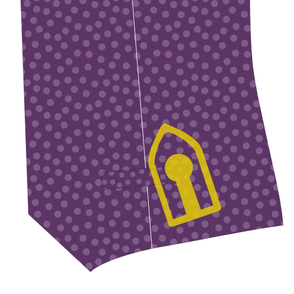
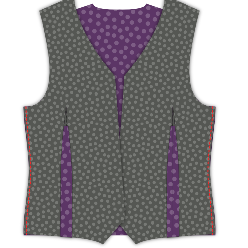
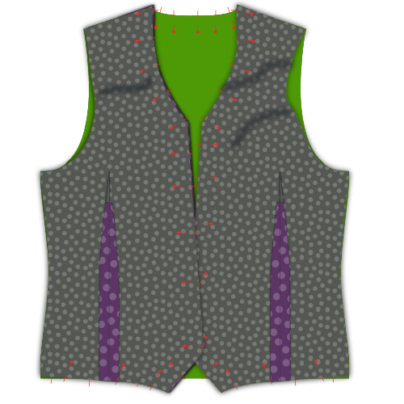

### Étape 1 : Thermocoller l'entoilage

#### Repasser l'entoilage sur les passepoils/rabats de poche

Placez votre passepoil/rabat poche avec le côté endroit vers le bas, et votre entoilage de poche sur le dessus.

L'entoilage est un peu plus petit que le passepoil, alors assurez-vous d'aligner le côté qui a la ligne d'aide marquée dessus.

Pour chaque poche, repassez l'entoilage sur l'envers du passepoil de poche.

#### Repasser l'entoilage sur les devants

Placez votre devant avec le côté endroit vers le bas et votre entoilage par-dessus.

Repassez l'entoilage en place.

> **Prenez votre temps**
> 
> Ne passez pas le fer simplement pour le repasser, vous voulez vraiment repasser sur votre tissu pour qu'il se thermocolle bien.
> 
> Placez votre fer à repasser et pressez pendant 10 secondes environ avant de passer au point suivant pour répéter le processus.

### Étape 2 : Assembler la parementure et la doublure de devant

#### Coudre la parementure à la doublure

Placez votre parementure avant et votre doublure endroit contre endroit. Épinglez les bords de la parementure/doublure en place.

Les coudre ensemble.

#### Repasser sur la marge de couture ouverte

Repassez pour ouvrir les marges de couture entre la parementure et la doublure.

### Étape 3 : Fermer toutes les pinces

#### Fermer les pinces dos

Repliez le dos endroit contre endroit et cousez la pince dos.

> N'oubliez pas de faire la même chose pour la doublure

#### Fermer les pinces devant

Repliez votre devant (avec son entoilage thermocollé) endroit contre endroit, et cousez la pince avant.

### Étape 4 : Repasser toutes les pinces

#### Repasser les pinces de devant

Une fois coupées ouvertes, repassez ouvertes les pinces avant.

#### Repasser les pinces dos

Si vous coupez les pinces dos, repassez pour les ouvrir. Si ce n'est pas le cas, repassez vers le côté.

> N'oubliez pas de faire la même chose pour la doublure

### Étape 5 : Construire les poches

#### Attacher le fond de poche au passepoil de poche

Placez votre fond de poche avec l'endroit vers le haut et votre passepoil de poche dessus avec l'endroit vers le bas.

Alignez le côté droit du fond de poche avec le côté du passepoil qui n'a pas d'entoilage, et les coudre ensemble avec la marge de couture standard.

#### Repasser pour ouvrir la couture

Lorsque vous avez terminé, repassez sur cette couture avec les marges ouvertes.

#### Marquer l'emplacement de votre poche

Votre pièce de patron avant possède une ligne d'aide pour montrer où doit être placée la poche passepoilée. Il s'agit de deux demi-rectangles réunis lors de la couture de la pince pour créer la forme de votre poche passepoilée.

Si vous n'avez pas encore marqué les quatre coins de ce rectange, vous devriez le faire maintenant.

> La poche est placée avec un léger angle sur votre patron. En avançant, dans les illustrations, je vais dessiner la poche droite car cela facilite les choses.

#### Fixer le passepoil et le parement de poche

 

Placez votre pièce devant avec l'endroit vers le haut. Nous allons fixer le passepoil à la ligne inférieure de votre contour de poche et le parement à la ligne du haut.

> Si vous n'avez jamais fait de poche passepoilée auparavant, cela peut paraître un peu contre-intuitif d'attacher la poche à l'extérieur du vêtement. La poche devrait être à l'intérieur, non ?
> 
> Détendez-vous, la poche se retrouvera bien à l'intérieur

Tant votre passepoil de poche que votre parement de poche ont une ligne d'aide. Cette ligne doit être alignée sur les bords longs de votre poche.

Placez le passepoil de poche vers le bas et le parement de poche vers le haut, les deux avec le côté endroit vers le bas.

Alignez soigneusement leur ligne d'aide sur le contour de la poche. Ils devraient maintenant se placer côte à côte et juste se superposer au milieu de votre poche.

Cousez maintenant le long de la ligne d’aide qui marque le bord long de votre poche.

> Il est important que les lignes que vous cousez forment maintenant les bords longs d'un rectangle parfait. Cela déterminera la forme de votre poche, donc si vous faites une ligne plus longue que l'autre, ou si elles ne sont pas parallèles ou mal alignées, votre poche aura mauvaise allure.

#### Couper et ouvrir la poche

Il est temps de couper soigneusement la poche. Commencez au milieu de la poche et coupez le long des bords les plus longs vers le côté.

Aux bords de votre poche, vous devez arrêter d'ouvrir le centre un peu avant et coupez plutôt à un angle de 45 degrés jusqu'au bout de chaque couture.

> Ce petit triangle que vous coupez à la fin est important. Assurez-vous de bien couper jusqu'à l'extrémité de vos points, sans les couper.

#### Repasser pour ouvrir la marge de couture

Repassez pour ouvrir la marge de couture le long des bords longs de votre poche.

#### Retourner le parement de poche vers l'arrière et repasser

Retournez le parement de poche vers l'arrière et repassez.

#### Repasser les triangles sur les côtés courts

Déplacez votre parement de poche sur le côté pour révéler ces petits triangles sur le côté de votre poche.

Repliez-les vers l'arrière en vous assurant de garder un rectangle parfait pour l'ouverture de poche, puis repassez-les.

#### Retourner le passepoil/rabat vers l'arrière, le plier et le repasser

 

Retournez le passepoil de poche avec la poche attachée vers le côté arrière.

Pliez votre passepoil au point où il atteint le sommet de la poche. Le passepoil doit couvrir la totalité de l'ouverture de poche.

> L'illustration le montre depuis le dos car il est plus facile de voir ce qui se passe de cette façon. Cependant, vous devriez vérifier à l'avant pour vous assurer que votre passepoil de poche est bien placé.

#### Coudre les triangles de poche

Placez votre devant avec le côté endroit vers le haut et assurez-vous que le parement et le passepoil de poche soient bien à plat.

Repliez le devant verticalement au bord de votre poche pour révéler ce petit triangle sur le côté court de votre ouverture.

Cousez ce triangle en cousant tout près du pli, et du bord de la poche.

#### Fermer le fond de poche

Cousez votre parement de poche au fond de poche pour finir votre poche.

> Cela devrait aller de soi, mais attention à ne pas coudre votre fond de poche au devant de votre gilet.

#### Repasser votre poche terminée

Lorsque vous avez terminé, donnez à votre poche un dernier coup de repassage.

### Etape 6: Couture centrale du dos

Placez vos deux pièces de dos endroit contre endroit et cousez la couture centrale du dos.

Lorsque vous avez terminé, repassez pour ouvrir cette couture.

> N'oubliez pas de faire la même chose pour la doublure

### Étape 7 : Joindre le dos aux devants

Posez votre dos avec le côté endroit vers le haut et posez vos devants dessus avec leur côté endroit vers le bas (endroit contre endroit donc). Alignez les coutures latérales, épinglez et cousez.

Lorsque vous avez terminé, Repassez pour ouvrir ces coutures.

### Étape 8: Joindre les épaules

Alignez les coutures des épaules, cousez-les et repassez pour ouvrir la marge de couture.

> N'oubliez pas de faire la même chose pour la doublure

### Étape 9 : Insérer la doublure

#### Faire glisser la doublure dans le gilet

Placez votre doublure dans votre gilet, endroit contre endroit. En d'autres termes, le gilet devrait avoir le côté endroit à l'intérieur et le côté envers à l'extérieur. La doublure devrait avoir le côté envers à l'intérieur et le côté endroit vers l'extérieur.

#### Épingler la doublure sur le tissu

Alignez la doublure avec le bord du tissu, puis épinglez-la en place.

Commencez au centre de l'arrière et suivez l'encolure jusqu'à l'ouverture du devant. Faites le tour de l'ourlet, mais laissez un écart de 15 cm environ au centre du dos.

#### Coudre la doublure au tissu

Avec votre doublure épinglée bien en place, coudre la doublure et le tissu ensemble.

N'oubliez pas de laisser cet écart de 15 cm au centre du dos.

#### Retourner le gilet et repasser les coutures

Passez la main par l’écart que vous avez laissé ouvert à l’ourlet et retournez votre gilet.

Repassez les bords que vous venez de coudre, assurez-vous de rouler un peu le tissu afin que la doublure soit toujours cachée.

### Étape 10 : Terminer les emmanchures

#### Épingler la marge de couture du tissu

Tout au long de l'emmanchure, épinglez la marge de couture du tissu de votre gilet. Tout le long de cette manoeuvre, veillez à maintenir la doublure hors d'atteinte.

#### Épingler la doublure

Maintenant, pliez votre doublure un peu en retrait du bord de l'emmanchure et épinglez-la.

#### Coudre la doublure à la main sur le tissu

Utilisez un point de couture glissée pour coudre à la main la doublure sur le tissu le long de l'emmanchure.

### Étape 11 : Terminer l'ourlet

Vous vous souvenez du trou que nous n'avons pas fermé à l'étape 9 ? Il est temps de le fermer.

Utilisez un point de couture glissée pour coudre à la main la doublure sur le tissu et ainsi fermer l'ouverture.

### Étape 12: Faire les boutonnières

Si vous ne l'avez pas encore fait, transférez le placement des boutonnières de votre patron sur votre tissu.

Faites ces boutonnières.

### Étape 13: Coudre les boutons

Épinglez votre gilet fermé et transférez l'emplacement de vos trous de boutonnières sur le côté des boutons.

Coudre ces boutons.

> Vous pouvez également transférer l'emplacement des boutons à partir du patron. Cependant, le transfert des trous de boutons que vous venez de faire vous assure que les boutons et les boutonnières s'alignent, même si votre ou vos boutonnier(s) sont un peu décalés.

### Étape 14: Optionnel : Surpiquer les bords

Si vous le souhaitez, vous pouvez faire une surpiqure (nommée couture AMF) sur les bords de votre gilet.

La couture AMF doit être faite à la main. Vous faites un simple point droit à quelques mm des bords de votre gilet, en laissant votre fil sortir que sur quelques fils. Vous l'avez certainement vu comme finition sur des vestes de costume.

> Vous pouvez faire la couture avec un fil de la même couleur ou utiliser une couleur contrastante si vous vous sentez audacieux.

> Bien que la couture AMF ajoute un aspect esthétique, il permet également de maintenir votre tissu à votre doublure/parementure ; ce qui les empêche de se décaler par la suite.

Après cela, vous voudrez probablement repasser votre gilet.
