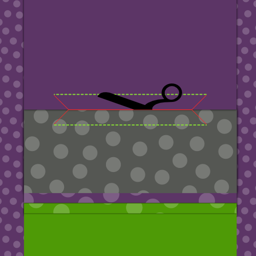
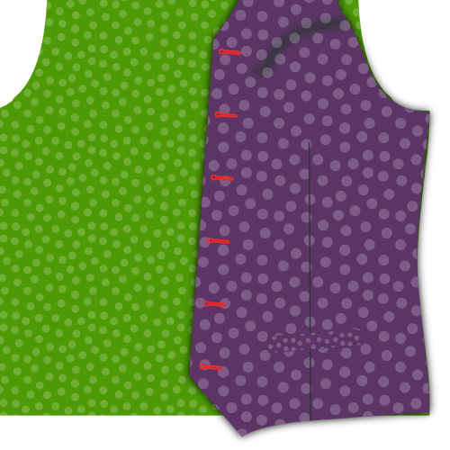
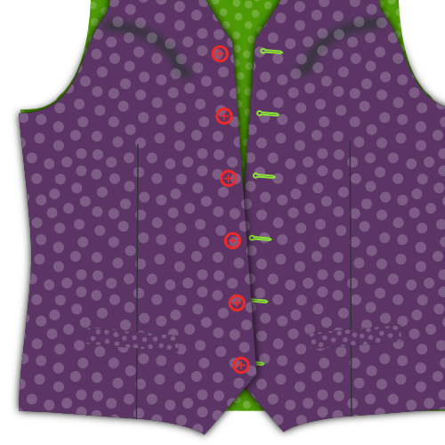

### Крок 1: Взаємодія запобіжників

#### Притискання до кишенькових швів

Покладіть кишеню лицьовим боком донизу, а виворітним боком догори.

Інтерфейс трохи коротший за шов, тому переконайтеся, що вирівняна сторона, на якій нанесена допоміжна лінія.

Для кожної кишені притисніть з'єднувальну деталь до виворітного боку шва кишені.

#### Притискання преса до фасадів

Покладіть лицьову сторону лицьовим боком донизу, а інтерфейс зверху.

Притисніть інтерфейс на місце.

> **Не поспішайте**
> 
> Не просто пропрасуйте її, щоб покінчити з цим, вам потрібно дійсно притиснути інтерфейс до тканини, щоб він добре з'єднався з нею.
> 
> Покладіть праску і притуліться до неї приблизно на 10 секунд, перш ніж переходити до наступного місця, щоб повторити процес.

### Крок 2: З'єднайте лицьову панель і підкладку

#### Пришийте лицьову сторону до підкладки

Покладіть лицьову сторону і підкладку лицьовими сторонами разом. Закріпіть краї межі між облицюванням і підкладкою на місці.

Зшийте їх разом.

#### Припуски шва припрасувати

Розправте припуск на шов між облицюванням і підкладкою.

### Крок 3: Закрийте всі виточки

#### Закрити задні виточки

Складіть спинку лицьовими боками разом і зшийте задню виточку.

> Не забудьте зробити те ж саме для підкладки

#### Закрийте передні виточки

Складіть передню частину (і прокладку, що з'єднана з нею) лицьовими боками разом і зшийте передню виточку.

### Крок 4: Натисніть на всі виточки

#### Притисніть передні виточки

Після розрізу розпрасуйте передні виточки.

#### Запрасуйте задні виточки

Якщо ви розрізаєте задні виточки, розпрасуйте їх. Якщо ні, притисніть їх в сторону.

> Не забудьте зробити те ж саме для підкладки

### Крок 5: Створіть кишені

#### Прикріпіть кишенькову сумку до шва кишені

Покладіть кишенькову сумку лицьовою стороною догори, а кишеньковий шов на неї зверху лицьовою стороною донизу.

Вирівняйте прямий бік сумки зі стороною шва, що не стикається, і зшийте їх разом зі стандартним припуском на шви.

#### Відкрийте шов притискання

Коли ви закінчите, натисніть, щоб відкрити цей шов.

#### Позначте, куди має йти ваша кишеня

На передній частині викрійки є допоміжна лінія, яка показує, де повинна знаходитися кишеня з прорізним швом. Це два напівпрямокутники, які з'єдналися разом, коли ви закрили виточку, щоб сформувати форму кишені.

Якщо ви ще не позначили чотири кути цього прямокутника, зробіть це зараз.

> Кишеня сидить під невеликим кутом на вашій викрійці. Надалі, на ілюстраціях я буду малювати кишеню прямою, оскільки це спрощує завдання.

#### Пришийте кишеньковий шов і обшивку кишені

 

Покладіть передню частину лицьовою стороною догори. Ми пришиваємо шов до нижньої лінії контуру кишені, а лицьову сторону - до верхньої лінії.

> Якщо ви ніколи раніше не робили прорізні кишені, може здатися, що пришивання кишені на зовнішній стороні одягу може бути дещо інтуїтивно незрозумілим. Кишеня має бути зсередини, так?
> 
> Розслабтеся, кишеня опиниться всередині

Як на шві кишені, так і на лицьовій стороні кишені є допоміжна лінія. Ця лінія має збігатися з довгими краями кишені.

Покладіть кишеню швом донизу, а кишеню лицьовою стороною догори, лицьовим боком донизу.

Акуратно нанесіть номер телефону довіри на контур кишені. Тепер вони повинні сидіти пліч-о-пліч і просто стикатися один з одним посередині вашої кишені.

Тепер прошийте вздовж допоміжної лінії, яка позначає довгий край кишені.

> Важливо, щоб лінії, які ви зараз прошиваєте, утворювали довгі краї ідеального прямокутника. Це визначатиме форму кишені, тому якщо ви зробите одну лінію довшою за іншу, або якщо вони не паралельні чи не співпадають, кишеня буде виглядати погано.

#### Розріжте кишеню

Час акуратно розрізати кишеню. Почніть з середини кишені і розріжте вздовж найдовших країв у бік.

По краях кишені вам потрібно припинити розрізати центр і замість цього розрізати до кінця лінії стібків під кутом 45 градусів.

> Цей маленький трикутник, який ви вирізаєте в кінці, дуже важливий. Уважно прицілюйтеся, оскільки ви повинні різати до кінця стібків, не розрізаючи їх.

#### Розкрийте припуск на шов

Розпрасуйте припуски на шви вздовж довгих країв кишені.

#### Прикладіть кишеню лицьовою стороною до задньої сторони і натисніть

Переверніть кишеню лицьовою стороною на зворотний бік і притисніть її.

#### Притисніть трикутники на коротких сторонах

Move your pocket facing out of the way to reveal those little triangles at the side of your pocket.

Складіть їх так, щоб у кишені залишився чистий прямокутник, і притисніть.

#### Виверніть шов кишені на виворітну сторону, складіть і притисніть

 

Відверніть шов кишені разом з прикріпленою кишенею на виворітний бік.

Загніть пояс вниз у місці, де він доходить до верхньої частини кишені. Шов повинен закривати весь отвір кишені.

> На ілюстрації це показано ззаду, оскільки так легше побачити, що відбувається. Однак варто перевірити спереду, щоб переконатися, що кишеня виглядає добре.

#### Пришийте трикутники кишень

Покладіть лицьовою стороною догори і переконайтеся, що кишеня і шов лежать рівно.

Складіть передню частину вертикально по краю кишені, щоб відкрити маленький трикутник на короткій стороні кишенькового отвору.

Пришийте цей трикутник вниз, зшиваючи поруч зі згином і краєм кишені.

#### Закрийте кишенькову сумку

Пришийте кишеню лицьовою стороною до кишенькової сумки, щоб закінчити кишеню.

> Це повинно бути само собою зрозуміло, але будьте обережні, щоб не пришити кишенькову сумку до передньої частини жилета.

#### Натисніть на заповнену кишеню

Закінчивши, добре відіжміть кишеню.

### Крок 6: Центральний задній шов

Складіть обидві деталі спинки лицьовим боком до лицьового боку і зшийте середній задній шов.

Коли закінчите, розправте цей шов.

> Не забудьте зробити те ж саме для підкладки

### Крок 7: З'єднайте задню частину з передньою

Покладіть спину лицьовою стороною догори і покладіть на неї передню частину лицьовою стороною донизу. Вирівняйте бокові шви, приколіть і зшийте.

Коли закінчите, розправте ці шви.

### Крок 8: З'єднайте плечі

Вирівняйте плечові шви, зшийте їх і розпрасуйте припуски на шви.

> Не забудьте зробити те ж саме для підкладки

### Крок 9: Вставте підкладку

#### Засуньте підкладку у вітровку

Покладіть підкладку в жилет лицьовими сторонами разом. Іншими словами, жилет повинен мати гарну сторону всередину і погану сторону назовні. Підкладка повинна бути виворітною стороною всередину, а лицьовою - назовні.

#### Приколіть підкладку до тканини

Вирівняйте підкладку по краю тканини і приколіть її на місці.

Почніть від центру спинки і пройдіть по вирізу горловини до застібки спереду. Пройдіть навколо подолу, але залиште приблизно 15 см проміжку по центру ззаду.

#### Пришийте підкладку до тканини

Акуратно прикріпивши підкладку на місце, зшийте підкладку і тканину разом.

Не забудьте залишити 15-сантиметровий проміжок по центру ззаду.

#### Підверніть жилет і припрасуйте краї

Простягніть руку крізь щілину, яку ви залишили відкритою на подолі, і виверніть жилет.

Притисніть щойно зшиті краї, не забуваючи трохи скручувати тканину, щоб підкладка завжди була прихована.

### Крок 10: Закінчіть обробку пройм

#### Припуски на шви тканини приколіть назад

Уздовж пройми приколіть припуски на шви тканини жилета. При цьому тримайте підкладку подалі від дороги.

#### Закріпіть підкладку

Тепер відверніть підкладку трохи назад перед краєм пройми і приколіть її.

#### Пришийте підкладку до тканини вручну

За допомогою потайного стібка пришийте підкладку до тканини вздовж пройми вручну.

### Крок 11: Закінчіть обробку подолу

Пам'ятаєте ту прогалину, яку ми не закрили на 9-му кроці? Час закривати.

Пришийте підкладку до тканини вручну і закрийте край швом "ковзання".

### Крок 12: Зробіть петлі для ґудзиків

Якщо ви цього ще не зробили, перенесіть розташування петель з викрійки на тканину.

Зробіть ці петлі.

### Крок 13: Прикріпіть кнопки

Приколіть жилет і перенесіть розташування петель на бік ґудзиків.

Пришийте ці ґудзики.

> Ви також можете перенести розташування кнопок з викрійки. Однак перенесення петель, які ви щойно зробили, гарантує, що ґудзики і петлі будуть вирівняні, навіть якщо петлі трохи зміщені.

### Крок 14: Необов'язково: Обшийте краї пікантними стібками

За бажанням, ви можете обробити краї жилета.

Пришивку потрібно робити вручну. Ви виконуєте просту строчку на відстані кількох мм від країв жилета, але залишаючи стібки на поверхні лише на кілька ниток. Ви, безумовно, бачили його як обробку на піджаках костюмів.

> Ви можете вишивати ниткою того ж кольору або використовувати контрастний колір, якщо ви відчуваєте себе сміливо.

> Крім того, що зшивання додає виразного вигляду, воно також фіксує тканину до підкладки/лицьової сторони, що запобігає зміщенню речей.

Після цього вам, напевно, захочеться попрасувати жилет.
