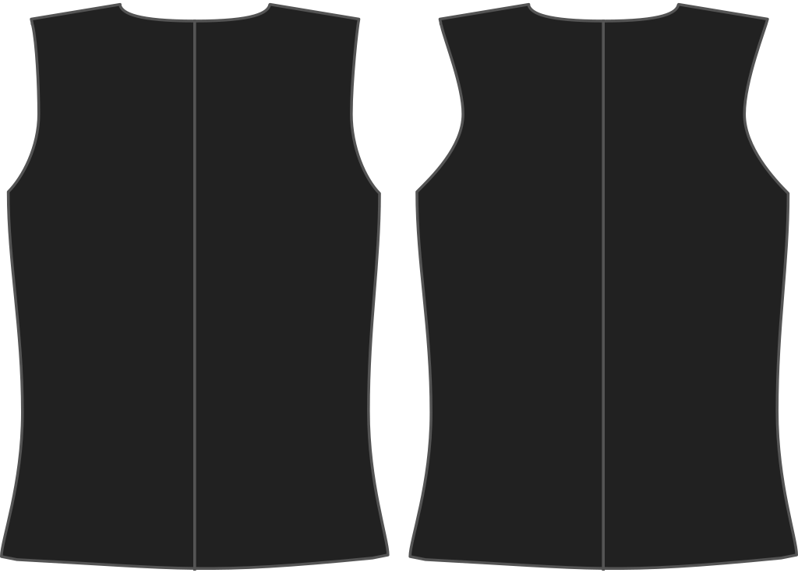

How far do you want your waistcoat armhole to curve inwards on the back side?

<Note>

###### What's the point?

The armhole of your waistcoat can curve further inward, given that there is no sleeve attached to it.
This influences the style of the waistcoat.

</Note>

## Effect of this option on the pattern

