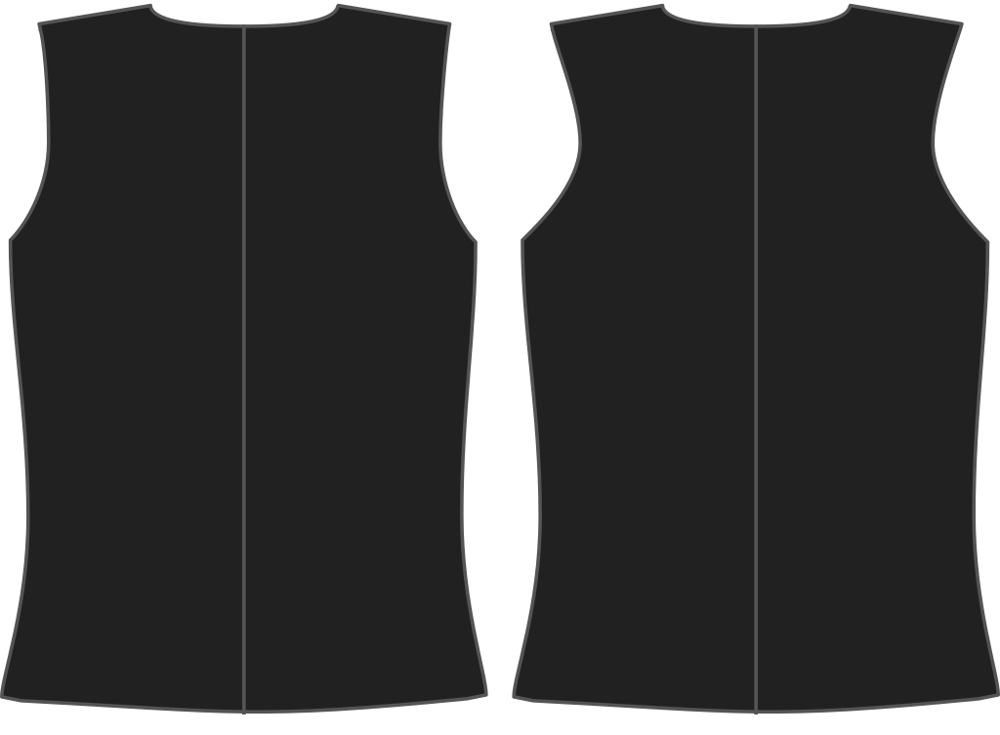

Наскільки ви хочете, щоб пройма жилета була загнута всередину зі зворотного боку?

<Note>

###### У чому сенс?

Пройма жилета може ще більше вигинатися всередину, враховуючи, що до неї не прикріплений рукав.
Це впливає на стиль жилета.

</Note>

## Вплив цієї опції на шаблон

