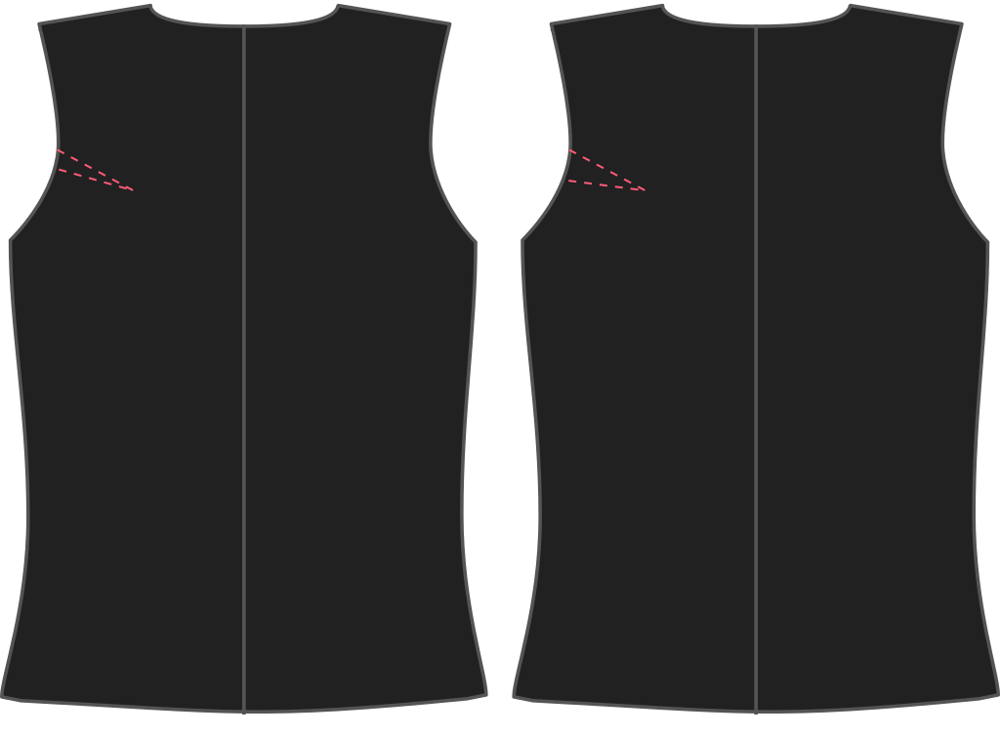

This pattern comes with a default 0.5 cm scye dart (think armhole dart) on the back. You can increase or decrease the dart to influence the armhole.

<Note>

###### What's the point?

The point of this dart is to make sure the armhole lies flat against your body, rather than gape.
Given that there is no sleeve, a gaping armhole is particularly unsightly.

While this dart is used to shape the pattern, you don't have to sew the dart because it's incorporated in the shoulder seam line.

</Note>

## Effect of this option on the pattern

