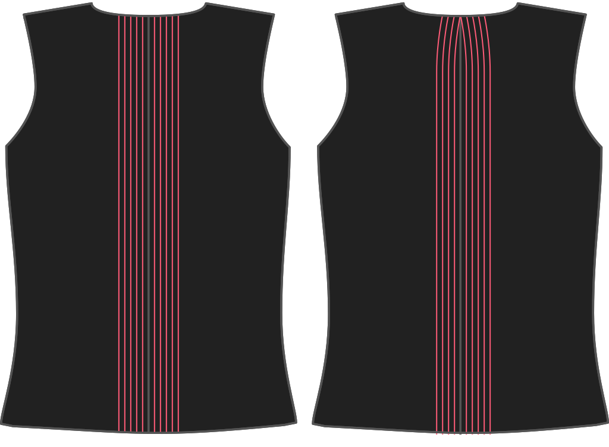

Niemand heeft een kaarsrechte rug, dus dit patroon gaat aan de nek 0.5 cm naar binnen.

<Note>

###### Waarom?

Als je rug een beetje naar voor gebogen is kan het gebeuren dat je een teveel aan stof hebt aan je nek. Zonder mouwen of kraag zorgt dit dat je halslijn gaat openstaan.
Deze optie zorgt dat er een beetje stof aan de achterkant van de nek weggenomen wordt. Het doet dit standaard met 0,5 cm, maar je kan die waarde verhogen of verlagen.

Dit is eigenlijk geen neep, maar ik wist niet zeker hoe het te benoemen. Suggesties zijn welkom.

</Note>

## Effect van deze optie op het patroon

