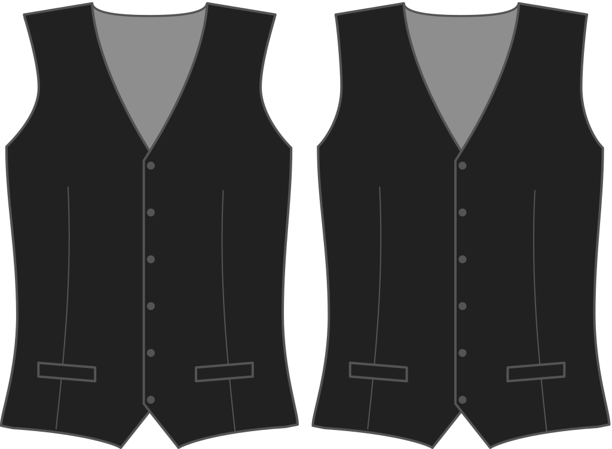

¿Hasta dónde quieres que tu armadura de cintura se curva hacia adentro en el frente?

<Note>

###### ¿Cuál es el punto?

###### What's the point?

The armhole of your waistcoat can curve further inward, given that there is no sleeve attached to it.
Esto influye en el estilo de la cintura.

</Note>

## Efecto de esta opción en el patrón

