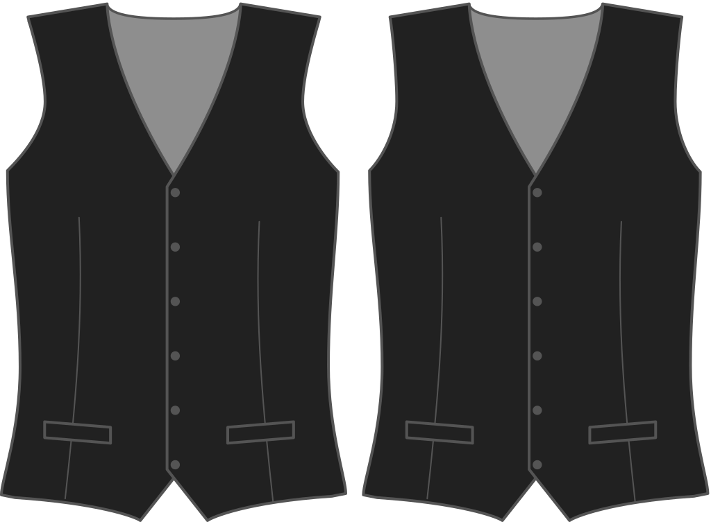

Hoe ver wil je dat het armsgat van je gilet op het voorpand naar binnen gaat?

<Note>

###### Waarom?

Het armsgat van je gilet kan verder naar binnen buigen, aangezien er geen mouw ingezet wordt.
Dit heeft invloed op de stijl van je gilet.

</Note>

## Effect van deze optie op het patroon

