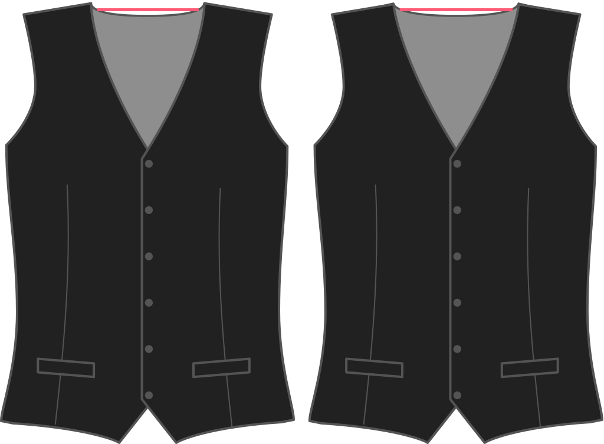

Wie weit soll sich Ihre Weste auf der SchulterNaht von Ihrem Kragen absetzen? Die Standardeinstellung ist 2cm.

<Note>

###### Was ist der Punkt?

Die Schulternaht einer Weste ist typischerweise enger als Ihr Hemd. Diese Option legt fest, wie eng sie wird (auf der Kragenseite).

</Note>

