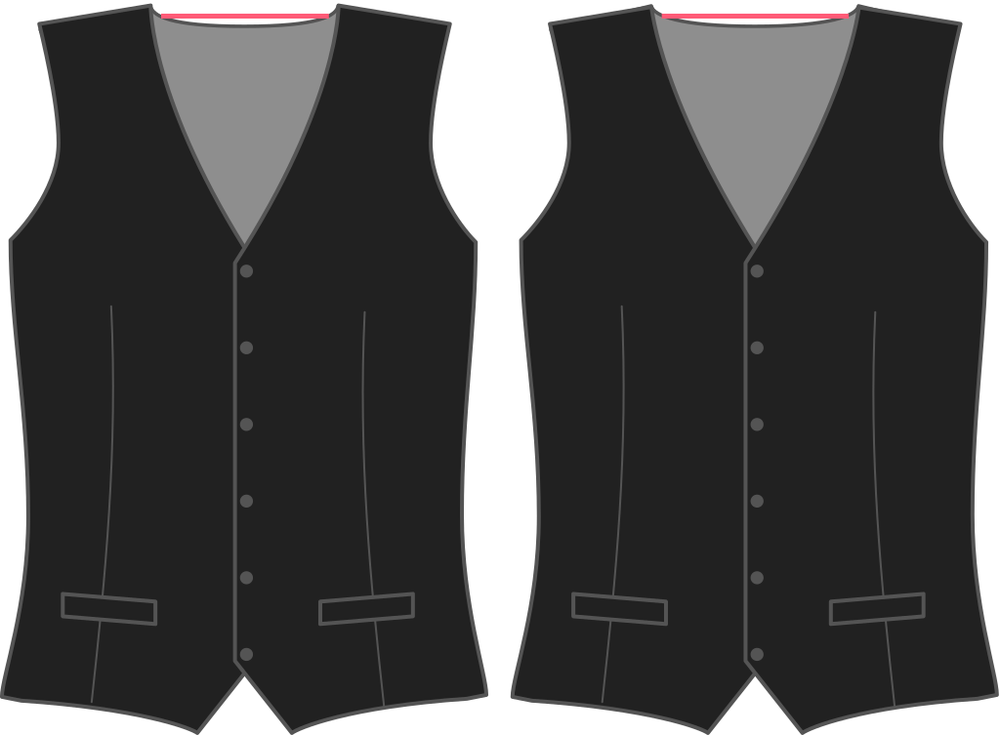

- - -
title:"Échancrure cou"
- - -

Jusqu'où voulez-vous que votre gilet s'éloigne de votre cou au niveau de votre couture d'épaule ? La valeur par défaut est 2 cm.

<Note>

###### Pour quoi faire ?

La couture de l'épaule d'un gilet est généralement plus étroite que votre chemise. Cette option permet de contrôler cette largeur (sur le côté de l'encolure).

</Note>

## Effet de cette option sur le patron

