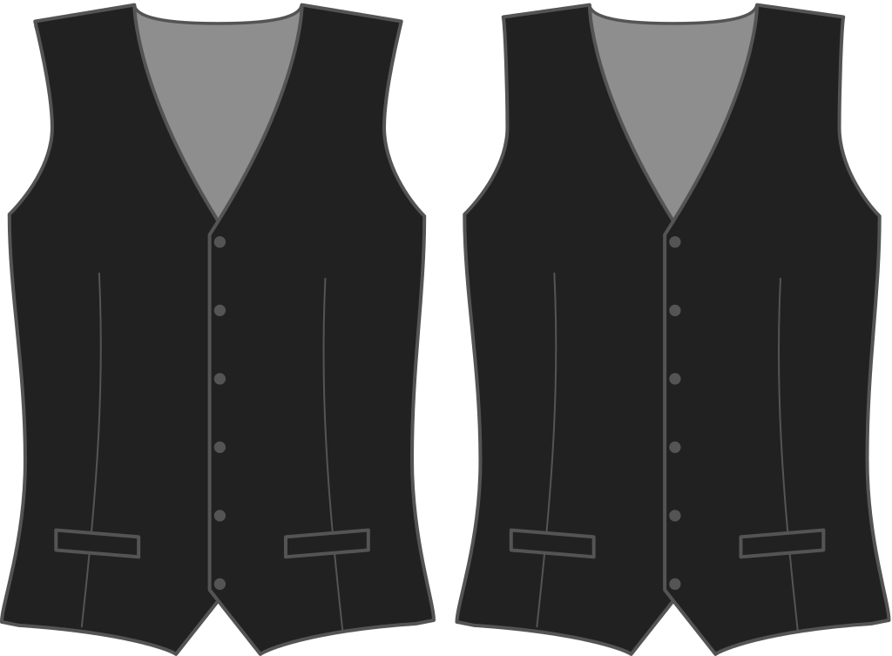

How far do you want your waistcoat to sit away from your shoulder on the shoulder seam? The default is 2cm.

<Note>

###### What's the point?

The shoulder seam of a waistcoat is typically more narrow than your shirt. This option controls how narrow it gets (on the shoulder side).

</Note>

## Effect of this option on the pattern

