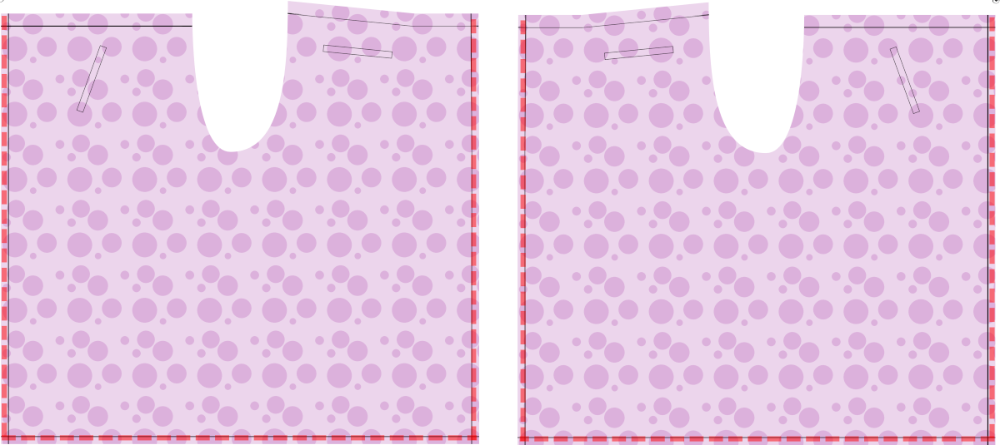
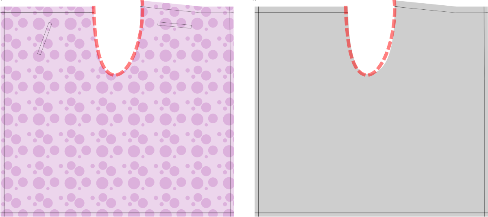

- - -
titre: "Pantalon portefeuille Waralee : Instructions de couture"
- - -

<Warning>

##### La clé de Waralee est la bande de taille

D'une certaine manière, Waralee est juste une bande de taille avec un long morceau de tissu attaché. La bande de taille doit continuer à partir du tissu en deux cordes de tissu qui sont utilisées pour attacher le pantalon à l'avant et deux autres pour le dos. Ces bandes ne sont pas incluses dans le patron. Traditionnellement, elles sont de la même longueur. Vous pouvez en faire des plus longues pour le panneau avant (le côté qui est un peu plus court que l'autre, sur la gauche dans les illustrations ci-dessous), pour vous permettre d'attacher les deux nœuds à l'avant. Je préfère comme ça car c'est pour facile à attacher et vous n'avez pas la bosse du nœud dans le dos.

</Warning>

### Étape 1 : Coudre les poches

<Note>

##### Les poches sont optionnelles

Traditionnellement, ce type de pantalon n'a pas de poches. Mais je veux mettre mon téléphone, mes clés et mon portefeuille quelque part. J'ai donc inclus des poches dans le motif. Vous pouvez décider par vous-même si vous le souhaitez sur votre pantalon.

Les illustrations des étapes suivantes montrent les pantalons Waralee sans poches. Seuls les emplacements de poche du modèle sont affichés, pour vous aider à vous orienter.

##### Si vous voulez des poches, faites-les d'abord

Si vous voulez faire les poches, faites les avant d'attacher les morceaux de tissus ensemble. Il est plus facile de travailler avec les pièces encore séparées.

</Note>

Les deux poches de Waralee sont des poches passepoilées. Celles-ci utilisent un seul morceau de tissu pour créer l'ouverture de poche, mais sont par ailleurs très similaires aux poches à double passepoil montrées ici : [Double-poches passepoilées](https://freesewing.org/docs/sewing/double-welt-pockets).

Nous commencerons par les poches avant.
- Commencez avec toutes les pièces et marquez l'emplacement de la poche sur le côté droit du tissu.
- Marquez également l'ouverture de la poche sur l'une des pièces de devant. Cette fois-ci sur le mauvais côté du tissu.
- Placez le parement sur le tissu, les côtés droit ensemble. Alignez les coins des ouvertures de la poche et épinglez-les en place.

Doublure de poche
- Marquez l'ouverture de la poche sur votre doublure de poche. Il devrait être juste à l'intérieur de la marge de couture.
- Alignez les ouvertures de poche au-dessus de tous les morceaux de tissu et fixez votre doublure de poche avec la ceinture. Épingler ou bâtir en place.

Ouverture de poche
- À l’aide de petits points de couture, coudre les côtés longs des ouvertures de poche, attrapez le tissu, la doublure de poche et la parmenture de poche. Ne pas coudre après les extrémités de l'ouverture de la poche.
- Couper une fente directement entre les deux lignes de couture. Juste avant la fin, séparez chaque extrémité de la coupe, en coupant vers chaque coin de la poche (mais sans les dépasser). Vous devriez avoir un petit V à chaque extrémité de la coupe.
- Repasser pour ouvrir la couture.
- Maintenant, faites tout passer par l'ouverture de l'autre côté. Disposez tout bien avec l'ouverture de la poche ouverte. Repassez sur l'ouverture de la poche.

Construction du passepoil
- Turn the garment over, and press the bottom edge of the pocket facing under. Later, this will yield a nice, clean edgestitch.
- Next, flip the pocket facing up, so that it covers the pocket opening. Then, fold back just enough of the facing to exactly cover the entire pocket opening. Press, and pin in place.

Sewing the pocket opening in place
- Turn the whole thing right side up, then fold back the fabric on one short side of the pocket opening, revealing a little triangle cutout and your pocket lining.
- Sew the short edge of the pocket opening, just outside of your markings. This should secure the V-shaped cutout bits to the lining. Once you feel confident everything will look good from the right side, restitch this line a few times to secure.
- Press.
- To make things nice and tidy, you'll also stitch the bottom edge of the pocket facing to the pocket lining at this point. (This is why we pressed the very edge under earlier.)

Finishing the pocket
- Take your second pocket facing, and press all edges under except for one of the longer edges.
- Lay this facing over the pocket opening, right sides together and raw edge aligned with the raw edge of the pocket lining.
- Now, fold your pocket lining over, aligning all the edges of the pocket.
- Pin or clip the second pocket facing to the pocket lining along the raw edges. Then flip the pocket lining back, and pin the entire edge of the facing to the pocket lining.
- Edgestitch the facing to the pocket fabric. This will sit behind the pocket opening when everything is assembled, so that if your pocket gaps open, your fashion fabric will show in the gap.
- Flip the pocket fabric back, aligning edges, and pin all sides of the pocket. Close the pocket as you normally do. You can use a french seam, a serger, or another method.

Making everything clean and tidy
- Flip the whole piece over so you're looking at the right side.
- Fold back the main fabric, so you can see the little triangles on the short edge of the pocket opening.
- Sew another line, now through all layers. You should be able to see the edge stitching line of the first facing. Stitch all the way to this line, which finishes the facing on the inside of the pocket. You want to be really close to the fold with this stitch line.
- Now fold the fabric back on the long side of the pocket opening, where the pocket sides were stitches together. You'll see the initial stitch line of the pocket opening. Make sure all the layers of fabric are laying nicely, and stitch over this stitch line once again, now through all layers. This secures this side of the pocket to the garment fabric.
- Flip over, press well, and admire your work.

<Note>

I included placements for the front pockets that will be hidden by the flaps in the front. But they will still be easily accessible to put your phone or keys in. These are single welt pockets. The ones in the front are at an angle and the ones in the back are horizontally oriented. The pocket templates should allow for enough fabric to attach the pocket to the waistband. If you want particularly deep pockets, please adjust accordingly.

</Note>

Constructing the back pockets
- The back pockets are also single welt pockets, but the pocket opening is horizontal, rather than at an angle. This means they hew much closer to the instructions for [double welt pockets](https://freesewing.org/docs/sewing/double-welt-pockets).
- Follow the double welt instructions, modifying the opening to have a single welt, rather than a double welt.

Congratulations! Your pockets are finished!

### Step 2: Hem the sides and bottom

- Hem the sides
- Hem the bottom.

<Note>

You can use whatever method works best for you. In the version I first made I just serged the sides, folded them back and top stitched them, then did the same for the bottom. I did this to keep the bulk of the fabric to a minimum and allow for a better drape. What you do should depend on the type of fabric you're using.

</Note>

### Step 3: Sew the two pants parts together at the crotch

Now you get to sew the two pants parts together.

- Lay the two pants parts on top of one another with _good sides together_ and sew the seam along the cutout.
- _Finish_ this seam and press it.

### Step 4: Prepare the four strings

The strings are just long tubes of fabric.

- Take a quarter of your waist measurement. Add that number to 40cm (17”). Add your seam allowance. This is the length of each string.
- Cut out four strips of fabric that are that long and 5cm (2”) wide.

<Tip>

For example, if my waist circumference is 84.6cm: 84.6cm divided by 4 is 21.2cm. 21.2cm plus 40cm is 61.2cm. 61.2cm plus my seam allowance of 1cm is 62.2cm. I will cut four strips of fabric that are 62.2cm by 5cm.

</Tip>

<Note>

##### You can lengthen the front ties

Optionally, to make the front ties longer, extend them by your quarter waist measurement.

When generating your pattern, one of the style options is called “Waist Band”. The strings, when folded, should have the same width as you specified for that option, 2.5cm (1") by default.

The extra 40cm (17") of length is to make the knot.

If your material is delicate or flimsy, you can add some interfacing to this to give it strength.

</Note>

- Fold them in half along the long side, _good sides together_.
- Stitch the long side and one of the short sides,
- Turn the tie right side out.

<Tip>

##### Tourner les tubes du côté droit du tissu peut être difficile

Cela peut être facilité en prenant un morceau de twine plus long que les bandes. Dites que entre les côtés de droite, le long du pli. Assurez-vous de bien l'attraper en couturant le côté court. Vous pouvez l'utiliser pour tirer la fin à travers le tube que vous avez créé. Lorsque vous avez terminé, vous pouvez le couper. Avoir un long bâton skinny ou un tourneur de boucle peut également aider à cela.

</Tip>

### Step 5: Sew the waist band

Now it is time to sew the waist band.

- If your fabric is delicate, add interfacing to the wrong side of the pants above the waist band line. (red)
- Fold the seam allowance in, and then fold along the waist band line. (red)
- Insert one of the strings you made in the previous step on each side.
- Sew along the waist band line, and add some additional stitching to make sure those strings are attached well. (blue)

<Warning>

##### Secure the strings well

The strings keep your pants up, so having that stitching fail will result in awkward moments.

</Warning>

### Step 6: Wear your pants

Press your pants, and try them on!

Hold the front side against your belly and wrap both strings around you and tie in the back (or, if you have long strings, wrap them all the way around you and tie in the front). Then hand the back side through your legs to yourself and tie the other strings in the front.

Here is an article demonstrating how to tie wrap pants: [How to Tie Wrap Pants](https://www.wikihow.com/Tie-Wrap-Pants)

If you get stuck, or have additional questions, you can always reach out to [other FreeSewers](https://discord.freesewing.org/).
