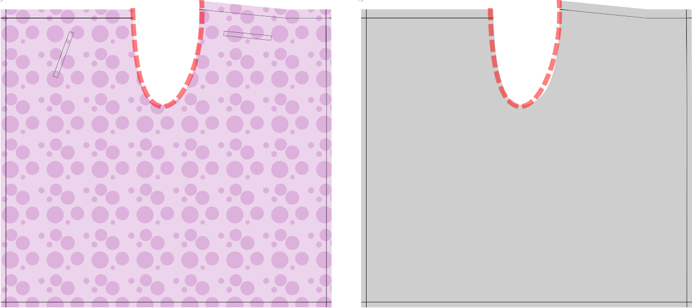

<Warning>

##### De sleutel van Waralee is de tailleband

Op een manier Waralee is slechts een tailleband met een lang stuk stof vast. De tailleband moet doorgaan van de stof in twee tekenreeksen die gebruikt worden om de voorpanden en twee aan de achterkant vast te zetten. Deze tekenreeksen zijn niet opgenomen in het patroon. Traditioneel hebben ze een vergelijkbare lengte. Je kunt de extra maken voor het voorpaneel (de zijde die iets korter is dan de andere, aan de linkerkant van de illustraties hieronder), zodat je beide sets aan de voorkant kunt binden. Ik geef er de voorkeur aan omdat het makkelijker is om aan te das en je hebt niet het grootste deel van de knoop in de rug.

</Warning>

### Stap 1: Stik de zakken

<Note>

##### Pockets zijn optioneel

Traditioneel hebben deze broektypes geen zakken. Maar ik wil ergens mijn telefoon, sleutels en portemonnee zetten. Dus ik heb zakken in het patroon opgenomen. Je kunt voor jezelf beslissen of je ze op je broek wilt hebben.

De illustraties in de volgende stappen laten de oorlogsbroek zien zonder zakken. Alleen de zakplaatsingen van het patroon worden getoond, om je te helpen jezelf te oriënteren.

##### Als je zakken wilt kun je ze eerst

Als je de zakken gaat maken, laat ze eerst één stuk stof op de andere plaatsen. Het is makkelijker om met de delen te werken die nog gescheiden.

</Note>

Beide sets zakken op Waralee zijn enkele paspelzakken. Deze gebruiken een enkel stuk stof om een zakopening te maken, maar lijken verder erg op de dubbele paspelzakken die je hier ziet: [Dubbele paspelzakken](https://freesewing.org/docs/sewing/double-welt-pockets).

We beginnen met de voorzakken.
- Begin met alle onderdelen en markeer de plaats van de zak op de goede kant van de stof.
- Markeer de zakopening ook op een van de voorkantdelen. Deze keer aan de verkeerde kant van de stof.
- Leg het beleg op de stof, met de goede kanten op elkaar. Lijn de hoeken van de zakopeningen uit en speld vast.

Voering voor zakken
- Markeer de zakopening op de voering van je zak. Het moet net binnen de naadtoeslag zitten.
- Breng de zakopeningen op één lijn op alle stofdelen en lijn de bovenkant van je zakvoering uit met de tailleband. Speld of rijg vast.

Zakopening
- Naai met kleine steekjes de lange kanten van de zakopeningen, de opvulstof, het beleg en de zakvoering. Naai niet voorbij de uiteinden van de zakopening.
- Knip een snee direct tussen de twee stiklijnen. Splits vlak voor het einde elk uiteinde van de snede en snijd in elke hoek van de zakopening (maar niet er voorbij). Je zou een kleine V moeten hebben aan elk uiteinde van de snede.
- Pers de naden open.
- Duw nu alles door de opening naar de andere kant. Leg alles mooi neer met de zakopening open. Druk op de opening van de zak.

Het boordsel maken
- Draai het kledingstuk om en pers de onderrand van de zak naar onder. Later levert dit een mooie, schone edgestitch op.
- Klap vervolgens de zak naar boven, zodat deze de zakopening bedekt. Vouw dan net genoeg van het beleg terug om de hele zakopening precies te bedekken. Druk aan en speld vast.

De zakopening vastnaaien
- Keer het geheel met de goede kant naar boven en vouw dan de stof aan een korte kant van de zakopening terug, zodat een kleine driehoekige uitsnede en je zakvoering tevoorschijn komen.
- Naai de korte rand van de zakopening, net buiten je markeringen. Dit moet de V-vormige uitgesneden stukjes aan de voering bevestigen. Als je er zeker van bent dat alles er vanaf de goede kant goed uitziet, naai je deze lijn een paar keer opnieuw om hem vast te zetten.
- Pers.
- Om alles netjes te maken, naai je op dit punt ook de onderrand van de voorkant van de zak aan de voering van de zak. (Dit is de reden waarom we de rand eerder naar beneden hebben gedrukt).

De zak afwerken
- Neem je tweede broekzak en pers alle randen onder, behalve een van de langere randen.
- Leg dit beleg over de zakopening, goede kanten op elkaar en de kniprand op één lijn met de kniprand van de zakvoering.
- Vouw nu de voering van je zak om, waarbij je alle randen van de zak op elkaar legt.
- Speld of klem het tweede broekzak beleg op de broekzakvoering langs de knipranden. Keer dan de zakvoering om en speld de hele rand van het beleg op de zakvoering.
- Stik het beleg aan de stof van de zak. Dit zit achter de zakopening als alles in elkaar zit, zodat als je zak opengaat, je modestof in de opening te zien is.
- Keer de stof van de zak om, leg de randen op elkaar en speld alle kanten van de zak vast. Sluit de zak zoals je normaal doet. Je kunt een Franse naad, een overlockmachine of een andere methode gebruiken.

Alles schoon en netjes maken
- Draai het hele stuk om zodat je naar de goede kant kijkt.
- Vouw de hoofdstof terug, zodat je de driehoekjes aan de korte kant van de zakopening kunt zien.
- Naai nog een lijn, nu door alle lagen heen. Je moet de stiklijn van de rand van de eerste facing kunnen zien. Naai helemaal tot deze lijn, die het beleg aan de binnenkant van de zak afmaakt. Je wilt heel dicht bij de vouw zijn met deze steeklijn.
- Vouw nu de stof terug aan de lange kant van de zakopening, waar de zijkanten van de zak aan elkaar gestikt waren. Je ziet de eerste steeklijn van de zakopening. Zorg dat alle lagen stof mooi liggen en naai nogmaals over deze steeklijn, nu door alle lagen heen. Hiermee zet je deze kant van de zak vast aan de stof van het kledingstuk.
- Draai om, druk goed aan en bewonder je werk.

<Note>

Ik bevatte plaatsingen voor de voorzakken die door de kleppen aan het voorpand verborgen worden. Maar ze zullen nog steeds gemakkelijk toegankelijk zijn om je telefoon of sleutels in te voeren. Dit zijn paspelzakken. De voorpand bevindt zich in een hoek en de achterste zijn horizontaal georiënteerd. De insteekzak zou voldoende stof moeten geven om de zak aan de tailleband te bevestigen. Als u extra diepe zakken wilt, pas dat dan aan.

</Note>

De achterzakken maken
- De achterzakken zijn ook enkele paspelzakken, maar de zakopening is horizontaal in plaats van schuin. Dit betekent dat ze veel dichter bij de instructies voor [dubbele paspelzakken](https://freesewing.org/docs/sewing/double-welt-pockets)liggen.
- Volg de instructies voor een dubbele boordsel, maar pas de opening aan met een enkele boordsel in plaats van een dubbele boordsel.

Gefeliciteerd! Je zakken zijn af!

### Stap 2: Zoom de zijkanten en onderkant

- De zijkanten omzomen
- De onderkant omzomen.

<Note>

Je kunt de methode die het beste voor je werkt gebruiken. In de versie die ik eerst maakte heb ik net de zijkanten geplaatst, plooide ze terug en stikte ze bovenop, en deed ik hetzelfde voor de onderkant. Ik heb dit gedaan om het leeuwendeel van de stof tot een minimum te houden en om een betere afvoer mogelijk te maken. Wat je doet, moet afhangen van het type stof dat je gebruikt.

</Note>

### Stap 3: Naai de twee broekdelen aan elkaar bij het kruis

Nu mag je de twee broekdelen aan elkaar naaien.

- Leg de twee broekdelen op elkaar met _goede kanten op elkaar_ en naai de naad langs de uitsnede.
- _Maak_ deze naad af en pers hem.

### Stap 4: Bereid de vier tekenreeksen voor

De tekenreeksen zijn slechts lange buizen.

- Neem een kwart van uw taillemaat. Voeg dat nummer toe aan 40cm (17). Voeg je naadwaarde toe. Dit is de lengte van elke string.
- Knip vier stroken stof die zo lang en 5 cm breed zijn.

<Tip>

Als mijn tailleomtrek bijvoorbeeld 84,6 cm: 84,6 cm gedeeld door 4 is 2cm. 2cm plus 40cm is 61,2cm. 61,2 cm plus mijn naadwaarde van 1 cm is 62,2 cm. Ik knip vier stroken stof die 62,2 cm bij 5 cm zijn.

</Tip>

<Note>

##### Je kunt de voorpanden verlengen

optioneel om de voorpanden langer te maken, verleng ze met je kwarttaillemeting.

Bij het genereren van je patroon wordt een van de stijlopties "Waist Band" genoemd. De strings, wanneer geplooid moet dezelfde breedte hebben als je hebt opgegeven voor die optie, 2,5 cm (1") als standaard.

De extra lengte van 40 cm (17") is om de knoop te maken.

Als je materiaal gevoelig of zwak is, kun je hier wat tussenvoering aan toevoegen om het kracht te geven.

</Note>

- Plooi ze over de helft langs de lange zijde, _goede kanten op elkaar_.
- Naai de lange kant en een van de korte kanten,
- Draai de stropdas met de goede kant naar buiten.

<Tip>

##### Het draaien van buizen aan de rechterkant van de stof kan moeilijk zijn

Dit kan makkelijker worden door een stuk twee stukken langer te nemen dan de strips. Leg die tussen de rechterzijden, langs de stof. Zorg ervoor dat je dit vastpakt terwijl je de korte kant naait. Je kunt dit gebruiken om het einde door de buis die je hebt gemaakt te trekken. Wanneer je klaar bent, kun je het uitknippen. Het hebben van een lange schoonheidsstok of loopdraad kan hier ook mee helpen.

</Tip>

### Stap 5: Stik de tailleband

Nu is het tijd om de tailleband vast te naaien.

- Als je stof gevoelig is, voeg dan versteviging toe aan de verkeerde kant van de broek boven de taillebandlijn. (rood)
- Plooi de naadwaarde in en plooi dan langs de lijn. (rood)
- Voeg aan beide kanten één van de tekenreeksen toe die u in de vorige stap hebt gemaakt.
- Stik langs de lijn van de tailleband en voeg wat extra stiksel toe om ervoor te zorgen dat deze snoorden goed vastzitten. (blauw)

<Warning>

##### Beveilig de tekenreeksen goed

De tekenreeksen houden je pannen, dus als je mislukken krijg je ongemakkelijke momenten.

</Warning>

### Stap 6: Draag je broek

Strijk je broek en probeer het op!

Houd de voorkant tegen je broekriem en pak beide tekenreeksen om je heen en strijk in de rug (of, als je lange strings hebt, pak ze helemaal om je heen en strijk aan het voorp). Leg de achterkant dan door je benen aan jezelf en pas de andere tekenreeksen aan de voorkant.

Hier is een artikel dat laat zien hoe ingepakte broek moet worden [Hoe Tie Wrap Broek](https://www.wikihow.com/Tie-Wrap-Pants)

Als je vastloopt, of extra vragen hebt, kun je altijd contact opnemen met [andere FreeSewers](https://discord.freesewing.org/).
