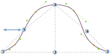

Deze optie bepaalt de horizontale plaatsing van het tussenpunt in de mouwkop aan de achterkant van de mouw.

<Tip>

Zie [begrijp de mouwkop](/docs/patterns/brian/options#understanding-the-sleevecap) voor een diepgaande
kijk hoe de mouwkop is opgebouwd en hoe de invloed van de verschillende opties op de vorm eruit ziet.

</Tip>

## Effect van deze optie op het patroon

