This option controls the horizontal placement of the sleevecap top.

<Tip>

See [understanding the sleevecap](/docs/patterns/brian/options#understanding-the-sleevecap) for an in-depth
look into how the sleevecap is constructed and the influence of the different options on its shape.

</Tip>

## Effect of this option on the pattern

